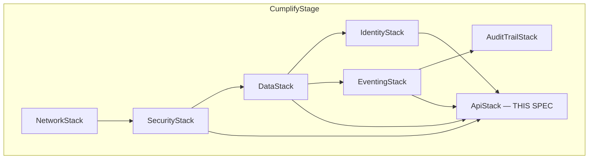

# API Core — Design

**Spec:** `api-core`
**Requirements approved:** R4-by-ratification (ec8c2ee, 2026-07-07)
**Steering rules exercised:** `00-stack-facts.md`, `01-tenancy-rules.md`, `03-auth-modes.md`, `04-immutability.md`, `06-cdk-conventions.md`, `07-events.md`, `14-simplicity.md`, `16-identity-boundaries.md`, `19-kiro-truth.md`
**Revision:** R2 — D-1..D-10 resolved; OQ-1/OQ-2/OQ-5 ratified decisions applied unconditionally; FF-1..FF-6 fix-forward corrections applied
**Ratified decisions (ec8c2ee):** OQ-1 = AWS_LAMBDA; OQ-2 = Data API; OQ-5 = auditTrail envelope flag

---

## 1. Ratified Auth Mechanism (OQ-1 — resolved)

`AWS_LAMBDA` authorizer. Single ABAC brain: validates Pool B/C ID tokens via
JWKS, rejects Pool A (Layer 1) before any role logic, returns `resolverContext`
{tenantId, role, poolClass, sub, entitlement}. Reusable for Part 24.1 API
Gateway surface. Authorizer code + IAM remain REQUIRES-HUMAN per C-2/AUTH-5.

**Entitlement stamp (P1 scope, D-10):** The authorizer reads the tenant
metadata item from CumplifyCore (`PK=TENANT#<tenantId>#META`, `SK=PLAN`) and
stamps a STATIC entitlement object {plan, seats, features} into
`resolverContext.entitlement`. This is a per-request DDB read (single-digit ms,
cached in-process for the authorizer's container lifetime per token cache key).
Real-time entitlement lookup (DDB on each auth) is the P2 upgrade path when
billing enforcement activates; in P1 the tenant metadata item is the source of
truth and is updated only on plan change events.

**Authorizer cache:** TTL 300s (dev), per ratification of OQ-3. Stale
entitlement is bounded by TTL; acceptable given static stamp in P1.

---

## 2. Mutation → Audit-Event Table & Routing (C-3 / RES-3 / OQ-5 / D-1 / D-2)

### 2.1 Event Semantics Rule (D-2)

Every mutation declares its OWN honest event — no shoehorning multiple
mutations into a shared detailType. "Every mutation MUST name its audit event
in design" (C-3) means one-to-one, not many-to-one.

### 2.2 Full Operations Table (D-4)

Covers ALL queries AND mutations per module per module-spec.

#### M1 — Document Studio

| Operation | Type | Auth | detailType | clauseRef | auditTrail | In registry? |
|-----------|------|------|-----------|-----------|------------|-------------|
| `getDocument(id)` | Query | @aws_lambda | — | 7.5 | — | — |
| `listDocuments(filter)` | Query | @aws_lambda | — | 7.5 | — | — |
| `getDocumentVersionDiff(v1,v2)` | Query | @aws_lambda | — | 7.5 | — | — |
| `createDocumentDraft(input)` | Mutation | @aws_lambda | ★ `Document.DraftCreated` | ISO 9001 7.5.2 | true | ★ NEW |
| `submitDocumentForApproval(id)` | Mutation | @aws_lambda | ★ `Document.SubmittedForApproval` | ISO 9001 7.5.2 | true | ★ NEW |
| `approveDocumentVersion(versionId, decision)` | Mutation | @aws_lambda | `Document.Approved` | ISO 9001 7.5.2 | true | ✅ Yes |
| `publishControlledDocument(versionId)` | Mutation | @aws_lambda | `Document.Published` | ISO 9001 7.5.3 | true | ✅ Yes |
| `updatePolicy(input)` | Mutation | @aws_lambda | `Policy.Updated` | ISO 9001 5.2 | true | ✅ Yes |
| `updateImsScope(input)` | Mutation | @aws_lambda | `Scope.Changed` | ISO 9001 4.3 | true | ✅ Yes |
| `agentDraftDocument(input)` | Mutation | @aws_iam | ★ `Document.DraftCreated` | ISO 9001 7.5.2 | true | ★ NEW (shared) |
| `publishDocumentEvent(input)` | Mutation | @aws_iam | — (None DS, subscription trigger) | — | — | — |
| `onDocumentStatusChanged(tenantId)` | Subscription | @aws_lambda | — | — | — | — |

#### M2 — CAPA

| Operation | Type | Auth | detailType | clauseRef | auditTrail | In registry? |
|-----------|------|------|-----------|-----------|------------|-------------|
| `getNonconformity(id)` | Query | @aws_lambda | — | 10.2 | — | — |
| `listOpenCAPAs(filter)` | Query | @aws_lambda | — | 10.2 | — | — |
| `raiseNonconformity(input)` | Mutation | @aws_lambda | `NC.Raised` | ISO 9001 10.2 | true | ✅ Yes |
| `recordRootCause(input)` | Mutation | @aws_lambda | ★ `CAPA.RootCauseRecorded` | ISO 9001 10.2 | true | ★ NEW |
| `createCorrectiveAction(input)` | Mutation | @aws_lambda | `CAPA.Opened` | ISO 9001 10.2 | true | ✅ Yes |
| `closeCapa(input)` | Mutation | @aws_lambda | `CAPA.Closed` | ISO 9001 10.2 | true | ✅ Yes |
| `verifyEffectiveness(input)` | Mutation | @aws_lambda | `CAPA.EffectivenessVerified` | ISO 9001 10.2 | true | ✅ Yes |
| `disposeNonconformingOutput(input)` | Mutation | @aws_lambda | ★ `CAPA.OutputDisposed` | ISO 9001 8.7 | true | ★ NEW |
| `agentTriageNC(input)` | Mutation | @aws_iam | `NC.Raised` | ISO 9001 10.2 | true | ✅ Yes (shared) |
| `agentProposeCorrectiveAction(input)` | Mutation | @aws_iam | `CAPA.Opened` | ISO 9001 10.2 | true | ✅ Yes (shared) |
| `publishCAPAEvent(input)` | Mutation | @aws_iam | — (None DS) | — | — | — |
| `onCAPAStatusChanged(tenantId)` | Subscription | @aws_lambda | — | — | — | — |

#### M3 — Audit Studio

| Operation | Type | Auth | detailType | clauseRef | auditTrail | In registry? |
|-----------|------|------|-----------|-----------|------------|-------------|
| `getAudit(id)` | Query | @aws_lambda | — | 9.2 | — | — |
| `getAuditReadiness(standard)` | Query | @aws_lambda | — | 9.2 | — | — |
| `createAuditProgramme(input)` | Mutation | @aws_lambda | ★ `Audit.ProgrammeCreated` | ISO 9001 9.2.2 | true | ★ NEW |
| `scheduleAudit(input)` | Mutation | @aws_lambda | `Audit.Scheduled` | ISO 9001 9.2.1 | true | ✅ Yes |
| `recordFinding(input)` | Mutation | @aws_lambda | `Audit.FindingRaised` | ISO 9001 9.2.1 | true | ✅ Yes |
| `completeAudit(id)` | Mutation | @aws_lambda | `Audit.Completed` | ISO 9001 9.2.1 | true | ✅ Yes |
| `agentGenerateChecklist(auditId)` | Mutation | @aws_iam | ★ `Audit.ChecklistGenerated` | ISO 9001 9.2.1 | false | ★ NEW |
| `agentScoreReadiness(standard)` | Mutation | @aws_iam | `Readiness.Scored` | ISO 9001 9.2.1 | false | ✅ Yes |
| `publishAuditEvent(input)` | Mutation | @aws_iam | — (None DS) | — | — | — |
| `onFindingRecorded(tenantId)` | Subscription | @aws_lambda | — | — | — | — |

#### M4 — Records Management

| Operation | Type | Auth | detailType | clauseRef | auditTrail | In registry? |
|-----------|------|------|-----------|-----------|------------|-------------|
| `getRecord(id)` | Query | @aws_lambda | — | 7.5 | — | — |
| `listCalibrationsDue(window)` | Query | @aws_lambda | — | 7.1.5 | — | — |
| `getAuditTrail(entityId)` | Query | @aws_lambda | — | 7.5 | — | — |
| `registerRecord(input)` | Mutation | @aws_lambda | `Record.Registered` | ISO 9001 7.5.3 | true | ✅ Yes |
| `recordCalibration(input)` | Mutation | @aws_lambda | `Calibration.Recorded` | ISO 9001 7.1.5.2 | true | ✅ Yes |
| `createRetentionPolicy(input)` | Mutation | @aws_lambda | ★ `Record.RetentionPolicySet` | ISO 9001 7.5.3 | true | ★ NEW |
| `appendAuditEvent(input)` | Mutation | @aws_iam | `AuditEvent.Appended` | all | true | ✅ Yes |
| `onCalibrationDue(tenantId)` | Subscription | @aws_lambda | — | — | — | — |

> `appendAuditEvent` is the `@aws_iam` mutation that PUBLISHES
> `AuditEvent.Appended` (auditTrail:true) to `cumplify-events`. R-3 routes it
> to audit-sink.fifo. The audit-sink appender writes the hash-chained DDB item
> and NEVER re-emits — no PutEvents call exists in the appender code. This is
> the **no-re-emit invariant**: one publish → exactly one chain item. A
> loop-guard test asserts: publish one `AuditEvent.Appended` → verify exactly
> ONE chain item written (no duplication, no re-publish loop).

#### M5 — Risk Management

| Operation | Type | Auth | detailType | clauseRef | auditTrail | In registry? |
|-----------|------|------|-----------|-----------|------------|-------------|
| `getRisk(id)` | Query | @aws_lambda | — | 6.1 | — | — |
| `getCrossRegisterRiskView(filter)` | Query | @aws_lambda | — | 6.1 | — | — |
| `createRisk(input)` | Mutation | @aws_lambda | `Risk.Created` | ISO 9001 6.1 | true | ✅ Yes |
| `addRiskTreatment(input)` | Mutation | @aws_lambda | ★ `Risk.TreatmentAdded` | ISO 9001 6.1 | true | ★ NEW |
| `createChangePlan(input)` | Mutation | @aws_lambda | `Change.Planned` | ISO 9001 6.3 | true | ✅ Yes |
| `agentAssessRisk(input)` | Mutation | @aws_iam | `Risk.Escalated` | ISO 9001 6.1 | true | ✅ Yes |
| `publishRiskEvent(input)` | Mutation | @aws_iam | — (None DS) | — | — | — |
| `onRiskEscalated(tenantId)` | Subscription | @aws_lambda | — | — | — | — |

### 2.3 New Event Registrations Required (C-4)

Before implementation, these events MUST be appended to `contracts/events.md`
with their `auditTrail` designation:

| detailType | Domain | Source | auditTrail | Rationale |
|-----------|--------|--------|------------|-----------|
| `Document.DraftCreated` | Document | `cumplify.m1.document-studio` | true | Draft creation is a distinct state transition (C-3: every mutation names its event) |
| `Document.SubmittedForApproval` | Document | `cumplify.m1.document-studio` | true | Submission for approval is auditable (7.5.2 creating/updating) |
| `Audit.ProgrammeCreated` | Audit | `cumplify.m3.audit-studio` | true | Programme creation is a planning decision (9.2.2) |
| `Audit.ChecklistGenerated` | Audit | `cumplify.m3.audit-studio` | false | Agent action, advisory — not a state transition |
| `CAPA.RootCauseRecorded` | CAPA | `cumplify.m2.capa` | true | Root-cause recording completes the analysis phase (10.2) |
| `CAPA.OutputDisposed` | CAPA | `cumplify.m2.capa` | true | Disposition of nonconforming output (8.7) is a controlled decision |
| `Risk.TreatmentAdded` | Risk | `cumplify.m5.risk` | true | Treatment addition is a planning action (6.1) |
| `Record.RetentionPolicySet` | Records | `cumplify.m4.records` | true | Retention policy governs record lifecycle (7.5.3) |

### 2.4 auditTrail Flag Mechanism (OQ-5 / D-1)

**Problem (D-1):** The R-3 suffix-matching pattern (`*.Approved`, `*.Closed`,
`*.Raised`, `*.Evaluated`, `AuditEvent.Appended`) only catches 2 of the 21
mutation events declared above. Events like `Audit.Scheduled`,
`Record.Registered`, `Change.Planned`, `Risk.Created`, and all new events
route to ZERO rules under the old pattern.

**Solution (ratified OQ-5):**

1. **ET-4 envelope gains `auditTrail: boolean` (required field).**
2. **Every registered detailType receives an explicit designation** in
   `contracts/events.md` (new "Trail Designation" section).
3. **Publisher stamps `auditTrail` from a compile-time registry map.**
   Publishing an unregistered detailType throws. A parity test asserts
   the map matches `contracts/events.md`.
4. **R-3 pattern rewritten:** `{ "detail": { "auditTrail": [true] } }`.
   Registration IS routing — every event designated `auditTrail: true`
   automatically reaches the audit sink. The "registered-but-never-sealed"
   defect class is eliminated.
5. **R-1, R-2, R-4..R-7 are UNCHANGED** (they route by detailType for
   domain-specific fan-out; the auditTrail flag is orthogonal).

### 2.5 Per-Event Routing Table (FF-1: derived from infra/lib/eventing-stack.ts)

Rules (deployed patterns from eventing-stack.ts):
- **R-1 nc-triage:** exact `Audit.FindingRaised`, `Incident.Reported`, `EnvIncident.Reported`, `Aspect.SignificantImpact`
- **R-2 capa-intake:** exact `NC.Raised`, `CAPA.Opened`, `CAPA.Closed`, `CAPA.EffectivenessVerified`, `CAPA.ActionRequiresDocChange`
- **R-3 audit-sink (AFTER OQ-5):** `{ "detail": { "auditTrail": [true] } }`
- **R-4 hazard:** exact `Hazard.Identified`, `Hazard.RiskEscalated`, `Incident.Reported`, `Safety.MetricLogged`
- **R-5 aspect:** exact `Aspect.SignificantImpact`, `Enviro.MonitoringLogged`, `EnvIncident.Reported`, `EnvEmergency.PlanUpdated`
- **R-6 review-fanout:** exact `Audit.Completed`, `CAPA.Closed`, `Objectives.Updated`, `Aspect.SignificantImpact`, `Incident.Reported`, `Compliance.Evaluated`, `Risk.Escalated`, `Context.Updated`
- **R-7 records:** prefix `CAPA.`, `Document.`, `Risk.`

Cross-checked against `.kiro/evidence/model-policy-evals/micro-routing-truth-table.md`.

| detailType | auditTrail | R-1 nc-triage | R-2 capa-intake | R-3 audit-sink (NEW) | R-4 hazard | R-5 aspect | R-6 review-fanout | R-7 records |
|-----------|------------|---------------|-----------------|----------------------|------------|------------|-------------------|-------------|
| `Document.DraftCreated` | true | — | — | ✅ | — | — | — | ✅ (Document.) |
| `Document.SubmittedForApproval` | true | — | — | ✅ | — | — | — | ✅ (Document.) |
| `Document.Approved` | true | — | — | ✅ | — | — | — | ✅ (Document.) |
| `Document.Published` | true | — | — | ✅ | — | — | — | ✅ (Document.) |
| `Policy.Updated` | true | — | — | ✅ | — | — | — | — |
| `Scope.Changed` | true | — | — | ✅ | — | — | — | — |
| `NC.Raised` | true | — | ✅ (exact) | ✅ | — | — | — | — |
| `CAPA.RootCauseRecorded` | true | — | — | ✅ | — | — | — | ✅ (CAPA.) |
| `CAPA.Opened` | true | — | ✅ (exact) | ✅ | — | — | — | ✅ (CAPA.) |
| `CAPA.Closed` | true | — | ✅ (exact) | ✅ | — | — | ✅ (exact) | ✅ (CAPA.) |
| `CAPA.EffectivenessVerified` | true | — | ✅ (exact) | ✅ | — | — | — | ✅ (CAPA.) |
| `CAPA.OutputDisposed` | true | — | — | ✅ | — | — | — | ✅ (CAPA.) |
| `Audit.ProgrammeCreated` | true | — | — | ✅ | — | — | — | — |
| `Audit.Scheduled` | true | — | — | ✅ | — | — | — | — |
| `Audit.FindingRaised` | true | ✅ (exact) | — | ✅ | — | — | — | — |
| `Audit.Completed` | true | — | — | ✅ | — | — | ✅ (exact) | — |
| `Readiness.Scored` | false | — | — | — | — | — | — | — |
| `Record.Registered` | true | — | — | ✅ | — | — | — | — |
| `Calibration.Recorded` | true | — | — | ✅ | — | — | — | — |
| `Record.RetentionPolicySet` | true | — | — | ✅ | — | — | — | — |
| `AuditEvent.Appended` | true | — | — | ✅ | — | — | — | — |
| `Risk.Created` | true | — | — | ✅ | — | — | — | ✅ (Risk.) |
| `Risk.TreatmentAdded` | true | — | — | ✅ | — | — | — | ✅ (Risk.) |
| `Risk.Escalated` | true | — | — | ✅ | — | — | ✅ (exact) | ✅ (Risk.) |
| `Change.Planned` | true | — | — | ✅ | — | — | — | — |
| `Audit.ChecklistGenerated` | false | — | — | — | — | — | — | — |

**Notes on R-2 routing (vs R1 design error):**
- `NC.Raised` routes to R-2 capa-intake (exact match), NOT R-1 nc-triage.
  R-1 catches `Audit.FindingRaised` (which triggers NC triage downstream).
- `CAPA.RootCauseRecorded` and `CAPA.OutputDisposed` are NEW events not in
  R-2's exact list — they route to R-7 (CAPA. prefix) but NOT R-2.
  R-2 only matches 5 exact strings deployed in eventing-stack.ts.
- `CAPA.Closed` matches BOTH R-2 (exact) AND R-6 review-fanout (exact).
- `Risk.Escalated` matches BOTH R-6 review-fanout (exact) AND R-7 (Risk. prefix).

**Verification:** Every `auditTrail: true` event reaches R-3. No `auditTrail: false`
event reaches R-3. Domain fan-out rules use exact/prefix matching unchanged.

---

## 3. Lambda-to-Aurora Connectivity (OQ-2 — resolved)

**Decision: RDS Data API.** Zero standing cost, no VPC cold start,
transaction-scoped tenant context via `set_config()`.

### 3.1 Implementation (D-7)

Data API does not support `SET LOCAL` as a raw SQL statement with bind
parameters. The correct pattern:

```sql
-- Inside a BeginTransaction/CommitTransaction block:
SELECT set_config('app.tenant_id', :tenantId, true);
-- :tenantId is a parameterized value from resolverContext.tenantId
-- third arg `true` = transaction-local (equivalent to SET LOCAL)
-- Then execute domain queries/mutations (RLS enforced)
```

**String interpolation of tenantId anywhere = review-blocking defect.**
The `:tenantId` parameter is always bound via the Data API `parameters` array.

### 3.2 DataStack Amendment (design task)

- Add `enableDataApi: true` to the Aurora cluster construct.
- Export `clusterArn` and `dbSecretArn` as CfnOutputs + stack props.
- Deploy is architect-witnessed (runtime property change, no replacement).

### 3.3 Aurora Resume Timeout Budget

Aurora 0-ACU resume: ~15s typical, ~30s after extended pause. Resolver Lambda
timeout: 30s. Data API handles resume internally — client sees latency, not
TCP connection failure. First-request-after-pause user experience: ~15–20s
response (acceptable for dev; prod min-ACU=0.5 avoids pause).

---

## 4. Migration Tooling (RDS-6 — unchanged from R1)

Raw SQL migrations + CDK Custom Resource via Data API. Idempotent via
`_migrations` table. Files in `services/api/migrations/` as numbered `.sql`.
Custom Resource Lambda executes pending migrations on every deploy.

Structure:
```
services/api/
  migrations/
    001_create_schemas.sql
    002_m1_document_studio.sql
    003_m2_capa.sql
    004_m3_audit_studio.sql
    005_m4_records_management.sql
    006_m5_risk_management.sql
    007_rls_policies.sql
    008_risk_register_view.sql
  src/
    migrator.ts          # Custom Resource handler
    migration-runner.ts  # Executes SQL via Data API (parameterized)
```

---

## 5. Naming Governance (D-5)

### 5.1 Rule

**The module-spec's "Core data entities" lists (M1–M5) GOVERN table naming.**
Architecture C.1's older schema-grouped names are SUPERSEDED where they differ.

### 5.2 Corpus Deviation Record (D-5)

> **CORPUS DEVIATION:** §5.3 uses per-module schemas (`m1`..`m5`) instead of
> C.1's domain-grouped schemas (`quality`, `capa`, `audit`, `environmental`,
> `ohs`, `legal`, `objectives`, `mgmt_review`). This is an architect ruling:
> per-module schemas align with module-spec entity ownership and avoid
> cross-module schema dependencies.
>
> **C.1 AMENDMENT CARRY (owner-visible):** Architecture C.1 Section "RDS
> PostgreSQL Schema Domains" requires amendment to reflect the `m<N>` schema
> convention adopted here. Carry recorded for spec closure; does not block
> implementation.

### 5.3 Schema Organization

| Schema | Tables |
|--------|--------|
| `m1` | documents, document_versions, document_approvals, document_distribution, policies, ims_scope |
| `m2` | nonconformities, root_cause_analyses, corrective_actions, capa_effectiveness_checks, nonconforming_outputs |
| `m3` | audit_programmes, audits, audit_checklists, audit_findings, audit_readiness_scores |
| `m4` | records, retention_policies, measuring_resources, calibration_records |
| `m5` | risks, risk_treatments, change_plans |
| `m5_views` | risk_register_view (materialized view — see §6.4) |

### 5.4 Naming Differences (module-spec GOVERNS)

| C.1 name | Module-spec name (GOVERNS) | Module |
|----------|---------------------------|--------|
| `quality_records` | `records` | M4 |
| `calibration_record` | `calibration_records` | M4 |
| `capa` | `corrective_actions` + `nonconformities` (split) | M2 |
| `audit_finding` | `audit_findings` (plural) | M3 |
| `risk_register` | `risks` + `risk_register_view` (split) | M5 |
| `document` | `documents` (plural) | M1 |
| `root_cause` | `root_cause_analyses` | M2 |
| `effectiveness_verification` | `capa_effectiveness_checks` | M2 |

---

## 6. Architecture Overview

### 6.1 Stack Placement



### 6.2 Request Flow

```
Client (AppSync SDK / Amplify)
  │  GraphQL request + Pool B/C ID token in Authorization header
  ▼
AppSync API (auth mode: AWS_LAMBDA default + AWS_IAM additional)
  │  1. Invokes Lambda authorizer (or returns cached response, TTL 300s)
  ▼
Lambda Authorizer [REQUIRES-HUMAN code]
  │  2. Validates JWT: JWKS signature, issuer ∈ {Pool B, Pool C}, expiry,
  │     custom:tenantId present+non-empty
  │  3. REJECTS Pool A (poolClass=internal) → 401 BEFORE role logic
  │  4. Reads tenant metadata from CumplifyCore (TENANT#<tenantId>#META/PLAN)
  │  5. Returns resolverContext: {tenantId, role, poolClass, sub, entitlement}
  ▼
AppSync (resolver dispatch)
  │  6. Routes to resolver Lambda based on field
  ▼
Resolver Lambda (NodejsFunction, node22, ARM_64, 512MB, timeout 30s)
  │  7. Reads resolverContext.tenantId
  │  8. Assumes tenant-data role via sts:AssumeRole + sts:TagSession
  │     (tags tenantId → enables DDB LeadingKeys condition)
  │  9. BEGIN TRANSACTION via Data API
  │     SELECT set_config('app.tenant_id', :tenantId, true);
  │     Execute domain query/mutation (RLS enforced on all 23 base tables)
  │     COMMIT
  │  10. Optionally write DDB metadata (using assumed role credentials)
  │  11. Publish audit event via services/eventing publisher
  │      (publisher stamps auditTrail from registry map)
  ▼
EventBridge cumplify-events
  │  12. R-3 audit-sink rule: { "detail": { "auditTrail": [true] } }
  │      → FIFO router → audit-sink.fifo
  ▼
Audit-sink consumer (spec 5)
  │  13. appendAuditEvent → chained DDB item (ONE writer, monotonic SK)
  ▼
DynamoDB Streams → WORM Sealer → S3 Object Lock COMPLIANCE
```

### 6.3 Tenant Isolation — Four Enforcement Points

| Layer | Mechanism | Requirement |
|-------|-----------|-------------|
| 1. Authorizer | Pool-A rejection; tenantId extraction from ID token | AUTH-1, AUTH-4 |
| 2. RDS (RLS) | `set_config('app.tenant_id', :tenantId, true)` per transaction; RLS policy on 23 base tables | RDS-2, RDS-3 |
| 3. DynamoDB (IAM) | Tenant-data role assumed with `tenantId` session tag; LeadingKeys condition | ROLE-1, ROLE-2 |
| 4. Resolver logic | Client-supplied tenantId overwritten by resolverContext claim | SCHEMA-5 |

### 6.4 risk_register_view Isolation (D-6)

`risk_register_view` is a PostgreSQL **materialized view**. RLS cannot be
applied to materialized views.

**Design: SECURITY DEFINER function.**

```sql
CREATE OR REPLACE FUNCTION m5_views.get_risk_register_view()
RETURNS SETOF m5_views.risk_register_view
LANGUAGE sql
SECURITY DEFINER
SET search_path = m5_views, m5, pg_temp
AS $$
  SELECT * FROM m5_views.risk_register_view
  WHERE tenant_id = current_setting('app.tenant_id');
$$;

-- Hardened: SET search_path prevents search_path injection
-- Owner (migration role) retains SELECT on the matview
-- App role has EXECUTE on the function ONLY, no direct SELECT on matview
REVOKE ALL ON m5_views.risk_register_view FROM app_role;
GRANT EXECUTE ON FUNCTION m5_views.get_risk_register_view() TO app_role;
```

The resolver calls `SELECT * FROM m5_views.get_risk_register_view()` — the
function runs as its definer (owner), reads the matview, and filters by the
caller's `app.tenant_id` session variable. ACC-5 includes a dedicated test
for this path (cross-tenant → empty result).

---

## 7. Tenant-Data Role Trust Mechanics (D-3 / CARRY-1)

### 7.1 Problem (D-3)

`assumedBy: ServicePrincipal('lambda.amazonaws.com')` is WRONG for a
per-request tenant-tagged role. An execution role never carries the tenantId
session tag dynamically — it's set at deploy time, not at request time. Every
DDB call would fail the LeadingKeys condition.

### 7.2 Correct Pattern

```
Resolver Lambda execution role
  │  sts:AssumeRole + sts:TagSession
  │  (allowed on tenant-data-role ARN)
  ▼
Tenant-data role (trust policy: resolver execution role as principal)
  │  Session tags: { tenantId: <from resolverContext> }
  │  Inline policy: dynamodb:GetItem/PutItem/Query/TransactWriteItems
  │    Condition: ForAllValues:StringLike dynamodb:LeadingKeys
  │    matches TENANT#${aws:PrincipalTag/tenantId}#*
  ▼
DynamoDB CumplifyCore (LeadingKeys enforced per-request)
```

### 7.3 CDK Implementation

```typescript
// Tenant-data role — trusted by resolver execution roles
const tenantDataRole = new iam.Role(this, 'TenantDataRole', {
  assumedBy: new iam.CompositePrincipal(
    // Each resolver Lambda's execution role can assume this role
    ...resolverLambdas.map(fn => new iam.ArnPrincipal(fn.role!.roleArn))
  ),
  // Trust policy allows sts:TagSession
});

// Trust policy statement (L1 override for sts:TagSession condition)
tenantDataRole.assumeRolePolicy!.addStatements(new iam.PolicyStatement({
  actions: ['sts:TagSession'],
  principals: resolverLambdas.map(fn => new iam.ArnPrincipal(fn.role!.roleArn)),
  conditions: {
    // Session tag value = BARE tenantId (UUID format, e.g. "abc-123-def")
    // The LeadingKeys condition adds the TENANT#...# prefix wrapper
    'StringLike': {
      'aws:RequestTag/tenantId': '????????-????-????-????-????????????',
    },
  },
}));

// Inline policy: DDB access with LeadingKeys condition
tenantDataRole.addToPolicy(new iam.PolicyStatement({
  actions: [
    'dynamodb:GetItem', 'dynamodb:PutItem',
    'dynamodb:Query', 'dynamodb:TransactWriteItems',
  ],
  resources: [tableArn, `${tableArn}/index/*`],
  conditions: {
    'ForAllValues:StringLike': {
      'dynamodb:LeadingKeys': ['TENANT#${aws:PrincipalTag/tenantId}#*'],
    },
  },
}));

// Resolver execution roles: allow AssumeRole + TagSession on tenant-data role
resolverLambdas.forEach(fn => {
  fn.role!.addToPrincipalPolicy(new iam.PolicyStatement({
    actions: ['sts:AssumeRole', 'sts:TagSession'],
    resources: [tenantDataRole.roleArn],
  }));
});
```

### 7.4 Resolver Credential Flow

```typescript
// In resolver Lambda handler:
import { STSClient, AssumeRoleCommand } from '@aws-sdk/client-sts';
import { DynamoDBClient } from '@aws-sdk/client-dynamodb';

const sts = new STSClient({});

// tenantId = BARE UUID from resolverContext (e.g. "abc-123-def")
const assumed = await sts.send(new AssumeRoleCommand({
  RoleArn: TENANT_DATA_ROLE_ARN,
  RoleSessionName: `resolver-${tenantId.substring(0, 8)}-${Date.now()}`,
  Tags: [{ Key: 'tenantId', Value: tenantId }],  // BARE tenantId
  DurationSeconds: 900,
}));

// LeadingKeys condition evaluates:
//   dynamodb:LeadingKeys must match TENANT#${aws:PrincipalTag/tenantId}#*
//   → TENANT#abc-123-def#* (the PK prefix pattern)
const ddb = new DynamoDBClient({
  credentials: {
    accessKeyId: assumed.Credentials!.AccessKeyId!,
    secretAccessKey: assumed.Credentials!.SecretAccessKey!,
    sessionToken: assumed.Credentials!.SessionToken!,
  },
});
```

**Credential caching:** Per-tenant credentials cached in Lambda memory for
the session duration (up to 15 min or container lifetime). A Map keyed by
tenantId avoids redundant STS calls within a warm container serving multiple
requests for the same tenant.

### 7.5 Event Semantics Principles (FF-6)

1. **detailType sharing:** allowed ONLY across user-path and agent-path
   mutations for the IDENTICAL semantic transition (the `actor` field
   distinguishes human vs agent). Example: `createCorrectiveAction` (user)
   and `agentProposeCorrectiveAction` (agent) both emit `CAPA.Opened`
   because both perform the same state transition.

2. **auditTrail: false** is permitted ONLY for:
   - Recomputable agent output (e.g., `Readiness.Scored`, `Audit.ChecklistGenerated`)
   - Deadline/notification events (e.g., `Calibration.Due`, `Training.Expiring`)
   - NEVER for human/controlled decisions or state transitions.

---

## 8. GSI Partition Key Verification (FF-5)

### 8.1 DataStack GSI Structure (verified from infra/lib/data-stack.ts)

All 9 GSIs use generic attribute names: `GSI1PK`/`GSI1SK` through `GSI9PK`/`GSI9SK`.
No items are written yet (no spec has populated CumplifyCore beyond the audit
trail's `PK=TENANT#<tenantId>#AUDITLOG` items).

### 8.2 Design Constraint

**All GSI partition key values written by api-core resolvers MUST be
`TENANT#<tenantId>#*` prefixed.** This ensures the `dynamodb:LeadingKeys`
condition on the tenant-data role applies equally to table queries AND index
queries (both use the same condition key).

The grant `${tableArn}/index/*` in §7.3 is SAFE if and only if this constraint
holds. If any future spec writes a GSI partition key that is NOT TENANT#-prefixed
(e.g., a global lookup index), that index must be excluded from the tenant-data
role grant and queried via a separate mechanism.

### 8.3 ACC-2 Matrix Extension (GSI probe)

Add to the CARRY-1 denial matrix:
- **GSI query probe (same-tenant):** `simulate-principal-policy` with action
  `dynamodb:Query` on `${tableArn}/index/GSI1`, context key
  `dynamodb:LeadingKeys = ["TENANT#tenantA#META"]`,
  `aws:PrincipalTag/tenantId = tenantA` → allowed.
- **GSI query probe (cross-tenant):** same action/resource, context key
  `dynamodb:LeadingKeys = ["TENANT#tenantB#META"]`,
  `aws:PrincipalTag/tenantId = tenantA` → denied (implicitDeny).

---

## 9. Construct Choices

| Component | CDK Construct | Key props |
|-----------|--------------|-----------|
| AppSync API | `appsync.GraphqlApi` | `authorizationConfig`: default `AWS_LAMBDA` + additional `AWS_IAM`; `xrayEnabled: true`; `logConfig: { fieldLogLevel: ALL }` |
| Lambda authorizer | `NodejsFunction` | `runtime: NODEJS_22_X`, `architecture: ARM_64`, `memorySize: 512`, `timeout: Duration.seconds(10)`, `bundling: { externalModules: [], target: 'node22' }` |
| Resolver Lambdas (×5) | `NodejsFunction` | Same runtime; `timeout: Duration.seconds(30)` (Aurora resume budget) |
| Tenant-data role | `iam.Role` | Trust: resolver execution roles; inline policy: DDB LeadingKeys condition; session tag: tenantId |
| WAFv2 association | `wafv2.CfnWebACLAssociation` | `resourceArn: api.arn`, `webAclArn` from SecurityStack |
| Migration Custom Resource | `cr.Provider` + `NodejsFunction` | Runs on deploy; executes SQL migrations via Data API |
| CfnOutputs | `CfnOutput` | GraphQL API URL, API ID, authorizer ARN, tenant-data-role ARN |

**CDK Nag (D-9):** Target is CDK Nag zero warnings. The Nag run at build
adjudicates rules; no specific rule IDs are pre-claimed. Justified
suppressions (if any) require documented reasoning in code.

---

## 10. Cross-Stack Integration

### 9.1 Props Interface

```typescript
interface ApiStackProps extends cdk.StackProps {
  envConfig: EnvConfig;
  // DataStack
  tableArn: string;
  tableName: string;
  dynamodbKey: kms.IKey;
  clusterArn: string;         // NEW export (OQ-2)
  clusterEndpoint: string;
  dbSecretArn: string;        // NEW export (OQ-2)
  // IdentityStack
  poolBId: string;
  poolBArn: string;
  poolCId: string;
  poolCArn: string;
  // SecurityStack
  webAclArn: string;
  // EventingStack
  busName: string;
  busArn: string;
}
```

### 9.2 New Exports Required from Existing Stacks

| Stack | New export | Purpose |
|-------|-----------|---------|
| DataStack | `clusterArn` | Data API `resourceArn` |
| DataStack | `dbSecretArn` | Data API `secretArn` |
| DataStack | `enableDataApi: true` (cluster prop) | Activates HTTP endpoint |
| IdentityStack | `poolBId`, `poolBArn` | Authorizer JWKS resolution |
| IdentityStack | `poolCId`, `poolCArn` | Authorizer JWKS resolution |

---

## 11. Testing Strategy

### 10.1 Template Assertion Unit Tests (C-1)

| Assertion | Target |
|-----------|--------|
| AppSync API exists with `AWS_LAMBDA` + `AWS_IAM` auth config | `AWS::AppSync::GraphQLApi` |
| Lambda authorizer: correct runtime/memory/timeout (node22/ARM/512/10s) | `AWS::Lambda::Function` |
| Resolver Lambdas (×5): correct config (node22/ARM/512/30s) | `AWS::Lambda::Function` |
| Tenant-data role: trust policy includes resolver role ARNs + TagSession | `AWS::IAM::Role` |
| Tenant-data role: inline policy has LeadingKeys condition | `AWS::IAM::Policy` |
| WAFv2 association exists | `AWS::WAFv2::WebACLAssociation` |
| CfnOutputs present (4) | `AWS::CloudFormation::Output` |
| Migration Custom Resource exists | `AWS::CloudFormation::CustomResource` |

### 10.2 Acceptance Readback Plan

| ACC | Method | Executor |
|-----|--------|----------|
| ACC-1 | Real GraphQL mutation → RDS row (RLS) → DDB metadata (optional) → EventBridge (auditTrail:true) → audit-sink.fifo → chained DDB item → S3 WORM object. Each hop evidenced. | Architect |
| ACC-2 | `aws iam simulate-principal-policy` with cross/same tenant context keys against tenant-data role | Architect |
| ACC-3 (D-8) | Four synthetic JWTs: (a) real Pool-A token (valid signature from Pool A JWKS, correct claims — tests Layer-1 pool rejection), (b) expired token, (c) missing `custom:tenantId`, (d) bad signature. All → 401. | Architect |
| ACC-4 | Chain-verifier Lambda (spec 5) runs green on events generated by this spec | Architect |
| ACC-5 | RLS: tenant-A session → rows; tenant-B session → zero rows. Plus: matview accessor with tenant-B → zero rows. | Architect |

### 10.3 Cross-Tenant Denial Suite (C-7)

1. **Authorizer denial:** Real Pool-A token (valid sig, wrong pool) → 401.
2. **DynamoDB denial:** simulate-principal-policy cross-tenant → implicitDeny.
3. **RDS RLS denial:** tenant-B session → empty result on tenant-A data.
4. **Materialized view denial:** tenant-B → `get_risk_register_view()` → empty.
5. **Resolver overwrite:** client-supplied tenantId → resolverContext used.

---

## 12. Subscription Analysis (SCHEMA-4)

Per module-spec M1–M5, all five modules declare subscriptions:

| Module | Subscription | Publish mutation (@aws_iam, None DS) |
|--------|-------------|--------------------------------------|
| M1 | `onDocumentStatusChanged(tenantId)` | `publishDocumentEvent` |
| M2 | `onCAPAStatusChanged(tenantId)` | `publishCAPAEvent` |
| M3 | `onFindingRecorded(tenantId)` | `publishAuditEvent` |
| M4 | `onCalibrationDue(tenantId)` | timer-driven (deferred to task, OQ-4) |
| M5 | `onRiskEscalated(tenantId)` | `publishRiskEvent` |

Each subscription resolver verifies `resolverContext.tenantId` matches the
subscription's `tenantId` argument before delivering (C-6).

---

## 13. EventingStack R-3 Amendment (OQ-5)

### 13.1 Current R-3 Pattern (spec 2, deployed)

```json
{ "detail-type": [{"suffix": ".Approved"}, {"suffix": ".Closed"},
  {"suffix": ".Raised"}, {"suffix": ".Evaluated"}, "AuditEvent.Appended"] }
```

### 13.2 New R-3 Pattern (this spec delivers)

```json
{ "detail": { "auditTrail": [true] } }
```

**Implications:**
- Pattern is simpler, broader (no suffix gaps), and self-documenting.
- Every event with `auditTrail: true` in the payload routes to audit-sink.
- The old suffix pattern is REPLACED, not augmented.
- Template assertion in `eventing-stack.unit.test.ts` must be updated.
- Live `TestEventPattern` verification: architect-executed at build.

### 13.3 Publisher Registry Map

```typescript
// services/eventing/src/audit-trail-registry.ts
export const AUDIT_TRAIL_REGISTRY: Record<string, boolean> = {
  'Document.DraftCreated': true,
  'Document.SubmittedForApproval': true,
  'Document.Approved': true,
  'Document.Published': true,
  'Policy.Updated': true,
  'Scope.Changed': true,
  'NC.Raised': true,
  'CAPA.RootCauseRecorded': true,
  'CAPA.Opened': true,
  'CAPA.Closed': true,
  'CAPA.EffectivenessVerified': true,
  'CAPA.OutputDisposed': true,
  'Audit.ProgrammeCreated': true,
  'Audit.Scheduled': true,
  'Audit.FindingRaised': true,
  'Audit.Completed': true,
  'Readiness.Scored': false,
  'Audit.ChecklistGenerated': false,
  'Record.Registered': true,
  'Calibration.Recorded': true,
  'Record.RetentionPolicySet': true,
  'AuditEvent.Appended': true,
  'Risk.Created': true,
  'Risk.TreatmentAdded': true,
  'Risk.Escalated': true,
  'Change.Planned': true,
  // ... all 46+ seed events from contracts/events.md
};
```

**Publisher stamps:**
```typescript
export async function publish(opts: PublishOptions): Promise<string> {
  const auditTrail = AUDIT_TRAIL_REGISTRY[opts.detailType];
  if (auditTrail === undefined) {
    throw new Error(`Unregistered detailType: ${opts.detailType}`);
  }
  const event: CumplifyEvent = {
    ...opts.event,
    eventId: opts.event.eventId || ulid(),
    auditTrail,
  };
  // ... PutEventsCommand as before
}
```

**Parity test:** asserts `AUDIT_TRAIL_REGISTRY` keys ↔ `contracts/events.md`
trail designation section are identical. Fails build on mismatch.

### 13.4 Deploy-Order Constraint (FF-4)

The R-3 pattern swap MUST be the LAST step in the eventing amendment deploy.
Sequence:

1. **Publisher upgrade:** `services/eventing/src/publisher.ts` gains
   `auditTrail` stamping + `audit-trail-registry.ts`. Parity test passes.
2. **All producer redeploys:** every Lambda currently publishing to
   `cumplify-events` is redeployed with the new publisher code so that ALL
   events carry the `auditTrail` field in `detail` BEFORE R-3 changes.
3. **R-3 pattern swap (LAST):** EventingStack deploys with the new pattern
   `{ "detail": { "auditTrail": [true] } }`.
4. **Verification (architect-executed):**
   - Positive: `TestEventPattern` with `detail.auditTrail=true` → matches.
   - Negative: `TestEventPattern` with `detail.auditTrail=false` → no match.
   - Live: publish a test event with `auditTrail: true` → arrives in
     `audit-sink.fifo`; publish with `auditTrail: false` → does NOT arrive.

**Current producers publishing to `cumplify-events` (inventory):**
| Producer | Location | Notes |
|----------|----------|-------|
| Demo consumer (echo) | `services/eventing/handlers/demo-consumer.ts` | Does NOT publish (read-only consumer) |
| Audit-trail appender | `services/audit-trail/src/appender.ts` | Does NOT publish (writes DDB only, no-re-emit invariant) |
| Eventing integration test | `services/eventing/__tests__/event-pattern.int.test.ts` | Test-only; uses `publish()` |

**At time of R-3 swap, the only live producer is the integration test.**
No production Lambda currently publishes domain events (resolvers don't exist
yet — this spec creates them). Therefore the deploy-order constraint is
satisfied trivially for the initial deploy: publisher upgrade and R-3 swap can
ship in the same stack deploy. The constraint becomes critical for FUTURE
amendments when production resolvers are live.

---

## 14. SOC 2 / Compliance Impact

- **CC6:** Lambda authorizer (Layer-1 pool rejection); RLS (23 tables +
  SECURITY DEFINER matview); tenant-data role (LeadingKeys + session tag).
- **CC7:** Every mutation → auditTrail:true event → sealed. Hash chain
  integrity verified daily (ACC-4).
- **A1:** Aurora resume handled by 30s timeout budget; authorizer cache
  provides resilience during cold starts.

---

## 15. Resolved Open Questions

| # | Resolution |
|---|-----------|
| OQ-1 | AWS_LAMBDA — ratified 2026-07-07 |
| OQ-2 | RDS Data API — ratified 2026-07-07 |
| OQ-3 | Authorizer cache TTL 300s (dev) — approved |
| OQ-4 | M4 scheduler defers to task implementation |
| OQ-5 | auditTrail envelope flag + R-3 rewrite — ratified 2026-07-07 |
