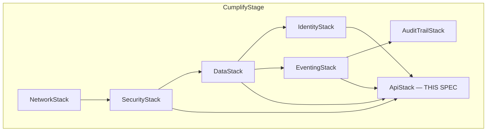

# API Core — Design

**Spec:** `api-core`
**Requirements approved:** R3 (ad1d574, 2026-07-07)
**Steering rules exercised:** `00-stack-facts.md`, `01-tenancy-rules.md`, `03-auth-modes.md`, `04-immutability.md`, `06-cdk-conventions.md`, `07-events.md`, `14-simplicity.md`, `16-identity-boundaries.md`, `19-kiro-truth.md`
**Revision:** R1
**Status:** REQUIRES-HUMAN decisions pending (AUTH-7, RDS-4 connectivity)

---

## 1. AUTH-7 Decision Analysis (REQUIRES-HUMAN)

### 1.1 Problem Statement

AppSync supports multiple auth modes per API. The user-facing auth mechanism
must deliver `tenantId`, `role`, `poolClass`, and entitlement context to every
resolver while enforcing Pool-A rejection (16-identity-boundaries Layer 1).
Two viable options exist; the architect recommends option (a).

### 1.2 Decision Table

| Criterion | (a) `AWS_LAMBDA` authorizer | (b) `AMAZON_COGNITO_USER_POOLS` + PreTokenGeneration |
|-----------|----------------------------|------------------------------------------------------|
| **v7 row 3 "authorizer + entitlement stamp"** | ✅ Directly satisfies — authorizer code returns `resolverContext` with entitlement | ⚠️ Entitlement must be stamped into the ID token via PreTokenGeneration V2_0 trigger; claim size limit (5 KB) constrains stamp payload |
| **Pool-A rejection (Layer 1)** | ✅ Authorizer inspects issuer, rejects Pool A before any role logic | ⚠️ Must be enforced at AppSync level via `userPoolConfig.appIdClientRegex` excluding Pool A clients — works but is indirect |
| **Steering 01 tenantId delivery** | ✅ `resolverContext.tenantId` available in `$ctx.identity.resolverContext` | ✅ `$ctx.identity.claims["custom:tenantId"]` available directly |
| **Steering 03 ABAC (role, permissions)** | ✅ Authorizer performs ABAC and returns computed permissions | ⚠️ Claims are static per token; ABAC must be re-computed in each resolver or stamped at login (stale until token refresh) |
| **Part 24.1 API Gateway reuse** | ✅ Same authorizer Lambda can serve API Gateway custom authorizer — one ABAC brain, two surfaces | ❌ Cognito auth mode is AppSync-specific; API Gateway needs a separate Lambda authorizer anyway |
| **RDS-3 session variable wiring** | ✅ Resolver reads `resolverContext.tenantId` → sets `app.tenant_id` | ✅ Resolver reads claims → sets `app.tenant_id` |
| **Entitlement freshness** | ✅ Authorizer can query DynamoDB/cache on each request for real-time entitlement | ⚠️ Token-stamped entitlement is stale until token refresh (typ. 1h); plan changes require forced token revocation |
| **Cold-start / latency** | ⚠️ Authorizer Lambda adds ~50–150ms cold start; warm <10ms | ✅ No additional Lambda invocation; Cognito verifies JWT internally |
| **Caching** | ✅ AppSync caches authorizer response by token (TTL configurable, max 3600s) | N/A — no authorizer to cache |
| **Complexity** | Medium — one Lambda, JWKS verification, ABAC logic | Low — native integration; but complexity moves to PreTokenGeneration + per-resolver claim parsing |
| **Cost (dev)** | Negligible — authorizer invocations at dev traffic ≈ $0 | $0 — no extra compute |
| **CDK construct** | `CfnGraphQLApi.additionalAuthenticationProviders` with `AWS_LAMBDA` type | `CfnGraphQLApi.userPoolConfig` |

### 1.3 Recommendation

**Option (a) `AWS_LAMBDA`** is the architect recommendation:
- Single ABAC brain reusable across AppSync + API Gateway (Part 24.1)
- Real-time entitlement (no stale-token problem)
- Direct satisfaction of v7 row 3 specification
- Pool-A rejection is explicit in code, not configuration-implicit

**Trade-off accepted:** authorizer Lambda cold start (~100ms first invocation
per container) is mitigated by AppSync's built-in authorizer response caching
(TTL 300s recommended for dev).

### 1.4 Decision Status

**REQUIRES-HUMAN.** Architect presents to owner. Implementation does NOT proceed
until this decision is taken. All subsequent design sections assume option (a)
as the working hypothesis but are marked where option (b) would differ.

---

## 2. Mutation → Audit-Event Table (C-3 / RES-3)

Every mutation declares its audit event BEFORE implementation. Events are
cross-checked against `contracts/events.md`. New registrations marked with ★.

### 2.1 M1 — Document Studio

| Mutation | detailType | module | clauseRef | In registry? |
|----------|-----------|--------|-----------|-------------|
| `createDocumentDraft` | `Document.Approved` | M1 | ISO 9001 7.5.2 | ✅ Yes |
| `submitDocumentForApproval` | `Document.Approved` | M1 | ISO 9001 7.5.2 | ✅ Yes |
| `approveDocumentVersion` | `Document.Approved` | M1 | ISO 9001 7.5.2 | ✅ Yes |
| `publishControlledDocument` | `Document.Published` | M1 | ISO 9001 7.5.3 | ✅ Yes |

> Note: `createDocumentDraft` emits `Document.Approved` only when auto-approve
> is enabled (design simplification — draft creation without approval emits no
> event; the audit trail records the draft via the resolver's DDB metadata write).
> Revisit if the module-spec adds a `Document.DraftCreated` event.

### 2.2 M2 — CAPA

| Mutation | detailType | module | clauseRef | In registry? |
|----------|-----------|--------|-----------|-------------|
| `raiseNonconformity` | `NC.Raised` | M2 | ISO 9001 10.2 | ✅ Yes |
| `recordRootCause` | ★ `CAPA.RootCauseRecorded` | M2 | ISO 9001 10.2 | ★ NEW |
| `createCorrectiveAction` | `CAPA.Opened` | M2 | ISO 9001 10.2 | ✅ Yes |
| `verifyEffectiveness` | `CAPA.EffectivenessVerified` | M2 | ISO 9001 10.2 | ✅ Yes |

### 2.3 M3 — Audit Studio

| Mutation | detailType | module | clauseRef | In registry? |
|----------|-----------|--------|-----------|-------------|
| `createAuditProgramme` | `Audit.Scheduled` | M3 | ISO 9001 9.2.2 | ✅ Yes |
| `scheduleAudit` | `Audit.Scheduled` | M3 | ISO 9001 9.2.1 | ✅ Yes |
| `recordFinding` | `Audit.FindingRaised` | M3 | ISO 9001 9.2.1 | ✅ Yes |

### 2.4 M4 — Records Management

| Mutation | detailType | module | clauseRef | In registry? |
|----------|-----------|--------|-----------|-------------|
| `registerRecord` | `Record.Registered` | M4 | ISO 9001 7.5.3 | ✅ Yes |
| `recordCalibration` | `Calibration.Recorded` | M4 | ISO 9001 7.1.5.2 | ✅ Yes |

> `appendAuditEvent` is the `@aws_iam` agent path — it does NOT publish a
> separate event; it IS the audit event (written directly by the audit-sink
> consumer from spec 5). No double-publish.

### 2.5 M5 — Risk Management

| Mutation | detailType | module | clauseRef | In registry? |
|----------|-----------|--------|-----------|-------------|
| `createRisk` | `Risk.Created` | M5 | ISO 9001 6.1 | ✅ Yes |
| `addRiskTreatment` | ★ `Risk.TreatmentAdded` | M5 | ISO 9001 6.1 | ★ NEW |
| `createChangePlan` | `Change.Planned` | M5 | ISO 9001 6.3 | ✅ Yes |

### 2.6 New Event Registrations Required (C-4)

Before implementation, the following events MUST be appended to
`contracts/events.md`:

| detailType | Domain | Source | Rationale |
|-----------|--------|--------|-----------|
| `CAPA.RootCauseRecorded` | CAPA | `cumplify.m2.capa` | Root-cause recording is a distinct state transition (completeness of 10.2 lifecycle); no existing event covers it |
| `Risk.TreatmentAdded` | Risk | `cumplify.m5.risk` | Treatment addition is auditable (6.1 planning action); existing `Risk.Created` and `Risk.Escalated` don't cover treatment lifecycle |

### 2.7 Audit-Sink Routing Verification

Both new events are checked against the R-3 audit-sink rule (suffix matching):
- `CAPA.RootCauseRecorded` — does NOT match `.Approved`, `.Closed`, `.Raised`,
  `.Evaluated` suffixes. It will NOT auto-route to audit-sink.
- `Risk.TreatmentAdded` — does NOT match the suffixes either.

**Resolution:** These events reach the immutable trail via the resolver's
explicit `appendAuditEvent` call (RES-1(c) → publish → R-3 catches the
corresponding `.Raised`/`.Closed` suffix event when the CAPA/Risk lifecycle
completes). The intermediate state transitions (`RootCauseRecorded`,
`TreatmentAdded`) are recorded in the DDB audit mirror via direct
`appendAuditEvent` invocation by the resolver (bypassing EventBridge for the
audit write, but still publishing to EventBridge for downstream consumers).

**Correction:** Per spec 5 design, the resolver publishes the domain event
to `cumplify-events`; the audit-sink consumer (ESM on `audit-sink.fifo`)
writes to the trail. For events that don't match R-3 suffixes, the resolver
ALSO calls `appendAuditEvent` directly to ensure trail coverage. This
dual-path is acceptable — `attribute_not_exists(pk)` provides idempotency.

---

## 3. Lambda-to-Aurora Connectivity (RDS-4)

### 3.1 Evaluation Matrix

| Criterion (from RDS-4) | (a) RDS Data API | (b) RDS Proxy | (c) Direct VPC |
|------------------------|-----------------|---------------|----------------|
| **VPC attachment** | ❌ Not needed — HTTP endpoint | ✅ Required | ✅ Required |
| **Cold-start impact** | ✅ None (no VPC ENI attach) | ⚠️ VPC cold start ~1–2s (mitigated by SnapStart/provisioned) | ⚠️ Same VPC cold start |
| **Connection pooling** | ✅ Built-in (managed by AWS) | ✅ Built-in (proxy pools connections) | ❌ Must self-manage; pool exhaustion at scale |
| **RLS session-variable support** | ✅ `SET LOCAL` per transaction (transaction-scoped); each `ExecuteStatement` within a `BeginTransaction`/`CommitTransaction` block inherits the session variable | ⚠️ `SET` causes **session pinning** — defeats multiplexing; pinned sessions exhaust the proxy's connection pool under concurrent load | ⚠️ Full control — `SET` works but connection reuse requires explicit reset |
| **Per-request tenant context** | ✅ Transaction-scoped `SET LOCAL app.tenant_id = :tenantId` — guaranteed isolated per request, no leakage between requests | ❌ Session pinning on `SET` means each concurrent tenant pins a connection; with N concurrent tenants, N connections pinned = proxy value negated | ✅ New connection per invocation — works but expensive at scale |
| **Cost (dev)** | ✅ $0 standing; pay-per-request ($0.35/M requests) — negligible at dev traffic | ❌ **Standing cost: ~$43.80/mo** (db.t4g.micro, min instance size × 730h × $0.06/hr) — Part 27 flag | ✅ $0 standing (Lambda networking only) |
| **Cost (prod, 1000 RPM)** | ~$15/mo (requests) | ~$175/mo (db.r6g.large proxy) | $0 (but operational risk) |
| **Aurora 0-ACU resume** | ✅ Data API handles resume internally; client sees ~15–30s latency on first call after pause — Lambda timeout must accommodate | ⚠️ Proxy health checks may fail during resume; retries needed | ⚠️ Direct TCP connection fails until resume completes |
| **Lambda timeout budget** | 30s minimum (15s resume + query time) | 30s minimum | 30s minimum |
| **Maturity / GA** | GA since 2023; Aurora PostgreSQL 16.x supported | GA; well-established | N/A — direct driver |
| **CDK enablement** | `cluster.grantDataApiAccess(role)` + set `enableDataApi: true` on cluster | `new rds.DatabaseProxy(...)` | Security group rules only |

### 3.2 Part 27 Cost Estimate (standing-cost options)

| Option | Dev monthly | Prod monthly (est.) | Standing? |
|--------|------------|--------------------|----|
| (a) Data API | ~$0 | ~$15 at 1000 RPM | No |
| (b) RDS Proxy | ~$44 | ~$175 | **Yes — Part 27 flag** |
| (c) Direct VPC | $0 | $0 | No (but operational risk) |

### 3.3 Recommendation

**Option (a) RDS Data API** is recommended:
1. Zero standing cost (Part 27 compliant — no new standing-cost resources).
2. No VPC attachment → no Lambda cold-start penalty from ENI creation.
3. Transaction-scoped `SET LOCAL` provides per-request tenant isolation
   without session-pinning problems.
4. Built-in connection pooling eliminates pool-exhaustion risk.
5. Handles Aurora 0-ACU resume transparently (client sees latency, not error).

**Trade-off accepted:** Data API adds ~5–10ms latency per query vs direct TCP
(HTTP overhead). At our dev/early-prod traffic, this is immaterial. If
sub-5ms query latency becomes critical at scale, direct VPC with a connection
manager can be evaluated — but RDS Proxy is excluded due to session-pinning.

**Implementation change required:** `enableDataApi: true` must be added to the
Aurora cluster in DataStack (spec 1 amendment — design task, not a new stack).

### 3.4 Decision Status

Architect recommends (a). **REQUIRES-HUMAN** for owner confirmation given it
adds a DataStack property change. No code written until confirmed.

---

## 4. Migration Tooling (RDS-6)

### 4.1 Options Evaluated

| Tool | Idempotency | Pipeline integration | Language | Notes |
|------|------------|---------------------|----------|-------|
| Raw SQL files (numbered) | ✅ Manual via `IF NOT EXISTS` / applied-migrations table | Simple — Lambda or CDK custom resource runs sequentially | SQL | Minimal deps; full PostgreSQL DDL control |
| node-pg-migrate | ✅ Built-in migrations table | npm script or Lambda | TypeScript/JS | Mature; generates up/down; TypeScript config |
| Prisma Migrate | ✅ `_prisma_migrations` table | CLI or programmatic | TypeScript | Heavy ORM; adds runtime dep; overkill for RLS-heavy schema |
| Flyway | ✅ `flyway_schema_history` table | Java-based CLI or Docker | SQL/Java | Battle-tested; but Java dependency in a Node stack |
| Drizzle Kit | ✅ `__drizzle_migrations` table | CLI push/pull | TypeScript | Lightweight; good DX; schema-as-code |

### 4.2 Recommendation: Raw SQL migrations + CDK Custom Resource

**Rationale:**
1. **Full DDL control** — RLS policies, `security_invoker` views, `SET LOCAL`
   functions, and PostgreSQL-specific features are expressed in native SQL
   without ORM translation uncertainty.
2. **Minimal dependencies** — no ORM runtime in Lambda bundles; no Java in
   the toolchain.
3. **Idempotency** — a `_migrations` table tracks applied files by filename
   hash; each migration runs inside a transaction with rollback on failure.
4. **Pipeline integration** — a CDK Custom Resource Lambda executes pending
   migrations on every deploy (via Data API). Migrations are committed in
   `services/api/migrations/` as numbered `.sql` files.
5. **Consistency** — same pattern as the existing `services/audit-trail/`
   library structure.

**Structure:**
```
services/api/
  migrations/
    001_create_schemas.sql
    002_m1_document_studio.sql
    003_m2_capa.sql
    004_m3_audit_studio.sql
    005_m4_records_management.sql
    006_m5_risk_management.sql
    007_rls_policies.sql
    008_risk_register_view.sql
  src/
    migrator.ts          # Custom Resource handler
    migration-runner.ts  # Executes SQL files via Data API
```

**Idempotency contract:**
- Each `.sql` file runs exactly once (tracked by filename in `_migrations`).
- Files are applied in numeric order.
- A failed migration aborts the deploy (Custom Resource signals FAILED).
- Re-running a successful migration is a no-op.

---

## 5. Naming Governance

### 5.1 Rule

**The module-spec's "Core data entities" lists (M1–M5) GOVERN table naming.**
Architecture C.1's older schema-grouped names (e.g., `quality_records`,
`audit_finding`, `capa`) are SUPERSEDED where they differ from module-spec.

### 5.2 Mapping (differences highlighted)

| C.1 name | Module-spec name (GOVERNS) | Module | Resolution |
|----------|---------------------------|--------|------------|
| `quality_records` | `records` | M4 | Use `records` |
| `calibration_record` | `calibration_records` | M4 | Use `calibration_records` (plural) |
| `capa` | `corrective_actions` + `nonconformities` (split) | M2 | Use module-spec's split entities |
| `audit_finding` | `audit_findings` (plural) | M3 | Use `audit_findings` |
| `audit_programme` | `audit_programmes` (plural) | M3 | Use `audit_programmes` |
| `risk_register` | `risks` + `risk_register_view` (split) | M5 | Use module-spec's split: base table `risks`, materialized view `risk_register_view` |
| `document` | `documents` (plural) | M1 | Use `documents` |
| `root_cause` | `root_cause_analyses` | M2 | Use `root_cause_analyses` |
| `effectiveness_verification` | `capa_effectiveness_checks` | M2 | Use `capa_effectiveness_checks` |

### 5.3 Schema Organization

Tables are organized under PostgreSQL schemas by module:

| Schema | Tables |
|--------|--------|
| `m1` | documents, document_versions, document_approvals, document_distribution, policies, ims_scope |
| `m2` | nonconformities, root_cause_analyses, corrective_actions, capa_effectiveness_checks, nonconforming_outputs |
| `m3` | audit_programmes, audits, audit_checklists, audit_findings, audit_readiness_scores |
| `m4` | records, retention_policies, measuring_resources, calibration_records |
| `m5` | risks, risk_treatments, change_plans |
| `m5_views` | risk_register_view (materialized view — see §6.4 for isolation) |

> C.1's domain-grouped schemas (`quality`, `capa`, `audit`, `environmental`,
> `ohs`, `legal`, `objectives`, `mgmt_review`) are superseded by per-module
> schemas for M1–M5. M6–M13 schemas will follow the same `m<N>` convention
> when those modules ship (P3).

---

## 6. Architecture Overview

### 6.1 Stack Placement



**ApiStack** depends on:
- **DataStack** — CumplifyCore table ARN/name, Aurora cluster ARN/endpoint,
  Data API enablement, DynamoDB CMK
- **IdentityStack** — Pool B/C user pool IDs, JWKS endpoints
- **SecurityStack** — WAFv2 WebACL ARN, KMS keys
- **EventingStack** — bus name/ARN (for publisher permissions)

### 6.2 Request Flow (option (a) — AWS_LAMBDA authorizer)

```
Client (AppSync SDK / Amplify)
  │  GraphQL request + Pool B/C ID token in Authorization header
  ▼
AppSync API
  │  1. Invokes Lambda authorizer (or returns cached response)
  ▼
Lambda Authorizer [REQUIRES-HUMAN]
  │  2. Validates JWT (JWKS), rejects Pool A / expired / missing tenantId
  │  3. Returns resolverContext: {tenantId, role, poolClass, sub, entitlement}
  ▼
AppSync (cached auth context, TTL 300s)
  │  4. Routes to resolver Lambda based on field
  ▼
Resolver Lambda (NodejsFunction, node22, ARM_64, 512MB)
  │  5. Reads resolverContext.tenantId
  │  6. BEGIN TRANSACTION via Data API
  │     SET LOCAL app.tenant_id = :tenantId
  │     Execute domain query/mutation (RLS enforced)
  │     COMMIT
  │  7. Optionally write DDB metadata (tenant-scoped role, LeadingKeys)
  │  8. Publish audit event via services/eventing publisher
  ▼
EventBridge cumplify-events
  │  9. R-3 audit-sink rule (suffix match) → FIFO router → audit-sink.fifo
  ▼
Audit-sink consumer (spec 5)
  │  10. appendAuditEvent → chained DDB item
  ▼
DynamoDB Streams → WORM Sealer → S3 Object Lock COMPLIANCE
```

### 6.3 Tenant Isolation — Four Enforcement Points

| Layer | Mechanism | Requirement |
|-------|-----------|-------------|
| 1. Authorizer | Pool-A rejection; tenantId extraction from ID token | AUTH-1, AUTH-4 |
| 2. RDS (RLS) | `SET LOCAL app.tenant_id`; RLS policy on every base table | RDS-2, RDS-3 |
| 3. DynamoDB (IAM) | Tenant-scoped role with `LeadingKeys` condition | ROLE-1, ROLE-2 |
| 4. Resolver logic | Client-supplied tenantId overwritten by verified claim | SCHEMA-5 |

### 6.4 risk_register_view Isolation (A-4 resolution)

`risk_register_view` is a PostgreSQL **materialized view** (cross-standard
risk rollup). RLS cannot be applied to materialized views.

**Design:** Create a `security_invoker` SQL function that:
1. Sets `app.tenant_id` from the caller's session.
2. Queries the materialized view with an explicit `WHERE tenant_id = current_setting('app.tenant_id')`.
3. Returns the filtered result set.

Direct `SELECT` on `risk_register_view` is revoked from the application role.
Access is ONLY through the function. ACC-5 proof includes a dedicated test
for the materialized view path (function returns zero rows for cross-tenant).

---

## 7. Construct Choices

| Component | CDK Construct | Key props |
|-----------|--------------|-----------|
| AppSync API | `appsync.GraphqlApi` | `authorizationConfig` with `AWS_LAMBDA` (default) + `AWS_IAM` (additional); `xrayEnabled: true`; `logConfig: { fieldLogLevel: ALL, excludeVerboseContent: false }` |
| Lambda authorizer | `NodejsFunction` | `runtime: NODEJS_22_X`, `architecture: ARM_64`, `memorySize: 512`, `timeout: Duration.seconds(10)`, `bundling: { externalModules: [], target: 'node22' }` |
| Resolver Lambdas | `NodejsFunction` | Same runtime config; `timeout: Duration.seconds(30)` (accommodates Aurora resume); one Lambda per module (M1–M5) |
| Tenant-data role | `iam.Role` | `assumedBy: new iam.ServicePrincipal('lambda.amazonaws.com')`; inline policy with DynamoDB LeadingKeys condition; session tag `tenantId` |
| WAFv2 association | `wafv2.CfnWebACLAssociation` | `resourceArn: api.arn`, `webAclArn: securityStack.webAclArn` |
| Migration Custom Resource | `cr.Provider` + `NodejsFunction` | Runs on deploy; executes SQL migrations via Data API |
| CfnOutputs | `CfnOutput` | GraphQL API URL, API ID, authorizer ARN, tenant-data-role ARN |

**CDK Nag compliance:**
- AppSync logging enabled (AwsSolutions-ASC1).
- WAFv2 associated (AwsSolutions-ASC2 equivalent).
- Lambda functions: no `*` resource in IAM policies; explicit ARN scoping.
- All Lambda environment variables sourced from stack props (no hardcoded secrets).

---

## 8. Cross-Stack Integration

### 8.1 Props Interface

```typescript
interface ApiStackProps extends cdk.StackProps {
  envConfig: EnvConfig;
  // DataStack
  tableArn: string;
  tableName: string;
  dynamodbKey: kms.IKey;
  clusterArn: string;
  clusterEndpoint: string;
  dbSecretArn: string;
  // IdentityStack
  poolBId: string;
  poolBArn: string;
  poolCId: string;
  poolCArn: string;
  // SecurityStack
  webAclArn: string;
  // EventingStack
  busName: string;
  busArn: string;
}
```

### 8.2 CumplifyStage Wiring

```typescript
const apiStack = new ApiStack(this, 'ApiStack', {
  envConfig,
  tableArn: dataStack.tableArn,
  tableName: dataStack.tableName,
  dynamodbKey: securityStack.outputs.dynamodbKey,
  clusterArn: dataStack.clusterArn,       // NEW export
  clusterEndpoint: dataStack.clusterEndpoint,
  dbSecretArn: dataStack.dbSecretArn,     // NEW export
  busName: eventingStack.busName,
  busArn: eventingStack.busArn,
  poolBId: identityStack.poolBId,
  poolBArn: identityStack.poolBArn,
  poolCId: identityStack.poolCId,
  poolCArn: identityStack.poolCArn,
  webAclArn: securityStack.webAclArn,
});
apiStack.addDependency(dataStack);
apiStack.addDependency(identityStack);
apiStack.addDependency(securityStack);
apiStack.addDependency(eventingStack);
```

### 8.3 New Exports Required from Existing Stacks

| Stack | New export | Type | Purpose |
|-------|-----------|------|---------|
| DataStack | `clusterArn` | string | Data API `resourceArn` parameter |
| DataStack | `dbSecretArn` | string | Data API `secretArn` parameter |
| DataStack | `enableDataApi: true` | cluster prop | Activates HTTP Data API endpoint |
| IdentityStack | `poolBId`, `poolBArn` | string | Authorizer JWKS endpoint resolution |
| IdentityStack | `poolCId`, `poolCArn` | string | Authorizer JWKS endpoint resolution |

---

## 9. Testing Strategy

### 9.1 Template Assertion Unit Tests (C-1)

Every L1 detail in ApiStack is verified by template-assertion tests:

| Assertion | Target |
|-----------|--------|
| AppSync API exists with correct auth config | `AWS::AppSync::GraphQLApi` |
| Lambda authorizer has correct runtime/memory/timeout | `AWS::Lambda::Function` |
| Resolver Lambdas have correct config (×5) | `AWS::Lambda::Function` |
| Tenant-data role has LeadingKeys condition | `AWS::IAM::Policy` |
| WAFv2 association exists | `AWS::WAFv2::WebACLAssociation` |
| CfnOutputs present (4 outputs) | `AWS::CloudFormation::Output` |
| Migration Custom Resource exists | `AWS::CloudFormation::CustomResource` |

### 9.2 Acceptance Readback Plan

| ACC | Method | Executor | Evidence |
|-----|--------|----------|----------|
| ACC-1 | Real GraphQL mutation → check RDS row → check DDB metadata → check EventBridge delivery → check audit-sink DDB item → check S3 WORM object | Architect (cloud-touching) | Command log + cdk-outputs.json SHA |
| ACC-2 | `aws iam simulate-principal-policy` with cross/same tenant context keys | Architect | Verbatim output capture |
| ACC-3 | `curl` / AppSync client with synthetic Pool-A / expired / missing-tenantId JWTs | Architect | HTTP 401 response bodies |
| ACC-4 | Trigger chain-verifier Lambda (spec 5) after ACC-1 events written | Architect | CloudWatch log showing PASS |
| ACC-5 | Lambda invocation with Data API: tenant-A session → query → rows; tenant-B session → same query → zero rows | Architect | Verbatim query results |

### 9.3 Cross-Tenant Denial Suite (C-7)

Mandatory integration tests (run in CI post-deploy):
1. **Authorizer denial:** Pool-A token → 401.
2. **DynamoDB denial:** simulate-principal-policy cross-tenant → implicitDeny.
3. **RDS RLS denial:** tenant-B session querying tenant-A data → empty result.
4. **Materialized view denial:** tenant-B calling `risk_register_view` accessor → empty result.
5. **Resolver overwrite:** client-supplied tenantId in mutation input → verified claim used (SCHEMA-5).

---

## 10. Subscription Analysis (SCHEMA-4)

Per module-spec M1–M5, the following subscriptions are specified:

| Module | Subscription | Trigger mutation | Required? |
|--------|-------------|-----------------|-----------|
| M1 | `onDocumentStatusChanged(tenantId)` | `publishDocumentEvent` (@aws_iam, None DS) | Yes — module-spec lists it |
| M2 | `onCAPAStatusChanged(tenantId)` | `publishCAPAEvent` (@aws_iam, None DS) | Yes — module-spec lists it |
| M3 | `onFindingRecorded(tenantId)` | `publishAuditEvent` (@aws_iam, None DS) | Yes — module-spec lists it |
| M4 | `onCalibrationDue(tenantId)` | (timer-driven, not mutation-triggered) | Yes — module-spec lists it |
| M5 | `onRiskEscalated(tenantId)` | `publishRiskEvent` (@aws_iam, None DS) | Yes — module-spec lists it |

**All five modules require subscriptions.** Each uses a None data source with
an `@aws_iam` publish mutation. The subscription resolver MUST verify
`tenantId` against the caller's claim (C-6).

M4's `onCalibrationDue` is timer-driven (EventBridge Scheduler → Lambda →
publish mutation). Design defers the scheduler to the M4 resolver
implementation; the subscription mechanism is identical.

---

## 11. SOC 2 / Compliance Impact

**Criteria touched:** CC6 (logical access), CC7 (integrity), A1 (availability).

- **CC6:** Lambda authorizer enforces identity boundary (Pool-A rejection);
  tenant-scoped IAM role (LeadingKeys); RLS at database layer. Three-layer
  logical access control.
- **CC7:** Every mutation emits an immutable audit event; hash chain integrity
  verified daily (ACC-4). Data integrity from ingestion through sealed storage.
- **A1:** Aurora auto-resume handled via Data API timeout budget; no single
  point of failure in the auth path (authorizer cache provides resilience
  during authorizer Lambda cold starts).

---

## 12. Open Questions for Architect Review

| # | Question | Blocking? |
|---|----------|-----------|
| OQ-1 | AUTH-7 decision: confirm option (a) AWS_LAMBDA | Yes — all code depends on this |
| OQ-2 | RDS Data API: confirm recommendation; approve DataStack `enableDataApi` change | Yes — resolver implementation depends on connectivity |
| OQ-3 | Authorizer cache TTL: 300s appropriate for dev? (trade-off: stale entitlement vs cold-start mitigation) | No — tunable post-deploy |
| OQ-4 | M4 `onCalibrationDue` scheduler: defer to task implementation or design now? | No — subscription mechanism is independent |
