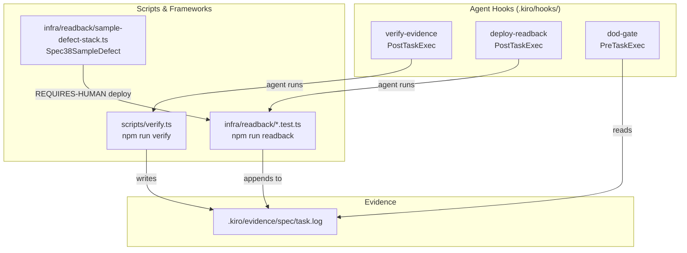

# Spec 38 — build-verification-harness: Design

**Requirements approved:** 2026-07-02
**Analysis findings:** 9/9 resolved (resolutions approved with tightenings)

---

## 1. Architecture & Data Flow

### 1.1 Component overview



### 1.2 Steering rules exercised

| Rule | How exercised |
|---|---|
| `19-kiro-truth.md` rule 2 | Evidence log existence is the completion truth |
| `13-testing.md` | Property-based tests mandatory on services/*; pyramid enforced by gate order |
| `02-aoss-rule.md` | Readback assertions on AOSS paths carry 45s timeout budget |
| `14-simplicity.md` | No new services introduced; scripts are TypeScript in the existing stack |
| `06-cdk-conventions.md` | CDK Nag = failure in step 5; synth uses the existing app |

### 1.3 Hook-type rationale (F-7 resolution)

All three hooks use `"type": "agent"` (not `"type": "command"`) because:
- The agent must determine the `<spec>` and `<task>` names from session context
  to construct the correct log path.
- The agent must identify the touched module for step 6's `--module` argument.
- The agent must interpret readback output and report it in the task context.

**The log file, not agent prose, is the completion truth.** The dod-gate hook
reads the log directly; the agent's claim is never a substitute.

---

## 2. Contracts Consumed / Produced

### Consumed
- `cumplify-dev-readonly` AWS profile (read-only, dev account) — for readback.
- Existing package.json scripts infrastructure (npm run).
- CDK app entrypoint at `infra/bin/` (when spec 1 creates it).

### Produced
- `npm run verify` — the evidence-gate entry point.
- `npm run readback` — the readback test entry point.
- Evidence log format (§4 below) — consumed by dod-gate and human reviewers.
- `infra/readback/` test pattern — consumed by every subsequent spec's §7.

### Contracts updated
- `contracts/` — no changes (this spec produces no API/event contracts).

---

## 3. Data Model Changes

None. This spec produces build tooling only — no RDS schema, DynamoDB items,
or AOSS indexes are created or modified.

**Tenant-isolation statement:** Not applicable. No tenant data is accessed.
The readback tests read infrastructure metadata (IAM policies, resource
configurations) via the aws-api MCP's read-only profile, never tenant content.

---

## 4. Evidence-Log Format Specification

Every evidence log at `.kiro/evidence/<spec>/<task>.log` follows this format:

```
=== EVIDENCE LOG ===
spec: <spec-name>
task: <task-id>
git-sha: <HEAD at execution time>
started: <ISO-8601 UTC, e.g. 2026-07-02T14:30:00Z>
script-version: <package.json version of scripts/verify.ts>
=====================================

=== STEP 1: npm ci [START 2026-07-02T14:30:01Z] ===
<full stdout/stderr>
=== STEP 1: npm ci [PASS 2026-07-02T14:30:12Z] ===

=== STEP 2: tsc --noEmit [START 2026-07-02T14:30:12Z] ===
<full stdout/stderr>
=== STEP 2: tsc --noEmit [PASS 2026-07-02T14:30:18Z] ===

=== STEP 3: eslint + prettier [START ...] ===
...
=== STEP 3: eslint + prettier [PASS ...] ===

=== STEP 4: unit + property tests [START ...] ===
<vitest output>
=== STEP 4: unit + property tests [PASS ...] ===

=== STEP 5: cdk synth + CDK Nag [START ...] ===
<synth output>
=== STEP 5: cdk synth + CDK Nag [PASS ...] ===

=== STEP 6: integration tests (module: <name>) [START ...] ===
<output or "no integration tests defined for module X">
=== STEP 6: integration tests (module: <name>) [SKIPPED 2026-07-02T14:31:00Z] ===

=== RESULT: PASS (steps 1-5 green, step 6 skipped) | MAX-RUNG: D1 ===
=== ENDED: 2026-07-02T14:31:00Z ===
```

The RESULT line encodes the **maximum eligible D-rung** based on what passed:
- All steps PASS, no SKIPPED → MAX-RUNG per the highest evidence gathered.
- Any SKIPPED step → MAX-RUNG capped at the rung below what that step proves
  (e.g., step 6 SKIPPED → max D1; readback not appended → max D2).

### Skip rules (F-1/F-2/F-4 tightenings)

- **Every skip is SKIPPED in the log, never PASS.** No silent skips.
- **dod-gate treats SKIPPED module-integration as not-green for D2 and above.**
  A task at D2+ cannot close with a SKIPPED step 6.
- Step 5 skip ("no CDK entrypoint"): only triggers when `infra/bin/` contains
  no `.ts` file. A CDK app that *exists but fails to load* is a FAIL.
- Step 6 skip ("no integration tests"): only when the module directory has no
  test files matching `*.integration.test.ts`.
- `npm ci` is unconditional (Part 39 Layer 1) — never skipped.

---

## 5. @local / @dev Test Tag Convention (F-2 resolution)

Integration tests in step 6 are tagged by execution environment:

```typescript
// In test file metadata or describe block:
// @local — runs against LocalStack (DynamoDB, SQS, S3 basic ops)
// @dev   — requires real dev account (IAM policy evaluation, KMS,
//          AOSS cold-start semantics that emulators cannot reproduce)
```

**Execution rules:**
- `@local` tests run unconditionally (LocalStack is a dev dependency).
- `@dev` tests run only when `AWS_PROFILE=cumplify-dev-readonly` is available
  and can assume the role. If unavailable: SKIPPED with warning in log.
- AOSS-path `@dev` tests set a 45-second timeout per assertion (02-aoss-rule).
- Readback tests (`infra/readback/`) are always `@dev` — they read the live
  account by definition.

---

## 6. Property-Based Test Mechanical Check (F-6 resolution)

The evidence-gate script enforces the 13-testing.md property-based mandate
mechanically in step 4:

```
For every directory matching services/<name>/ (excluding services/_scaffold/):
  IF the directory contains source .ts files (excluding index.ts, types.ts)
  AND does NOT contain at least one *.property.test.ts file
  THEN step 4 FAILS with:
    "FAIL: services/<name>/ has no property-based test (*.property.test.ts).
     Per 13-testing.md, property-based tests are mandatory on services/*."
```

The scaffold template lives at `services/_scaffold/example.property.test.ts`
and is excluded from this check (it is a reference, not production code).

This is a hard gate, not advisory. The test-sync hook provides earlier
feedback at file-save time (advisory), but the evidence gate is the
enforcement point.

---

## 7. Readback Framework & F-5 Boundary

### What spec 38 ships
- The `infra/readback/` directory structure with Vitest config (serial
  execution, no watch mode).
- Assertion helper utilities: `assertResource(name, designed, observed)` that
  formats the pass/fail output per AC-2.4.
- `npm run readback` script entry (runs `vitest run infra/readback/`).
- One sample assertion: the `Spec38SampleDefect` S3 bucket check (for AC-5.2).

### What spec 38 does NOT ship (F-5 boundary)
The AC-2.2 assertion list (CumplifyCore, Lambdas, IAM, SQS, VPC) arrives
with spec 1's `design.md §7`. Each subsequent spec adds its own assertions
per Part 39's grow-per-spec rule. No placeholder assertions are created.

### Spec38SampleDefect stack (F-8 resolution)
```typescript
// infra/readback/sample-defect-stack.ts
// A minimal CDK stack with ONE intentional defect for AC-5.2 proof.
// Stack name: Spec38SampleDefect
// Contains: one S3 bucket WITHOUT ObjectLockConfiguration
// RemovalPolicy: DESTROY (no data stored)
// Purpose: human deploys → readback fails with
//   "observed: undefined, designed: COMPLIANCE" → evidence captured → teardown
```

### Readback execution
- Vitest runs serially (no parallelism — AWS API rate limits).
- AOSS-path assertions carry `{ timeout: 45_000 }` per test.
- `npm run readback` exits non-zero on any assertion failure.

---

## 8. Hook Prompt Updates (F-9 resolution)

After scripts are implemented, the three hook prompts are updated:

**verify-evidence.json:**
```
"Run `npm run verify -- --spec <spec-name> --task <task-id> --module <touched-module>`.
 Omitting --module is intentional only when the task touches no single service
 module (e.g., cross-cutting scripts or infra-only changes) — state the reason
 in the task context. The script writes to .kiro/evidence/<spec>/<task>.log.
 If the script exits non-zero, the task is NOT complete — report the failure
 verbatim from the log. The log file is the completion truth, not this message."
```

**deploy-readback.json:**
```
"If the just-completed task performed no deployment (no cdk deploy in its
 evidence log), reply 'no deploy — skipped' and stop. Otherwise run
 `npm run readback`. Report each assertion pass/fail with observed vs designed
 values. Any mismatch is a defect on the deploying spec."
```

**dod-gate.json:**
```
"If the task being started is not named close:* and is not a phase-gate task,
 reply 'not a gate task — skipped' and stop. Otherwise enumerate the D-rung
 evidence required (Part 40) and verify: (1) .kiro/evidence/<spec>/<task>.log
 exists, (2) all steps show PASS (SKIPPED is not green for D2+), (3) for D3+
 the readback table is appended and green. Refuse to proceed with missing or
 insufficient evidence; list exactly what's missing."
```

---

## 9. Tech.md Amendment (design-phase obligation per 14-simplicity.md)

Add to tech.md `## Third-party (non-AWS)` section:

```
- Vitest (test runner), fast-check (property-based testing), eslint, prettier,
  tsx (TypeScript execution) — dev/test tooling only, not deployed
- LocalStack (Docker-run AWS service emulator for @local integration tests) —
  dev/test only, not deployed. Machine prerequisite: Docker (confirmed installed).
```

This will be committed as part of spec 38's implementation tasks.

---

## 10. SOC 2 Impact (per 11-soc2.md)

**Criteria touched:** CC8 (Change management).

This spec produces the *evidence-generation infrastructure* that supports
CC8's requirement for documented, tested, reviewed changes reaching production.
Every subsequent spec's task closure produces evidence logs that feed the
SOC 2 audit trail — this spec is the machine that generates that evidence.

**Evidence emitted:** `.kiro/evidence/<spec>/<task>.log` files — the proof
that code was compiled, tested, synthesized, and (at D3+) deployed and
verified. These logs are committed to the repo and are available to auditors.

**Controls exercised:** CDK Nag enforcement (CC8 — no non-compliant infra
reaches prod); evidence-gate ordering (CC8 — tests before deploy is mandatory,
not voluntary).

---

## 11. Audit Events Emitted

**None.** This spec is build tooling — it does not write to the CumplifyCore
AUDITLOG, emit domain events to EventBridge, or modify tenant-visible state.
The evidence logs it produces are git-committed artifacts, not runtime audit
events. This is explicitly stated per the evidence-first rule: build tooling
that produces no compliance-state mutations emits no audit events.

---

## 12. Cost Impact

**Monthly cost delta: $0 by construction — no persistent resources created,
nothing to price.**

- The `Spec38SampleDefect` S3 bucket exists only during the AC-5.2 proof
  (REQUIRES-HUMAN, immediate teardown, seconds to minutes). No data stored.
- `npm run readback` makes read-only API calls against the dev account.
- All other components are local scripts and CI steps — no deployed
  infrastructure.

**Part 27 tripwire:** Not triggered ($0).

---

## 13. Failure Modes, Retry/DLQ, and Rollback Move

### Failure modes
| Failure | Impact | Mitigation |
|---|---|---|
| Evidence-gate script crashes mid-run | Partial log written; task stays open | Script wraps each step in try/catch; partial log still shows which step failed |
| Readback test hangs (AOSS cold start) | Script blocked | 45-second per-assertion timeout; overall 5-minute test timeout |
| npm ci fails (registry down) | Step 1 fails; log captures | Retry once; if persistent, human intervention (network issue) |
| CDK synth fails on a valid change | Blocks task closure | Report verbatim; developer fixes; never weaken the gate |

### Rollback move
This spec produces scripts and configuration only — no deployed infrastructure
(except the ephemeral Spec38SampleDefect during AC-5.2, which has
`RemovalPolicy.DESTROY` and explicit teardown). Rollback = revert the commit.
No cloud state to unwind.

---

*Design complete. Do not generate tasks yet.*
