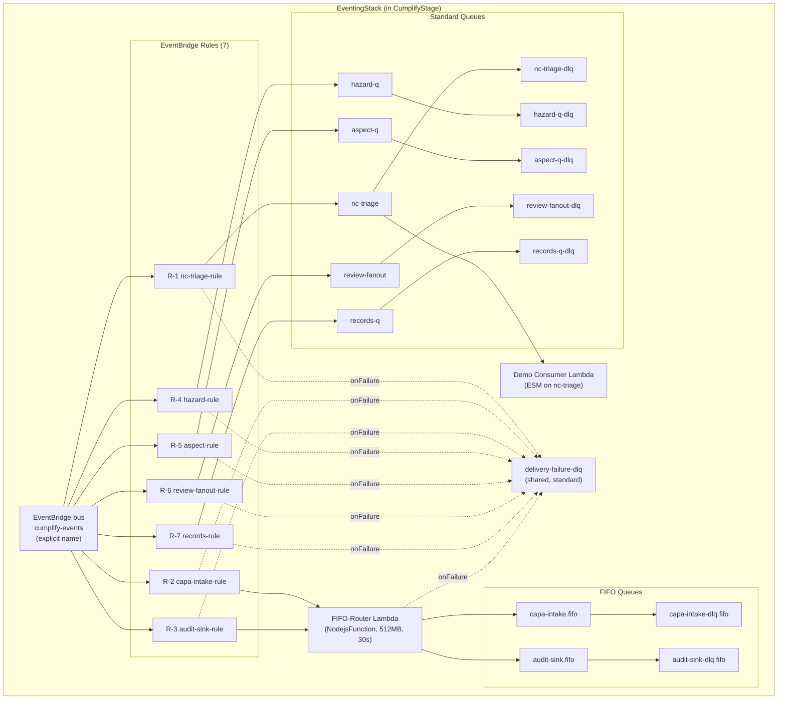

# Eventing Backbone — Design

**Spec:** `eventing-backbone`
**Requirements approved:** 2026-07-04 (R2 + CON-8 addition)
**Steering rules exercised:** `00-stack-facts.md`, `07-events.md`, `14-simplicity.md`, `19-kiro-truth.md`, `06-cdk-conventions.md`
**Architect design constraints:** D-1 (readback vs ESM), D-2 (fast poison test), D-3 (router routing key + registry nuances)
**Revision:** R2 — architect review 2026-07-04 (FIX-1 through FIX-7 applied)

---

## 1. Architecture Overview



**Flow summary:**
1. Any module Lambda publishes an event via the `services/eventing` publisher → EventBridge bus `cumplify-events`.
2. Rules match on `detail-type` and route to standard queues (via input transformer) or the FIFO-router Lambda (for FIFO queues).
3. **Canonical queue-message contract (FIX-1):** every message body arriving in any queue has the shape `{"detailType": "<Domain>.<Action>", "detail": {CumplifyEvent}}`. This is enforced by input transformers on ALL rule targets (direct SQS and router alike).
4. The FIFO-router extracts `detail.tenantId` → `MessageGroupId` and `detail.eventId` → `MessageDeduplicationId`, then sends to the appropriate FIFO queue. The target queue is stamped by the rule's input transformer (D-3).
5. Each queue has a paired DLQ. Every rule target has a RetryPolicy + DeadLetterConfig pointing to the shared delivery-failure DLQ.
6. The demo consumer Lambda (ESM on `nc-triage`) proves the end-to-end path for readback.

---

## 2. Construct Choices

| Component | CDK Construct | Key props |
|-----------|--------------|-----------|
| EventBridge bus | `events.EventBus` | `eventBusName: 'cumplify-events'` |
| FIFO queues | `sqs.Queue` | `fifo: true`, `contentBasedDeduplication: false`, `enforceSSL: true`, `visibilityTimeout: Duration.seconds(360)`, `deadLetterQueue: { queue: <dlq>, maxReceiveCount: 3 }` |
| FIFO DLQs | `sqs.Queue` | `fifo: true`, `enforceSSL: true` + NagSuppression (AwsSolutions-SQS3: "is a dead-letter queue") |
| Standard queues | `sqs.Queue` | `enforceSSL: true`, `visibilityTimeout: Duration.seconds(360)`, `deadLetterQueue: { queue: <dlq>, maxReceiveCount: 3 }` |
| Standard DLQs | `sqs.Queue` | `enforceSSL: true` + NagSuppression (AwsSolutions-SQS3: "is a dead-letter queue") |
| Delivery-failure DLQ | `sqs.Queue` | `enforceSSL: true` + NagSuppression (AwsSolutions-SQS3: "is a dead-letter queue"); standard; shared across all rule targets |
| EventBridge rules | `events.Rule` | `eventBus`, `eventPattern: { detailType: [...] }`, targets with `RetryPolicy` + `deadLetterQueue` + input transformer |
| FIFO-router Lambda | `NodejsFunction` | `memorySize: 512`, `timeout: Duration.seconds(30)`, `bundling: { externalModules: [], target: 'node22' }`, `runtime: Runtime.NODEJS_22_X`, `architecture: Architecture.ARM_64` |
| Demo consumer Lambda | `NodejsFunction` | `memorySize: 512`, `timeout: Duration.seconds(60)`, `bundling: { externalModules: [], target: 'node22' }`, `runtime: Runtime.NODEJS_22_X`, `architecture: Architecture.ARM_64` |
| Demo consumer ESM | `SqsEventSource` | `queue: ncTriageQueue`, `batchSize: 10`, `reportBatchItemFailures: true` |
| CloudWatch alarms | `cloudwatch.Alarm` | per DLQ (8 total: 7 consumer + 1 delivery), metric `ApproximateNumberOfMessagesVisible`, threshold 1, period 5m, evaluationPeriods 3 (= 15 min), `treatMissingData: TreatMissingData.NOT_BREACHING` |
| CfnOutputs | `CfnOutput` | one per: bus name, bus ARN, 7× queue URL, 7× queue ARN, 7× DLQ ARN, delivery-DLQ ARN, 7× rule name, router Lambda ARN, demo consumer Lambda ARN, demo consumer log group name |

**FIX-3 (CDK Nag):** `enforceSSL: true` on ALL 16 queues (satisfies AwsSolutions-SQS4). DLQs get `NagSuppressions.addResourceSuppressions(dlq, [{ id: 'AwsSolutions-SQS3', reason: 'This is a dead-letter queue — no redrive policy needed' }])`. Encryption: default SSE-SQS this spec — CMK posture revisits with spec 5 (audit trail). Accepted decision.

**FIX-4:** Runtime `NODEJS_22_X`, esbuild target `node22` — consistent with spec 1 and the toolchain. No second runtime introduced.

**FIX-6:** `treatMissingData: TreatMissingData.NOT_BREACHING` — an idle queue emits no datapoints; default would leave alarms in INSUFFICIENT_DATA. Alarms have no notification action until spec 14 wires alerting (accepted).

**Graviton (ARM_64):** all Lambdas use `architecture: Architecture.ARM_64` per v3 Part 25.2 cost lever (20% better price-perf).

---

## 3. Canonical Queue-Message Contract (FIX-1)

Every SQS message body in any queue — whether delivered by a direct SQS target or by the FIFO-router — has this shape:

```json
{
  "detailType": "CAPA.Opened",
  "detail": {
    "tenantId": "tenant-123",
    "eventId": "01J...",
    "timestamp": "2026-07-04T12:00:00Z",
    "actor": "CAPAGuru",
    "module": "M2",
    "clauseRef": "ISO 9001 10.2",
    "standard": "ISO9001",
    "payload": { ... }
  }
}
```

**Enforcement:**

- **Direct SQS targets (R-1, R-4–R-7):** each rule target uses an input transformer that reshapes the EventBridge envelope into the canonical form (see §3.1).
- **FIFO-router (R-2, R-3):** the router's input transformer also produces this shape; the router then wraps `{ detailType, detail }` into the `MessageBody` when calling `SendMessage`.
- **consumer.ts:** validates ET-4 fields on `parsed.detail` (not top-level); reads `parsed.detailType` for logging.

### 3.1 Input Transformer (all rules)

All 7 rules use this input transformer pattern:

```json
{
  "inputPathsMap": { "dt": "$.detail-type", "detail": "$.detail" },
  "inputTemplate": "{\"detailType\": \"<dt>\", \"detail\": <detail>}"
}
```

**FIX-2 (quoting):** `<dt>` resolves to a string value and is wrapped in escaped quotes (`\"<dt>\"`). `<detail>` resolves to an object and is injected unquoted (it serializes as a JSON object directly).

**CDK implementation note:** `RuleTargetInput.fromObject()` auto-quotes `EventField` tokens, which corrupts object injection. Use a hand-authored `InputTransformer` on the `CfnRule` level (or `RuleTargetInput.fromText()` with a raw template string) to produce the exact template above.

---

## 4. Routing Table (Rule → Pattern → Target)

| Rule ID | Rule logical name | Event pattern (`detail-type`) | Target | Additional transformer fields |
|---------|------------------|-------------------------------|--------|-------------------------------|
| R-1 | `NcTriageRule` | `["Audit.FindingRaised", "Incident.Reported", "EnvIncident.Reported", "Aspect.SignificantImpact"]` | `nc-triage` queue (direct SQS) | canonical transform only |
| R-2 | `CapaIntakeRule` | `["NC.Raised", "CAPA.Opened", "CAPA.Closed", "CAPA.EffectivenessVerified", "CAPA.ActionRequiresDocChange"]` | FIFO-router Lambda | + `"targetQueue": "CAPA_INTAKE_QUEUE_URL"` |
| R-3 | `AuditSinkRule` | `[{"suffix": ".Approved"}, {"suffix": ".Closed"}, {"suffix": ".Raised"}, {"suffix": ".Evaluated"}, "AuditEvent.Appended"]` | FIFO-router Lambda | + `"targetQueue": "AUDIT_SINK_QUEUE_URL"` |
| R-4 | `HazardRule` | `["Hazard.Identified", "Hazard.RiskEscalated", "Incident.Reported", "Safety.MetricLogged"]` | `hazard-q` queue (direct SQS) | canonical transform only |
| R-5 | `AspectRule` | `["Aspect.SignificantImpact", "Enviro.MonitoringLogged", "EnvIncident.Reported", "EnvEmergency.PlanUpdated"]` | `aspect-q` queue (direct SQS) | canonical transform only |
| R-6 | `ReviewFanoutRule` | `["Audit.Completed", "CAPA.Closed", "Objectives.Updated", "Aspect.SignificantImpact", "Incident.Reported", "Compliance.Evaluated", "Risk.Escalated", "Context.Updated"]` | `review-fanout` queue (direct SQS) | canonical transform only |
| R-7 | `RecordsRule` | `[{"prefix": "CAPA."}, {"prefix": "Document."}, {"prefix": "Risk."}]` | `records-q` queue (direct SQS) | canonical transform only |

**All targets** carry: `retryPolicy: { retryAttempts: 3, maximumEventAge: Duration.hours(24) }` and `deadLetterQueue: deliveryFailureDlq`.

### 4.1 R-2/R-3 Extended Input Transformer (D-3)

```json
// R-2 (CapaIntakeRule)
{
  "inputPathsMap": { "dt": "$.detail-type", "detail": "$.detail" },
  "inputTemplate": "{\"targetQueue\": \"CAPA_INTAKE_QUEUE_URL\", \"detailType\": \"<dt>\", \"detail\": <detail>}"
}

// R-3 (AuditSinkRule)
{
  "inputPathsMap": { "dt": "$.detail-type", "detail": "$.detail" },
  "inputTemplate": "{\"targetQueue\": \"AUDIT_SINK_QUEUE_URL\", \"detailType\": \"<dt>\", \"detail\": <detail>}"
}
```

### 4.2 Registry Note (D-3 — `contracts/events.md`)

`Change.Planned` is in the **Risk domain** but does NOT match the `records-q` prefix rule (R-7's `"Risk."` prefix). It is a planning event, not a record-bearing state change. Later specs must be aware: record-bearing events are matched by `detail-type` PREFIX (`CAPA.`, `Document.`, `Risk.`), not by domain membership. This will be documented as a note in `contracts/events.md`.

### 4.3 R-3 Mixed Pattern Verification (FIX-7)

R-3 mixes constant strings and suffix operators in one `detail-type` pattern array. This is not explicitly shown in AWS documentation as a supported combination. **Before first deploy**, a unit test must call `events:TestEventPattern` (via the SDK) proving:
- `Document.Approved` → **matches** (suffix `.Approved`)
- `AuditEvent.Appended` → **matches** (constant string)
- `Hazard.Identified` → **does NOT match**

**Fallback:** if `TestEventPattern` rejects the mixed array, replace `"AuditEvent.Appended"` with `{"suffix": ".Appended"}` and record the broadened match scope in `contracts/events.md` (any future `*.Appended` event would also route to audit-sink — acceptable given the append-only audit trail semantics, but must be noted).

---

## 5. `services/eventing/` Package Layout

```
services/eventing/
├── package.json          # workspace package: "@cumplify/eventing"
├── tsconfig.json
├── src/
│   ├── index.ts          # barrel export
│   ├── types.ts          # CumplifyEvent<T> envelope + QueueMessage wrapper
│   ├── publisher.ts      # publish() — wraps PutEvents
│   ├── consumer.ts       # createHandler() — SQS batch processor with poison routing
│   └── constants.ts      # source prefixes, event-name registry (type-safe)
├── handlers/
│   ├── fifo-router.ts    # FIFO-router Lambda entry point
│   └── demo-consumer.ts  # Demo consumer Lambda entry point (log-and-ack)
└── __tests__/
    ├── publisher.test.ts
    ├── consumer.test.ts
    ├── fifo-router.test.ts
    └── event-pattern.test.ts  # FIX-7: TestEventPattern verification
```

### 5.1 `types.ts` — Event Envelope + Queue Message

```typescript
export interface CumplifyEvent<T = Record<string, unknown>> {
  tenantId: string;
  eventId: string;       // ULID
  timestamp: string;     // ISO 8601
  actor: string;         // cognito sub or agentName
  module: string;        // M1..M13
  clauseRef: string;     // ISO clause string
  standard: 'ISO9001' | 'ISO14001' | 'ISO45001';
  payload: T;
}

/** Canonical queue-message contract (FIX-1).
 *  Every SQS message body in any queue has this shape. */
export interface QueueMessage<T = Record<string, unknown>> {
  detailType: string;    // Domain.Action
  detail: CumplifyEvent<T>;
}
```

### 5.2 `publisher.ts` — Core Logic

```typescript
import { EventBridgeClient, PutEventsCommand } from '@aws-sdk/client-eventbridge';
import { Logger } from '@aws-lambda-powertools/logger';
import { ulid } from 'ulid';
import { CumplifyEvent } from './types';

const client = new EventBridgeClient({});
const logger = new Logger({ serviceName: 'eventing-publisher' });

export interface PublishOptions {
  busName: string;
  source: string;        // e.g. 'cumplify.m2.capa'
  detailType: string;    // e.g. 'CAPA.Opened'
  event: CumplifyEvent;
}

export async function publish(opts: PublishOptions): Promise<string> {
  const event = { ...opts.event, eventId: opts.event.eventId || ulid() };
  const cmd = new PutEventsCommand({
    Entries: [{
      EventBusName: opts.busName,
      Source: opts.source,
      DetailType: opts.detailType,
      Detail: JSON.stringify(event),
    }],
  });
  const result = await client.send(cmd);
  if (result.FailedEntryCount && result.FailedEntryCount > 0) {
    logger.error('PutEvents partial failure', { detailType: opts.detailType, eventId: event.eventId });
    throw new Error(`PutEvents failed: ${result.Entries?.[0]?.ErrorMessage}`);
  }
  logger.info('Event published', { detailType: opts.detailType, tenantId: event.tenantId, eventId: event.eventId });
  return event.eventId;
}
```

### 5.3 `consumer.ts` — SQS Batch Processor with Poison Routing (D-2, FIX-1)

```typescript
import { SQSEvent, SQSBatchResponse, SQSBatchItemFailure } from 'aws-lambda';
import { SQSClient, SendMessageCommand } from '@aws-sdk/client-sqs';
import { Logger } from '@aws-lambda-powertools/logger';
import { CumplifyEvent, QueueMessage } from './types';

const sqsClient = new SQSClient({});
const logger = new Logger({ serviceName: 'eventing-consumer' });

export type EventHandler<T = Record<string, unknown>> = (
  event: CumplifyEvent<T>,
  detailType: string,
) => Promise<void>;

export interface ConsumerConfig {
  dlqUrl: string;
  handler: EventHandler;
}

/**
 * Creates an SQS batch handler with:
 * - Canonical queue-message parsing (FIX-1: body = {detailType, detail})
 * - Envelope validation (ET-4 fields on .detail)
 * - Poison-message explicit DLQ send on parse/validation failure (D-2)
 * - Partial batch failure reporting (reportBatchItemFailures)
 * - Powertools structured logging
 */
export function createHandler(config: ConsumerConfig) {
  return async (sqsEvent: SQSEvent): Promise<SQSBatchResponse> => {
    const batchItemFailures: SQSBatchItemFailure[] = [];

    for (const record of sqsEvent.Records) {
      try {
        const msg = parseAndValidate(record.body);
        logger.info('Processing event', {
          detailType: msg.detailType,
          tenantId: msg.detail.tenantId,
          eventId: msg.detail.eventId,
        });
        await config.handler(msg.detail, msg.detailType);
      } catch (err) {
        if (err instanceof PoisonMessageError) {
          // D-2: explicit DLQ send — immediate, no 18-minute wait
          logger.warn('Poison message → DLQ', {
            messageId: record.messageId,
            reason: err.message,
          });
          await sqsClient.send(new SendMessageCommand({
            QueueUrl: config.dlqUrl,
            MessageBody: record.body,
            MessageAttributes: {
              PoisonReason: { DataType: 'String', StringValue: err.message },
              OriginalMessageId: { DataType: 'String', StringValue: record.messageId },
            },
          }));
          // Do NOT add to batchItemFailures — message is handled (sent to DLQ)
        } else {
          // Transient error — let SQS retry via visibility timeout
          logger.error('Transient processing failure', {
            messageId: record.messageId,
            error: (err as Error).message,
          });
          batchItemFailures.push({ itemIdentifier: record.messageId });
        }
      }
    }
    return { batchItemFailures };
  };
}

class PoisonMessageError extends Error {
  constructor(reason: string) { super(reason); this.name = 'PoisonMessageError'; }
}

/** FIX-1: parse canonical queue-message contract {detailType, detail} */
function parseAndValidate(body: string): QueueMessage {
  let parsed: any;
  try {
    parsed = JSON.parse(body);
  } catch {
    throw new PoisonMessageError('JSON parse failure');
  }
  // Validate wrapper
  if (typeof parsed.detailType !== 'string') {
    throw new PoisonMessageError('Missing or invalid detailType');
  }
  if (!parsed.detail || typeof parsed.detail !== 'object') {
    throw new PoisonMessageError('Missing or invalid detail object');
  }
  // Validate mandatory envelope fields on .detail (ET-4)
  const required = ['tenantId', 'eventId', 'timestamp', 'actor', 'module', 'clauseRef', 'standard', 'payload'];
  for (const field of required) {
    if (!(field in parsed.detail)) {
      throw new PoisonMessageError(`Missing envelope field: detail.${field}`);
    }
  }
  return parsed as QueueMessage;
}
```

---

## 6. FIFO-Router Lambda Design (D-3, FIX-1, FIX-5)

### 6.1 Router Handler (`handlers/fifo-router.ts`)

```typescript
import { SQSClient, SendMessageCommand } from '@aws-sdk/client-sqs';
import { Logger } from '@aws-lambda-powertools/logger';

const sqsClient = new SQSClient({});
const logger = new Logger({ serviceName: 'fifo-router' });

// Queue URL map from environment variables
const QUEUE_MAP: Record<string, string> = {
  CAPA_INTAKE_QUEUE_URL: process.env.CAPA_INTAKE_QUEUE_URL!,
  AUDIT_SINK_QUEUE_URL: process.env.AUDIT_SINK_QUEUE_URL!,
};

interface RouterEvent {
  targetQueue: string;   // env var key stamped by input transformer (D-3)
  detailType: string;    // Domain.Action
  detail: {
    tenantId: string;
    eventId: string;
    [key: string]: unknown;
  };
}

export async function handler(event: RouterEvent): Promise<void> {
  const queueUrl = QUEUE_MAP[event.targetQueue];
  if (!queueUrl) {
    throw new Error(`Unknown targetQueue key: ${event.targetQueue}`);
  }

  // FIX-1: MessageBody = canonical queue-message contract
  const messageBody = JSON.stringify({
    detailType: event.detailType,
    detail: event.detail,
  });

  await sqsClient.send(new SendMessageCommand({
    QueueUrl: queueUrl,
    MessageBody: messageBody,
    MessageGroupId: event.detail.tenantId,
    MessageDeduplicationId: event.detail.eventId,
  }));

  logger.info('Routed to FIFO', {
    targetQueue: event.targetQueue,
    detailType: event.detailType,
    tenantId: event.detail.tenantId,
    eventId: event.detail.eventId,
  });
}
```

### 6.2 Failure Handling (RTR-6)

- **Invocation failure** (Lambda error, throttle): EventBridge rule's `RetryPolicy` (3 retries, 24h max age) handles it; after exhaustion → delivery-failure DLQ via the rule target's `DeadLetterConfig`.
- **Processing failure** (unknown targetQueue, SQS SendMessage error): Lambda throws → caught by EventBridge retry. The Lambda is invoked asynchronously by EventBridge, so its `onFailure` destination (delivery-failure DLQ) catches errors that exhaust Lambda's internal retry (2 built-in retries for async invoke).

### 6.3 CDK Wiring (FIX-5)

```typescript
import * as destinations from 'aws-cdk-lib/aws-lambda-destinations';

const router = new NodejsFunction(this, 'FifoRouterFn', {
  entry: 'services/eventing/handlers/fifo-router.ts',
  handler: 'handler',
  runtime: Runtime.NODEJS_22_X,
  architecture: Architecture.ARM_64,
  memorySize: 512,
  timeout: Duration.seconds(30),
  bundling: { externalModules: [], target: 'node22' },
  environment: {
    CAPA_INTAKE_QUEUE_URL: capaIntakeQueue.queueUrl,
    AUDIT_SINK_QUEUE_URL: auditSinkQueue.queueUrl,
    POWERTOOLS_SERVICE_NAME: 'fifo-router',
  },
  onFailure: new destinations.SqsDestination(deliveryFailureDlq),
});

// FIX-5: Grant send-message to both FIFO queues
capaIntakeQueue.grantSendMessages(router);
auditSinkQueue.grantSendMessages(router);

// Grant send to delivery-failure DLQ (for onFailure destination)
deliveryFailureDlq.grantSendMessages(router);
```

The rule target wiring (EventBridge → Lambda):
```typescript
import * as targets from 'aws-cdk-lib/aws-events-targets';

// R-2 target
capaIntakeRule.addTarget(new targets.LambdaFunction(router, {
  retryAttempts: 3,
  maxEventAge: Duration.hours(24),
  deadLetterQueue: deliveryFailureDlq,
}));

// R-3 target — same Lambda, different input transformer
auditSinkRule.addTarget(new targets.LambdaFunction(router, {
  retryAttempts: 3,
  maxEventAge: Duration.hours(24),
  deadLetterQueue: deliveryFailureDlq,
}));
```

Note: input transformers for R-2/R-3 are applied at the `CfnRule` level (L1 escape hatch) because `targets.LambdaFunction` does not expose input transformer configuration. The L2 `Rule` construct creates the rule; then `(rule.node.defaultChild as events.CfnRule)` is used to set the `InputTransformer` on the target entry.

---

## 7. Demo Consumer Lambda Design (CON-8)

### 7.1 Queue Choice: `nc-triage`

The demo consumer is wired to `nc-triage` (standard queue) because:
- It is the entry point of the NC/CAPA chain (Appendix B) — the most common event flow.
- It is a standard queue (simpler ESM semantics than FIFO for the demo).
- It validates the direct rule→queue→consumer path (R-1) end-to-end in readback.

### 7.2 Handler (`handlers/demo-consumer.ts`)

```typescript
import { createHandler } from '../src/consumer';
import { CumplifyEvent } from '../src/types';

const DLQ_URL = process.env.NC_TRIAGE_DLQ_URL!;

const businessLogic = async (event: CumplifyEvent, detailType: string): Promise<void> => {
  // Throwaway-grade: log and acknowledge
  // Production consumers will replace this with actual agent invocations
};

export const handler = createHandler({
  dlqUrl: DLQ_URL,
  handler: businessLogic,
});
```

### 7.3 CDK Wiring

```typescript
const demoConsumer = new NodejsFunction(this, 'DemoConsumerFn', {
  entry: 'services/eventing/handlers/demo-consumer.ts',
  handler: 'handler',
  runtime: Runtime.NODEJS_22_X,
  architecture: Architecture.ARM_64,
  memorySize: 512,
  timeout: Duration.seconds(60),
  bundling: { externalModules: [], target: 'node22' },
  environment: {
    NC_TRIAGE_DLQ_URL: ncTriageDlq.queueUrl,
    POWERTOOLS_SERVICE_NAME: 'demo-consumer',
  },
});

// Grant send-message to the DLQ (for explicit poison routing per D-2)
ncTriageDlq.grantSendMessages(demoConsumer);

// ESM: wire to nc-triage queue
demoConsumer.addEventSource(new SqsEventSource(ncTriageQueue, {
  batchSize: 10,
  reportBatchItemFailures: true,
}));
```

---

## 8. Readback Plan (D-1, D-2, D-3)

### 8.1 Constraint Summary

| Constraint | Implication for readback |
|------------|------------------------|
| **D-1** | `nc-triage` has an ESM (demo consumer drains it). Readback CANNOT poll `nc-triage` for arrival. Instead: publish event → verify arrival via demo consumer's Powertools structured log (filter for `eventId` match in CloudWatch Logs). All other queues (no ESM) use `ReceiveMessage` polling. |
| **D-2** | Poison test uses explicit DLQ send (immediate). Readback sends a malformed message directly to `nc-triage` → demo consumer validates → poison → explicit send to DLQ → readback polls `nc-triage-dlq` for the poison message. Completes in seconds. |
| **D-3** | FIFO path readback: publish a CAPA event → verify it arrives in `capa-intake` FIFO (no ESM, poll directly). Separately, publish a `Document.Approved` event → verify `audit-sink` FIFO (no ESM, poll directly). Both pass through the FIFO-router; successful arrival proves the input-transformer + router chain. |

### 8.2 Readback Test Matrix

| # | Test | Method | Asserts | Req |
|---|------|--------|---------|-----|
| 1 | Bus exists | `DescribeEventBus` via SDK | ARN matches output | EB-2 |
| 2 | All queues exist | `GetQueueAttributes` on each URL from outputs | URL resolves, attributes match (FIFO flag, visibility timeout 360s, DLQ policy, enforceSSL) | SQS-G1, SQS-G3, FIX-3 |
| 3 | All rules exist | `DescribeRule` on each rule name from outputs | State=ENABLED, event pattern correct | R-8 |
| 4 | Standard-queue direct path (hazard-q) | Publish `Hazard.Identified` → `ReceiveMessage` on `hazard-q` | `body.detail.eventId` matches published eventId; arrives < 30s | RB-2, FIX-1 |
| 5 | Standard-queue direct path (records-q) | Publish `Document.Published` → `ReceiveMessage` on `records-q` | `body.detail.eventId` matches; `body.detailType` = `Document.Published` | RB-2, R-7, FIX-1 |
| 6 | FIFO path via router (capa-intake) | Publish `CAPA.Opened` → `ReceiveMessage` on `capa-intake.fifo` | `body.detail.eventId` matches; message present within 30s | RB-2, RTR-2 |
| 7 | FIFO path via router (audit-sink) | Publish `Document.Approved` → `ReceiveMessage` on `audit-sink.fifo` | `body.detail.eventId` matches; suffix rule matched | RB-2, R-3 |
| 8 | ESM-drained path (nc-triage → demo consumer) | Publish `Audit.FindingRaised` → poll CloudWatch Logs for demo consumer log entry with matching `eventId` | Log entry found within 60s (D-1); log contains `detailType` and `tenantId` | RB-2, ACC-1 |
| 9 | Poison → DLQ (explicit send, D-2) | Send malformed JSON directly to `nc-triage` via `SendMessage` → poll `nc-triage-dlq` for message with `PoisonReason` attribute | DLQ message found within 30s; `PoisonReason` = "JSON parse failure" or "Missing or invalid detailType" | RB-3, ACC-2 |
| 10 | Cold-start: FIFO-router | Direct `Invoke` on router Lambda (cold) with synthetic event | Completes < 30s; log cold-start duration | RB-4, C-8 |
| 11 | Cold-start: demo consumer | Direct `Invoke` on demo consumer Lambda (cold, with synthetic SQS event payload) | Completes < 60s; log cold-start duration | RB-4, C-8 |
| 12 | ALL DLQ alarms exist (8 total) | `DescribeAlarms` filtered by prefix | 8 alarms found: 7 consumer DLQs + 1 delivery-failure DLQ; all have `treatMissingData: notBreaching` | DLV-4, SQS-G4, FIX-6 |

### 8.3 Readback Evidence Format (RB-5, 19-kiro-truth.md rule 8)

Each readback run produces a table:

```
| Timestamp | Test # | Result | Duration | Notes |
|-----------|--------|--------|----------|-------|
| 2026-07-XX T...Z | 1 | PASS | 1.2s | ARN: arn:aws:events:... |
| ... | ... | ... | ... | ... |

Exit code: 0
cdk-outputs.json blob SHA: <git hash-object infra/cdk-outputs.json>
```

---

## 9. Contracts Produced / Updated

| Artifact | Action | Contents |
|----------|--------|----------|
| `contracts/events.md` | **Created** | Full seed taxonomy (§3.1 of requirements), envelope schema (ET-4), canonical queue-message contract (FIX-1), naming convention, prefix-match note for R-7 (D-3: `Change.Planned` is Risk domain but does NOT match `Risk.` prefix), R-3 suffix-match scope note if fallback triggered (FIX-7) |
| `services/eventing/package.json` | **Created** | `@cumplify/eventing` workspace package |
| `infra/lib/eventing-stack.ts` | **Created** | EventingStack CDK construct |
| `cdk-outputs.json` (post-deploy) | **Updated** | Bus, queue, DLQ, rule, Lambda outputs appended |

---

## 10. SOC 2 Impact

| Criteria | Impact |
|----------|--------|
| CC7 Operations | DLQ alarms ensure no silent event loss; delivery-failure DLQ covers the bus→queue gap; `enforceSSL: true` on all queues |
| CC8 Change management | EventingStack deploys via CDK Pipeline only; CDK Nag enforced (FIX-3 SSL + suppressions) |
| A1 Availability | RetryPolicy (24h) + DLQs mean transient failures do not lose events; consumers handle poison without crash-looping |

---

## 11. Cost Impact

| Resource | Monthly estimate (dev) | Notes |
|----------|----------------------|-------|
| EventBridge | < $1 | First 64K custom events/mo free; dev traffic negligible |
| SQS (7 queues + 8 DLQs + 1 delivery DLQ) | < $1 | First 1M requests free; FIFO at $0.35/M after |
| Lambda (router + demo, idle) | $0 | Pay-per-invoke; dev traffic is readback only |
| CloudWatch alarms (8) | ~$0.80 | $0.10/alarm/mo |
| **Total** | **< $3/mo** | Well within Part 27 cost discipline |

---

## 12. Accepted Decisions

| Decision | Rationale |
|----------|-----------|
| SSE-SQS (not CMK) for queue encryption | CMK posture revisits with spec 5 (audit trail). Default SSE-SQS satisfies CDK Nag and is sufficient for non-audit infrastructure queues. |
| DLQ alarms have no notification action | Spec 14 (`observability-dr`) wires SNS/alerting. This spec provisions the alarms only. |
| R-3 fallback to `{"suffix": ".Appended"}` if mixed pattern fails TestEventPattern | Broadened match (any `*.Appended`) is acceptable — only `AuditEvent.Appended` exists today; future events ending in `.Appended` would logically belong in the audit sink anyway. Noted in `contracts/events.md`. |

---

## 13. Open Design Decisions

None. All decisions resolved by architect constraints D-1/D-2/D-3 and FIX-1 through FIX-7.
