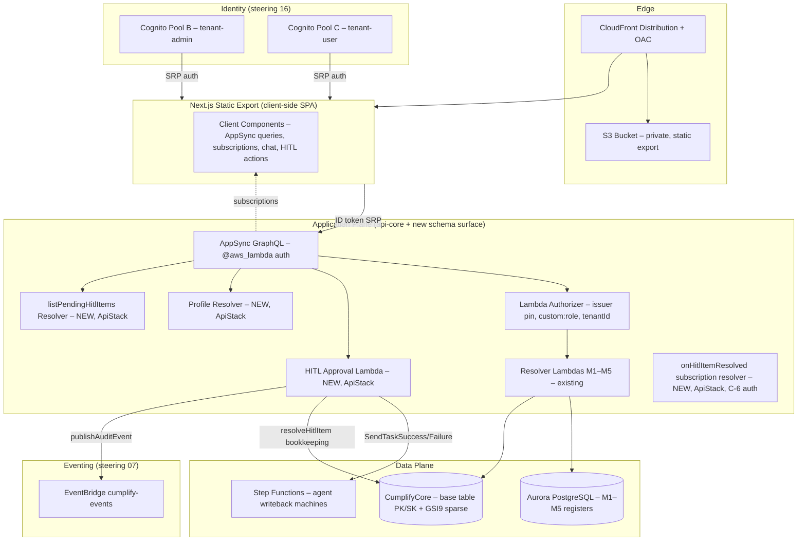

# Frontend App — Design R2

**Spec:** `frontend-app` (spec 9)
**Requirements approved:** 2026-07-10 (R2, commit `0fa7a2b`)
**Design revision:** R2 — addresses architect review D-1..D-9 + owner FRM-4 decision (33f1e57)
**Steering rules exercised:** `21-framer-ui-source.md`, `01-tenancy-rules.md`, `03-auth-modes.md`, `05-hitl.md`, `12-token-metering.md`, `16-identity-boundaries.md`, `17-i18n.md`

---

## 1. Architecture & Data Flow



### Request paths

| Path | Flow | Steering |
|------|------|----------|
| Initial load (static) | CloudFront → S3 (index.html) → browser renders SPA shell | — |
| Data fetch (client-side) | Browser → AppSync (ID token via Amplify Auth SRP) → resolvers → RDS/DDB | 03-auth-modes |
| Real-time updates | Client → AppSync WebSocket (ID token, tenantId verified C-6) → subscription events | 03-auth-modes |
| HITL approval | Client → AppSync `approveHitlItem` → HITL Approval Lambda → SFN + DDB + EventBridge | 05-hitl, 01-tenancy |
| Ask Cumplify | Client → AppSync query (`askISO*`, question text only) → guru resolver → ai-invoker | 12-token-metering |
| Profile save | Client → AppSync `updateProfile` → Profile Resolver → DDB `PROFILE#` item | 01-tenancy |
| Pending HITL list | Client → AppSync `listPendingHitlItems` → query resolver → DDB GSI9 | 01-tenancy |

---

## 2. Contracts Consumed & Produced

### 2.1 Consumed (existing api-core schema — no changes)

All queries, mutations, and subscriptions in `services/api/schema/schema.graphql` (M1–M5 + guru queries + 4 active subscriptions). The frontend calls these as-is.

### 2.2 Produced — Consolidated New Schema Surface (BC-7, REQUIRES-HUMAN)

**Owner signs a 5-field bundle:** `listPendingHitlItems` (query), `approveHitlItem` (mutation), `onHitlItemResolved` (subscription), `getProfile` (query), `updateProfile` (mutation).

**Owning stack:** ApiStack (`infra/lib/api-stack.ts`) — new data sources + resolvers wired there alongside existing M1–M5.

```graphql
# ─── HITL Types ───────────────────────────────────────────────────────────────

enum HitlDecision {
  APPROVE
  SEND_BACK
}

type GuardrailEvidence @aws_lambda {
  groundingScore: Float
  arVerdict: String
  arDetails: String
  citations: [Citation!]
}

type Citation @aws_lambda {
  clauseRef: String!
  sourceChunk: String
  score: Float
}

type HitlItem @aws_lambda {
  hitlItemId: ID!
  agentName: String!
  clauseRef: String
  standard: Standard
  module: String!
  draftBody: String!
  status: String!
  createdAt: AWSDateTime!
  guardrailEvidence: GuardrailEvidence
  # taskToken is EXCLUDED (BC-8) — never exposed to client
}

type HitlApprovalResult @aws_lambda {
  hitlItemId: ID!
  decision: HitlDecision!
  auditEventId: String!
  auditEventTimestamp: AWSDateTime!
  resolvedBy: String!
  resolvedAt: AWSDateTime!
}

# ─── HITL Inputs ──────────────────────────────────────────────────────────────

input ApproveHitlItemInput {
  hitlItemId: ID!
  decision: HitlDecision!
  editedPayload: AWSJSON
  note: String
  justification: String
}

# ─── Pagination ───────────────────────────────────────────────────────────────

input PaginationInput {
  limit: Int
  nextToken: String
}

type HitlItemConnection @aws_lambda {
  items: [HitlItem!]!
  nextToken: String
}

# ─── Profile Types ────────────────────────────────────────────────────────────

type UserProfile @aws_lambda {
  userId: ID!
  locale: String!
  updatedAt: AWSDateTime!
}

input UpdateProfileInput {
  locale: String!
}

# ─── New Query ────────────────────────────────────────────────────────────────

extend type Query {
  listPendingHitlItems(pagination: PaginationInput): HitlItemConnection! @aws_lambda
  getProfile: UserProfile @aws_lambda
}

# ─── New Mutation ─────────────────────────────────────────────────────────────

extend type Mutation {
  approveHitlItem(input: ApproveHitlItemInput!): HitlApprovalResult! @aws_lambda
  updateProfile(input: UpdateProfileInput!): UserProfile! @aws_lambda
}

# ─── New Subscription ─────────────────────────────────────────────────────────
# @aws_subscribe return type MUST match the mutation's return type (D-2 fix).
# C-6 auth: subscription resolver Lambda verifies tenantId claim.

extend type Subscription {
  onHitlItemResolved(tenantId: ID!): HitlApprovalResult
    @aws_subscribe(mutations: ["approveHitlItem"])
    @aws_lambda
}
```

**New data sources in ApiStack:**
- `HitlApprovalDS` → NodejsFunction `services/api/src/resolvers/hitl-approval.ts`
- `HitlQueryDS` → NodejsFunction `services/api/src/resolvers/hitl-query.ts`
- `ProfileDS` → NodejsFunction `services/api/src/resolvers/profile.ts`
- `HitlSubscriptionDS` → None data source (with C-6 subscription auth resolver Lambda)
- `HitlSweeperFn` → NodejsFunction `services/api/src/resolvers/hitl-sweeper.ts` + EventBridge Schedule (rate 5 min). IAM: DDB Query GSI9 + UpdateItem on CumplifyCore (tenant-scoped via LeadingKeys). Part of the REQUIRES-HUMAN IAM bundle.

**Tenant isolation:** `listPendingHitlItems` queries GSI9 with key prefix `TENANT#<tenantId>#HITL_PENDING` where tenantId is from `resolverContext` (never client). `approveHitlItem` fetches the HITL item by base-table key and verifies tenantId ownership before acting. `getProfile`/`updateProfile` operate on `PROFILE#<userId>` with tenant-scoped PK. Subscription `onHitlItemResolved` verifies tenantId server-side (C-6 pattern, dedicated resolver Lambda).

---

### 2.3 HITL Approval Lambda Contract

**Location:** `services/api/src/resolvers/hitl-approval.ts`
**Auth:** `@aws_lambda` (user-facing, Lambda authorizer derives tenantId + sub + role)

**Flow:**

```
1. Extract from resolverContext: tenantId, sub (approverSub), role
2. Validate role has approval permission for the item's module
   → Part 13 matrix checked via shared module (§2.5)
   → 403 if not authorized
3. Fetch HITL item from DDB base table:
   GetItem(PK=TENANT#<tenantId>#HITL, SK=PENDING#<hitlItemId>)
   (verified: services/agents/shared/store-token.ts:54, hitl.ts:106)
   → 404 if not found or tenantId mismatch (defense-in-depth)
4. Guard: conditional UpdateItem with ConditionExpression:
   attribute_exists(PK) AND #status = :pending
   Sets status = RESOLVING, resolvingAt = <now> (optimistic lock — prevents double-approval race)
   → On ConditionalCheckFailedException: return 409 "already resolved"
5. Extract taskToken from the item (server-side only — BC-8)
6. Extract sfnExecutionArn from the item (populated by carry #3 amendment)
7. Branch on decision:
   a. APPROVE:
      - Build output: { decision:'APPROVE', approverSub, editedPayload?, justification? }
      - Call SFN SendTaskSuccess(taskToken, JSON.stringify(output))
      - Catch States.TaskDoesNotExist / TaskTimedOut → return 410 "task expired"
      - Call resolveHitlItem(tenantId, hitlItemId, 'APPROVED', approverSub) for bookkeeping
   b. SEND_BACK:
      - Call SFN SendTaskFailure(taskToken, error:'SENT_BACK', cause: note)
      - Catch States.TaskDoesNotExist / TaskTimedOut → return 410 "task expired"
      - Call resolveHitlItem(tenantId, hitlItemId, 'REJECTED', approverSub) for bookkeeping
8. Publish audit event (Hitl.Approved or Hitl.SentBack) via publishAuditEvent
   (auditTrail: true — sealed to immutable trail)
9. Return HitlApprovalResult { hitlItemId, decision, auditEventId, auditEventTimestamp,
   resolvedBy: approverSub, resolvedAt }
```

**Error mapping:**
- 403: role lacks module-approval permission
- 404: item not found / tenant mismatch
- 409: item already resolved (conditional check failed — race with another approver)
- 410: SFN task expired (TaskDoesNotExist / TaskTimedOut)

**IAM permissions (approval Lambda execution role):**
- `dynamodb:GetItem`, `dynamodb:UpdateItem` on CumplifyCore (tenant-scoped via LeadingKeys)
- `states:SendTaskSuccess`, `states:SendTaskFailure` — resource-scoping to the HITL state machine ARN(s); exact ARN pattern verified at build time against deployed state machines
- `events:PutEvents` on `cumplify-events` bus (via publisher)

### 2.4 HITL-10: SFN Amendment + Carry #3 (REQUIRES-HUMAN, AiStack)

**Bundle (one owner sign-off, packaged with the BC-7 schema surface):**

1. **Carry #3 — sfnExecutionArn on HITL item:** Amend the WaitForApproval task's `Parameters` to include `"sfnExecutionArn.$": "$$.Execution.Id"` in the payload passed to the store-token step. The store-token Lambda (`services/agents/shared/store-token.ts`) adds a `sfnExecutionArn` SET field to its UpdateItem. **Note:** sfnExecutionArn does NOT exist on the HITL item today — this amendment creates it.

2. **Send-back branch (D-5 RULED):** `SEND_BACK = SendTaskFailure(error: 'SENT_BACK')`. The WaitForApproval state adds a `Catch`:
   ```json
   "Catch": [{
     "ErrorEquals": ["SENT_BACK"],
     "Next": "HandleSendBack"
   }]
   ```
   `HandleSendBack` state: logs the send-back, marks the agent task for re-drafting (re-draft logic owned by `agents-existing-8` — this spec defines the state-machine skeleton only).

**Affected resources:** AiStack state machine definitions (`services/agents/`). This is `14-simplicity.md` human-gated domain.

### 2.5 Part 13 Permission Matrix — Shared Module

**Location:** `services/api/src/permissions/role-matrix.ts` (new, versioned)

A compile-time map encoding the Part 13 permission matrix:
```typescript
export const ROLE_MODULE_PERMISSIONS: Record<string, Set<string>> = {
  'management-rep':   new Set(['M1','M2','M3','M4','M5','M6','M7','M8','M9','M10','M11','M12','M13']),
  'quality-manager':  new Set(['M1','M2','M3','M4','M5','M7','M11','M12','M13']),
  'ehs-manager':      new Set(['M5','M7','M8','M9','M10','M11']),
  'document-controller': new Set(['M1']),
  'top-management':   new Set([]), // read-all, approve policies — approval on M1 policy only
  // ... remaining roles
};

export function canApprove(role: string, module: string): boolean {
  return ROLE_MODULE_PERMISSIONS[role]?.has(module) ?? false;
}
```

Consumed by `hitl-approval.ts` step 2. Versioned alongside the schema — changes require a code update and re-deploy.

---

## 3. Data Model Changes

### 3.1 PROFILE# Item (new, CumplifyCore)

| Attribute | Type | Description |
|-----------|------|-------------|
| PK | `TENANT#<tenantId>#PROFILE` | Partition key, tenant-scoped |
| SK | `USER#<userId>` | Sort key, user's Cognito `sub` |
| locale | String | `en` \| `es` \| `pt` (user's display locale) |
| updatedAt | String (ISO 8601) | Last modification timestamp |

**Tenant isolation:** PK includes tenantId; resolver assumes tenant-data role with user's tenantId session tag. LeadingKeys ABAC restricts to `TENANT#<tenantId>#*`.

**GSI usage:** None. Fetched by exact PK+SK (GetItem).

**Scope boundary (AM-3):** `updateProfile` writes the per-USER locale only. The tenant `document-locale` (Settings → Organization) is a DIFFERENT item (`TENANT#<tenantId>#META` or equivalent) — its write surface is a **NAMED CARRY to the `settings-ui` spec**. This spec reads the tenant default locale (fallback) but does not write it.

### 3.2 HITL Item (existing base-table keys — verified `store-token.ts:54`, `hitl.ts:106`)

| Attribute | Source | Notes |
|-----------|--------|-------|
| PK | `TENANT#<tenantId>#HITL` | Base-table partition key |
| SK | `PENDING#<hitlItemId>` | Base-table sort key |
| GSI9PK | `TENANT#<tenantId>#HITL_PENDING` | Sparse GSI key — query-only; removed on resolve |
| GSI9SK | `createdAt` (ISO 8601) | Enables oldest-first ordering |
| taskToken | String | SFN task token — **never in GraphQL types** (BC-8) |
| sfnExecutionArn | String | **NEW (carry #3 amendment)** — does NOT exist today; populated by store-token after HITL-10 lands |
| guardrailEvidence | JSON (optional) | **NEW (spec-35 L5)** — does NOT exist today; arrives when guardrails-antihallucination ships |
| agentName, proposedAction, createdAt, status, tokenStoredAt, itemType | existing | Written by store-token.ts |

### 3.3 Tenant-Isolation Statement

All data access patterns follow the api-core convention:
- Resolver assumes tenant-data role with `tenantId` session tag (from resolverContext)
- DynamoDB LeadingKeys ABAC condition: `TENANT#${aws:PrincipalTag/tenantId}#*`
- GSI9 query uses the same condition (GSI9PK starts with `TENANT#<tenantId>#`)
- No cross-tenant access path exists
- `listPendingHitlItems` pagination uses `exclusiveStartKey` (DDB native) mapped to/from an opaque `nextToken` (base64-encoded last-evaluated-key) — the resolver validates that the decoded key's PK matches the caller's tenantId before using it

---

## 4. Audit Events Emitted

| Event (DetailType) | auditTrail | When | Payload fields |
|--------------------|------------|------|----------------|
| `Hitl.Approved` | **true** | User approves a HITL item (decision=APPROVE) | `hitlItemId`, `agentName`, `module`, `clauseRef`, `approverSub`, `sfnExecutionArn`, `editedPayload?`, `justification?` |
| `Hitl.SentBack` | **true** | User sends back a HITL item (decision=SEND_BACK) | `hitlItemId`, `agentName`, `module`, `clauseRef`, `approverSub`, `note` |

**Registration required:** Both events appended to `contracts/events.md` (Hitl domain) and `services/eventing/src/audit-trail-registry.ts` (auditTrail: true) before the approval Lambda can publish them. Publisher throws on unregistered detailType.

---

## 5. SOC 2 Impact (steering `11-soc2.md`)

| TSC | Control affected | Evidence emitted |
|-----|-----------------|------------------|
| CC5 (Control activities) | HITL approval is a control activity — every AI-drafted artifact requires human sign-off before effect. Sealed with approver identity + timestamp + justification. | `Hitl.Approved` / `Hitl.SentBack` (auditTrail: true → chain + WORM) |
| CC6 (Logical access) | Role-gating on approval (Part 13 matrix, server-enforced). Profile locale changes. | Authorizer + resolver enforcement |
| CC8 (Change management) | Frontend deploys through CDK pipeline only → Amplify `start-deployment` from pipeline artifact. Pipeline is single deploy trigger; no console deploys, no GitHub auto-build. | CodePipeline history + Amplify job history |

---

## 6. Cost Impact

**Source:** `AWS_PROFILE=cumplify-dev-readonly aws pricing get-products` (us-east-1, 2026-07-10)

### 6.1 Amplify Hosting (platform: WEB_COMPUTE)

| Line item | Unit price | P1 estimate (dev/staging, ~5 users) | Prod estimate (100 DAU) |
|-----------|-----------|--------------------------------------|------------------------|
| Compute requests | $0.30 / 1M | ~$0.01/mo | ~$0.90/mo (3M req) |
| Compute duration | $0.20 / GB-hour | ~$0.05/mo | ~$2.00/mo |
| Build minutes | $0.01 / min (standard) | ~$0.50/mo (50 builds) | ~$1.00/mo |
| Data transfer out | $0.15 / GB | ~$0.15/mo (1GB) | ~$1.50/mo (10GB) |
| Storage | $0.023 / GB | ~$0.02/mo | ~$0.05/mo |
| **Subtotal** | | **~$0.73/mo** | **~$5.45/mo** |

### 6.2 HITL Approval Lambda + new resolvers + sweeper

| Line item | Unit price | Estimate |
|-----------|-----------|----------|
| Lambda invocations (4 new resolvers + sweeper) | $0.20 / 1M | negligible (< 10K/mo at P1) |
| DDB reads (GetItem/Query HITL + PROFILE) | $0.25 / 1M RRU | negligible |
| DDB writes (sweeper resets, ~10 items/day) | $1.25 / 1M WRU | negligible |
| SFN SendTaskSuccess/Failure | $0.025 / 1K transitions | negligible (< 1K/mo) |
| EventBridge PutEvents | $1.00 / 1M | negligible |
| EventBridge Scheduler (sweeper, rate 5 min) | free tier (14K/mo) | $0.00 |

### 6.3 Monthly delta summary

| Environment | Delta | Notes |
|-------------|-------|-------|
| Dev | ~$1/mo | Amplify Hosting, minimal traffic |
| Staging | ~$1/mo | Same |
| Prod (100 DAU) | ~$6/mo | Amplify + Lambda + events |

**Part 27 tripwire ($200/mo):** well below. No cost concern.

---

## 7. Failure Modes, Retry & Rollback

| Failure | Impact | Mitigation | Rollback |
|---------|--------|------------|----------|
| AppSync subscription disconnect | Live feed stale; HITL queue not updating | SUB-4: exponential backoff reconnect + refetch on reconnect. 15s polling interim for HITL queue. | N/A (client-side) |
| HITL approval Lambda timeout | User sees error; item remains in RESOLVING state | Retry: user clicks again → step 4 conditional check succeeds (status=RESOLVING is not PENDING → 409 if set by another caller, or same caller retries and the original SFN call may have succeeded). Timeout recovery: a scheduled cleanup sweeper resets items with `resolvingAt` older than 5 min back to PENDING (conditional on status=RESOLVING — cannot resurrect completed items). | Item stays in queue — no corruption |
| SFN SendTaskSuccess: TaskDoesNotExist | Task token expired (SFN timeout fired) | Caught in step 7a: return 410 "task expired — the agent will re-draft." Cleanup: resolveHitlItem marks TIMED_OUT. | No corruption — SFN owns timeout lifecycle |
| SFN SendTaskFailure: TaskDoesNotExist | Same as above for send-back | Same pattern: 410 + TIMED_OUT bookkeeping | Same |
| Double-approval race (two users click simultaneously) | First wins, second gets 409 | Step 4: conditional UpdateItem (`attribute_exists(PK) AND #status = :pending`). Second caller's condition fails → ConditionalCheckFailedException → 409. | No corruption — conditional write is the guard |
| Amplify build failure | New frontend version doesn't deploy | Pipeline stops at Amplify deploy step. Previous version continues serving (atomic deploys). Alert via pipeline notification. | Previous version live (no action needed) |
| Profile write failure | Locale preference not saved | Standard DDB retry. UI shows error toast. Previous locale persists. | N/A — read path unaffected |

### Rollback move (Part 41)

Frontend deployments via Amplify Hosting are **atomic**: each `start-deployment` creates a new deployment artifact. Rollback = pipeline re-runs with previous commit SHA → Amplify rebuilds and deploys the prior version. No database migrations in this spec — rollback is deployment-level only.

The HITL-10 SFN amendment follows the two-pass protocol if agent writeback machines are already live: (1) deploy the Catch branch first (additive — no behavioral change to existing success path), (2) wire the approval Lambda's SEND_BACK call path.

---

## 8. Framer Design Inventory (steering 21 — SDK read 2026-07-10)

Enumerated via `framer-api` SDK (`getNodesWithType("WebPageNode")`) against project "Spora (copy)":

### 8.1 Available Pages (14 web pages)

| Framer path | Maps to | Surface |
|-------------|---------|---------|
| `/dashboard` | **Command Center** (Surface 1) | Authenticated app — **design available** |
| `/` | Marketing home | Out of scope (frontend-funnel) |
| `/Features` | Marketing features | Out of scope |
| `/How-it-works` | Marketing | Out of scope |
| `/Pricings` | Marketing pricing | Out of scope |
| `/Contact-us` | Marketing contact | Out of scope |
| `/Sign-up` | Signup flow | Out of scope (signup-legal-gate) |
| `/Sign-in` | Sign-in flow | Shared — this spec owns authenticated redirect |
| `/Blogs`, `/Blogs/:slug` | Content marketing | Out of scope |
| `/404` | Error page | Shared |
| `/legal/:slug` | Legal pages | Out of scope |
| `/changelog` | Changelog | Out of scope |
| `/new-home` | Marketing variant | Out of scope |

### 8.2 Available Components (22)

Button/Back Button, CTA Card, Toggle Button, Pricing Cards, Footer, FAQ, Menu Icon, Nav Bar, Logo, Card 2, Card 3, Card 1, Primary Button, Feature Card, Testimonial Card, Pricing Section Button, Social Icon, Secondary Button, Contact Card, Contact Form Button, Blog Card, "DELETE THIS"

**Reusable for this spec:** Nav Bar, Logo, Footer, Primary Button, Secondary Button.

### 8.3 FRM-4 Gaps — Owner Provides Designs (decision 33f1e57, SUPERSEDES D-6)

| View needed | Surface | Status |
|-------------|---------|--------|
| Module M1 (Document Studio) list + detail | Surface 3 | **[BLOCKED-ON-OWNER-DESIGN]** |
| Module M2 (CAPA) list + detail | Surface 3 | **[BLOCKED-ON-OWNER-DESIGN]** |
| Module M3 (Audit Studio) list + detail | Surface 3 | **[BLOCKED-ON-OWNER-DESIGN]** |
| Module M4 (Records Management) list + detail | Surface 3 | **[BLOCKED-ON-OWNER-DESIGN]** |
| Module M5 (Risk Management) list + detail | Surface 3 | **[BLOCKED-ON-OWNER-DESIGN]** |
| Ask Cumplify chat panel | Surface 2 | **[BLOCKED-ON-OWNER-DESIGN]** |
| Settings → Organization | Settings | **[BLOCKED-ON-OWNER-DESIGN]** |

**Process:** When owner delivers Framer designs for these views, re-run the SDK inventory (`getNodesWithType("WebPageNode")`) to confirm the pages exist, then unblock the corresponding tasks. No guessing ahead of delivery.

**Design-independent work proceeds first** — see §11 task sequencing.

---

## 9. Hosting Architecture (OQ-1 Resolved → PIVOTED, owner decision fc6849a)

**Decision: Next.js static export (client-side SPA) served from private S3 + CloudFront (OAC), deployed from the CDK pipeline.**

SSR dropped: the app is auth-gated, SSR/SEO value is low; all data fetching is client-side against AppSync. Task 1 spike proved Amplify manual deployments are static-only (WEB_COMPUTE bundles rejected) — the pivot eliminates Amplify entirely.

**Evidence:**
- `task-1-hosting-spike.md`: Amplify WEB_COMPUTE manual deploy = static-only (live proof, 2 independent signals)
- `oq1-hosting-decision.md`: owner chose option (c) — static SPA on S3+CloudFront

**Architecture:**

```
CDK Pipeline (mgmt account)
  → Dev/Staging/Prod post-deploy step (credentialed ShellStep):
      1. cd frontend && npm ci && npm run build   (next build → output: 'export' → out/)
      2. aws s3 sync out/ s3://<frontend-bucket>/  --delete
      3. aws cloudfront create-invalidation --distribution-id <id> --paths "/*"
```

**Per-environment resources (FrontendStack — new, own lifecycle):**

| Resource | Purpose | Notes |
|----------|---------|-------|
| S3 Bucket (private, BucketEncryption SSE-S3) | Static asset store | No public access; OAC grants CloudFront read |
| CloudFront Distribution | Edge delivery, HTTPS, caching | OAC origin, custom error response (403/404 → /index.html, status 200) for SPA routing |
| OAC (Origin Access Control) | S3→CF authentication | Replaces legacy OAI |
| Bucket Policy | Allow CF via OAC condition | `s3:GetObject` with `aws:SourceArn` = distribution ARN |

**CDK implementation (`infra/lib/frontend-stack.ts`):**
```typescript
import * as cdk from 'aws-cdk-lib';
import * as s3 from 'aws-cdk-lib/aws-s3';
import * as cloudfront from 'aws-cdk-lib/aws-cloudfront';
import * as origins from 'aws-cdk-lib/aws-cloudfront-origins';
import { Construct } from 'constructs';
import { type EnvConfig } from './env-config.js';

export interface FrontendStackProps extends cdk.StackProps {
  readonly envConfig: EnvConfig;
  readonly apiUrl: string;
}

export class FrontendStack extends cdk.Stack {
  public readonly distributionId: string;
  public readonly bucketName: string;
  public readonly distributionDomainName: string;

  constructor(scope: Construct, id: string, props: FrontendStackProps) {
    super(scope, id, props);
    const { envConfig } = props;

    const bucket = new s3.Bucket(this, 'FrontendBucket', {
      encryption: s3.BucketEncryption.S3_MANAGED,
      blockPublicAccess: s3.BlockPublicAccess.BLOCK_ALL,
      removalPolicy: cdk.RemovalPolicy.RETAIN,
      autoDeleteObjects: false,
    });

    const distribution = new cloudfront.Distribution(this, 'FrontendDistribution', {
      defaultBehavior: {
        origin: origins.S3BucketOrigin.withOriginAccessControl(bucket),
        viewerProtocolPolicy: cloudfront.ViewerProtocolPolicy.REDIRECT_TO_HTTPS,
        cachePolicy: cloudfront.CachePolicy.CACHING_OPTIMIZED,
      },
      defaultRootObject: 'index.html',
      errorResponses: [
        { httpStatus: 403, responseHttpStatus: 200, responsePagePath: '/index.html' },
        { httpStatus: 404, responseHttpStatus: 200, responsePagePath: '/index.html' },
      ],
    });

    this.distributionId = distribution.distributionId;
    this.bucketName = bucket.bucketName;
    this.distributionDomainName = distribution.distributionDomainName;

    new cdk.CfnOutput(this, 'FrontendBucketName', { value: bucket.bucketName });
    new cdk.CfnOutput(this, 'DistributionId', { value: distribution.distributionId });
    new cdk.CfnOutput(this, 'DistributionDomain', { value: distribution.distributionDomainName });
  }
}
```

**Cross-account credentialed-step role (ONE role, two consumers):**
The pipeline post-deploy step (mgmt account) assumes a role in the workload account granting:
- `s3:PutObject`, `s3:DeleteObject`, `s3:ListBucket` on the frontend bucket
- `cloudfront:CreateInvalidation` on the distribution
- Integration-test permissions (for `test:int` consumer — same role)

This is designed ONCE inside the Task 14 REQUIRES-HUMAN bundle.

**i18n note:** `next-intl` remains valid for static export (client-side `NextIntlClientProvider`). Locale resolution moves fully client-side: after sign-in, the app fetches `getProfile` and sets the locale in React context. Tenant-default fallback unchanged.

---

## 10. Design Decisions Log

| # | Decision | Rationale |
|---|----------|-----------|
| D-1 | Base-table key PK=`TENANT#<t>#HITL`, SK=`PENDING#<id>` (not GSI9PK) | Verified store-token.ts:54, hitl.ts:106 |
| D-2 | Single result type `HitlApprovalResult` for both mutation + subscription | @aws_subscribe requires matching return types |
| D-3 | Conditional UpdateItem (status=PENDING guard) + SFN error catch (TaskDoesNotExist/TaskTimedOut → 410) | Real guards — resolveHitlItem has no conditions (8R-2 removed them) |
| D-4 | ~~Amplify manual deployments~~ **SUPERSEDED** — static SPA on S3+CloudFront (fc6849a) | Amplify WEB_COMPUTE rejects manual bundles (task-1 spike gate fired) |
| D-5 | SEND_BACK = SendTaskFailure(error:'SENT_BACK') + Catch on WaitForApproval | Architect ruling — no either/or |
| D-6 | ~~Component-pattern extraction~~ **SUPERSEDED** — owner provides Framer designs | Owner decision 33f1e57 |
| D-7 | `next-intl` with App Router (server + client components) | Standard i18n for Next.js App Router; ICU message format |
| D-8 | Paginated `listPendingHitlItems` (limit + nextToken) | Handles tenants with large approval queues |
| D-9 | Permission matrix as `services/api/src/permissions/role-matrix.ts` | Versioned shared module; consumed by HITL approval Lambda |

---

## 11. Task Sequencing (design-independent first)

Work that can proceed without owner Framer designs:

1. BC-7 schema surface (SDL + resolvers + data sources in ApiStack)
2. HITL Approval Lambda (`hitl-approval.ts` + permissions module)
3. HITL-10 SFN amendment (carry #3 + Catch branch) — REQUIRES-HUMAN
4. `listPendingHitlItems` query resolver (GSI9, pagination)
5. `onHitlItemResolved` subscription resolver (C-6 auth)
6. PROFILE# plumbing (`getProfile` / `updateProfile` resolvers)
7. Event registration (`Hitl.Approved`, `Hitl.SentBack` in contracts/events.md + registry)
8. i18n scaffold (next-intl setup, EN/ES/PT catalogs, pseudo-locale CI check)
9. Amplify Hosting infra (CfnApp + CfnBranch + pipeline deploy step)
10. Design-sync tooling (framer-api → design tokens script)
11. Command Center from existing `/dashboard` Framer design

Work blocked on owner-provided Framer designs: **[BLOCKED-ON-OWNER-DESIGN]**

12. M1 Document Studio UI
13. M2 CAPA UI
14. M3 Audit Studio UI
15. M4 Records Management UI
16. M5 Risk Management UI
17. Ask Cumplify chat panel
18. Settings → Organization
