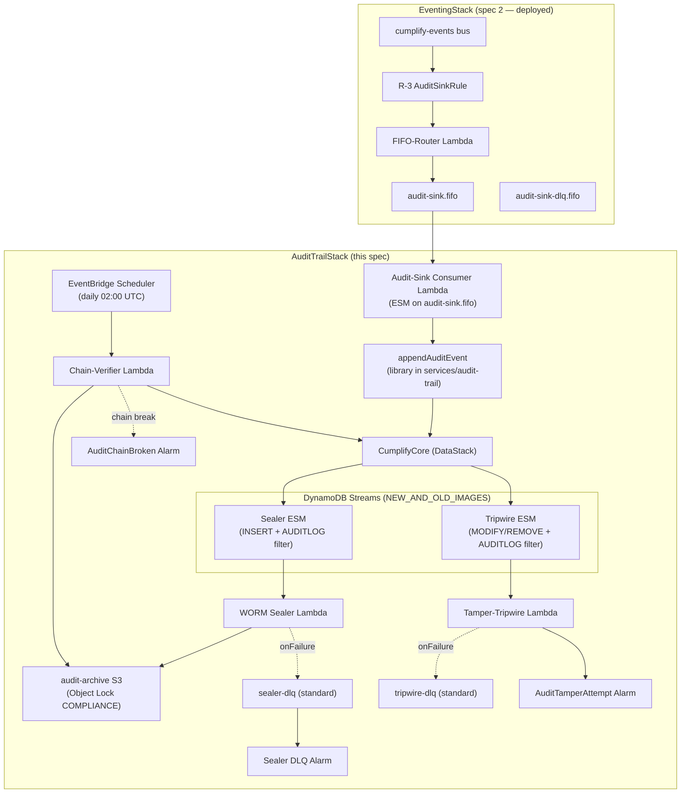

# Immutable Audit Trail — Design

**Spec:** `immutable-trail`
**Requirements approved:** R2.1 (AMEND-1/AMEND-2 folded)
**Steering rules exercised:** `00-stack-facts.md`, `04-immutability.md`, `02-aoss-rule.md`, `06-cdk-conventions.md`, `14-simplicity.md`, `19-kiro-truth.md`
**Architect design directives:** D-1 (cross-stack), D-2 (template assertions), D-3 (readback plan), D-4 (services layout), D-5 (HITL checkpoints)
**Revision:** R2 — FIX-1 through FIX-6 + minors applied (architect review pending)

---

## 1. Architecture Overview



**Flow summary:**
1. Events matching R-3 arrive in `audit-sink.fifo` via the FIFO-router (spec 2).
2. The audit-sink consumer Lambda (ESM) processes messages using `createHandler` in FIFO mode, calling `appendAuditEvent`.
3. `appendAuditEvent` writes a hash-chained item to CumplifyCore (PK=`TENANT#<tenantId>#AUDITLOG`), enforcing monotonic SK, storing full payload, and registering the tenant in `AUDITMETA`.
4. DynamoDB Streams carries the INSERT to the WORM sealer (ESM #1), which writes the item to S3 with Object Lock COMPLIANCE retention.
5. If any out-of-band MODIFY/REMOVE occurs on AUDITLOG items, the tamper-tripwire (ESM #2) fires immediately, emitting `AuditTamperAttempt` metric.
6. Daily, the chain-verifier walks each tenant's hash chain + compares against sealed S3 objects; breaks emit `AuditChainBroken`.

---

## 2. Cross-Stack Integration (D-1)

### 2.1 Props Flow

```typescript
// In CumplifyStage — new additions for AuditTrailStack
const auditTrailStack = new AuditTrailStack(this, 'AuditTrailStack', {
  envConfig,
  tableArn: dataStack.tableArn,
  tableName: dataStack.tableName,
  tableStreamArn: dataStack.tableStreamArn,  // NEW export from DataStack
  dynamodbKey: securityStack.outputs.dynamodbKey,
  s3GeneralKey: securityStack.outputs.s3GeneralKey,
  auditSinkQueueArn: eventingStack.auditSinkQueueArn,  // NEW export
  auditSinkDlqUrl: eventingStack.auditSinkDlqUrl,      // NEW export
  auditSinkDlqArn: eventingStack.auditSinkDlqArn,      // NEW export (minor-c)
});
auditTrailStack.addDependency(dataStack);
auditTrailStack.addDependency(securityStack);
auditTrailStack.addDependency(eventingStack);
```

### 2.2 Required Additions to Existing Stacks

| Stack | Addition | Rationale |
|-------|----------|-----------|
| `DataStack` | `public readonly tableStreamArn: string` + CfnOutput `TableStreamArn` | AuditTrailStack needs the stream ARN for ESM creation. `TableV2` exposes `tableStreamArn`. |
| `EventingStack` | `public readonly auditSinkQueueArn: string` + `public readonly auditSinkDlqUrl: string` + `public readonly auditSinkDlqArn: string` | Consumer ESM needs queue ARN; poison routing needs DLQ URL; consumer Lambda's poison-send grant needs the DLQ ARN. Values already in CfnOutputs — just expose as class properties. |

**Cycle analysis:** No cycles. Data flows one-way: DataStack → AuditTrailStack, EventingStack → AuditTrailStack. Neither DataStack nor EventingStack imports from AuditTrailStack.

### 2.3 AuditTrailStack Props Interface

```typescript
export interface AuditTrailStackProps extends cdk.StackProps {
  readonly envConfig: EnvConfig;
  readonly tableArn: string;
  readonly tableName: string;
  readonly tableStreamArn: string;
  readonly dynamodbKey: kms.IKey;
  readonly s3GeneralKey: kms.IKey;
  readonly auditSinkQueueArn: string;
  readonly auditSinkDlqUrl: string;
  readonly auditSinkDlqArn: string;
}
```

---

## 3. Construct Choices

| Component | CDK Construct | Key props |
|-----------|--------------|-----------|
| Audit-sink consumer | `NodejsFunction` | `entry: 'services/audit-trail/handlers/consumer.ts'`, `runtime: NODEJS_22_X`, `architecture: ARM_64`, `memorySize: 512`, `timeout: 60s`, `bundling: { externalModules: [], target: 'node22' }` |
| Consumer ESM | `SqsEventSource` | `queue: auditSinkQueue (imported by ARN)`, `batchSize: 5`, `reportBatchItemFailures: true` |
| WORM sealer | `NodejsFunction` | `entry: 'services/audit-trail/handlers/sealer.ts'`, same runtime/arch/mem, `timeout: 60s` |
| Sealer ESM | `DynamoEventSource` (L1 override for FilterCriteria) | `startingPosition: LATEST`, `batchSize: 10`, `maxBatchingWindow: 5s`, `bisectBatchOnFunctionError: true`, `retryAttempts: 3`, `onFailure: SqsDestination(sealerDlq)`, FilterCriteria via L1 |
| Tamper-tripwire | `NodejsFunction` | `entry: 'services/audit-trail/handlers/tripwire.ts'`, same runtime/arch/mem, `timeout: 30s` |
| Tripwire ESM | `DynamoEventSource` (L1 override for FilterCriteria) | `startingPosition: LATEST`, `batchSize: 10`, `bisectBatchOnFunctionError: true`, `retryAttempts: 3`, `onFailure: SqsDestination(tripwireDlq)`, FilterCriteria via L1 |
| Chain-verifier | `NodejsFunction` | `entry: 'services/audit-trail/handlers/verifier.ts'`, same runtime/arch, `memorySize: 1024`, `timeout: 900s` |
| EventBridge schedule | `scheduler.CfnSchedule` | `scheduleExpression: 'cron(0 2 * * ? *)'`, target: verifier Lambda ARN |
| Audit-archive bucket | `s3.Bucket` | Object Lock, COMPLIANCE, versioned, CMK, enforceSSL, blockPublicAccess, RETAIN, eventBridgeEnabled |
| Sealer DLQ | `sqs.Queue` | `enforceSSL: true` + NagSuppression (AwsSolutions-SQS3) |
| Tripwire DLQ | `sqs.Queue` | `enforceSSL: true` + NagSuppression (AwsSolutions-SQS3) |
| Sealer DLQ alarm | `cloudwatch.Alarm` | metric `ApproximateNumberOfMessagesVisible >= 1`, period 5m, eval 1, `NOT_BREACHING` |
| AuditTamperAttempt alarm | `cloudwatch.Alarm` | custom metric `AuditTamperAttempt`, `Sum >= 1`, period 1m, eval 1, `NOT_BREACHING` |
| AuditChainBroken alarm | `cloudwatch.Alarm` | custom metric `AuditChainBroken`, `Sum >= 1`, period 5m, eval 1, `NOT_BREACHING` |

---

## 4. DynamoDB Streams ESM Filter Patterns (D-2 — verbatim expected JSON)

### 4.1 Sealer ESM FilterCriteria (INSERT on AUDITLOG items — FIX-4)

```json
{
  "Filters": [
    {
      "Pattern": "{\"eventName\":[\"INSERT\"],\"dynamodb\":{\"NewImage\":{\"itemType\":{\"S\":[\"AUDITLOG\"]}}}}"
    }
  ]
}
```

**Explanation (FIX-4):** The appender stamps `itemType: 'AUDITLOG'` on every chain item. The filter matches:
- `eventName` = `INSERT`
- `dynamodb.NewImage.itemType.S` = exact value `"AUDITLOG"`

This is an **exact-match filter** — no prefix/suffix gymnastics. Benefits:
- No per-write Lambda invocations for ordinary tenant items (metadata, sessions, counters).
- `AUDITDEDUP` marker items are naturally excluded (they have `itemType: 'AUDITDEDUP'`).
- No reliance on suffix operator support (which DynamoDB Streams filtering does not have).

**Defense-in-depth guard (kept in handler):**
```typescript
if (item.itemType !== 'AUDITLOG') {
  logger.debug('Skipping non-AUDITLOG item', { pk, itemType: item.itemType });
  return;
}
```

### 4.2 Tripwire ESM FilterCriteria (MODIFY/REMOVE on AUDITLOG items — FIX-4)

```json
{
  "Filters": [
    {
      "Pattern": "{\"eventName\":[\"MODIFY\",\"REMOVE\"],\"dynamodb\":{\"OldImage\":{\"itemType\":{\"S\":[\"AUDITLOG\"]}}}}"
    }
  ]
}
```

**Explanation (FIX-4):** Uses `dynamodb.OldImage` (always present for both MODIFY and REMOVE because the stream is `NEW_AND_OLD_IMAGES`). Exact match on `itemType: 'AUDITLOG'`.

**Defense-in-depth guard (kept in handler):**
```typescript
const oldItemType = record.dynamodb?.OldImage?.itemType?.S;
if (oldItemType !== 'AUDITLOG') {
  logger.debug('Skipping non-AUDITLOG event', { pk, oldItemType });
  return;
}
```

### 4.3 CDK Implementation (FIX-5 — native FilterCriteria, no L1 gymnastics)

`DynamoEventSource` natively supports the `filters` property via `lambda.FilterCriteria.filter()`. No `findAll()`/`addPropertyOverride` needed — that pattern risks silent-skip bugs (the if-guard in R1's §9.2 would no-op if the construct tree traversal failed).

```typescript
import * as lambda from 'aws-cdk-lib/aws-lambda';
import { DynamoEventSource } from 'aws-cdk-lib/aws-lambda-event-sources';
import { FilterCriteria, FilterRule } from 'aws-cdk-lib/aws-lambda';

// --- Sealer ESM (FIX-5: native filters) ---
sealerFn.addEventSource(new DynamoEventSource(table, {
  startingPosition: lambda.StartingPosition.LATEST,
  batchSize: 10,
  maxBatchingWindow: cdk.Duration.seconds(5),
  bisectBatchOnFunctionError: true,
  retryAttempts: 3,
  onFailure: new destinations.SqsDestination(sealerDlq),
  filters: [
    FilterCriteria.filter({
      eventName: FilterRule.isEqual('INSERT'),
      dynamodb: {
        NewImage: {
          itemType: { S: FilterRule.isEqual('AUDITLOG') },
        },
      },
    }),
  ],
}));

// --- Tripwire ESM (FIX-5: native filters, AMEND-2: separate Lambda) ---
tripwireFn.addEventSource(new DynamoEventSource(table, {
  startingPosition: lambda.StartingPosition.LATEST,
  batchSize: 10,
  bisectBatchOnFunctionError: true,
  retryAttempts: 3,
  onFailure: new destinations.SqsDestination(tripwireDlq),
  filters: [
    FilterCriteria.filter({
      eventName: FilterRule.or('MODIFY', 'REMOVE'),
      dynamodb: {
        OldImage: {
          itemType: { S: FilterRule.isEqual('AUDITLOG') },
        },
      },
    }),
  ],
}));
```

**Minor (a):** Neither ESM uses `reportBatchItemFailures` — the chosen semantics are throw → bisect/retry → DLQ. A void-returning handler makes the flag misleading.

### 4.4 Template-Assertion Tests (C-12)

```typescript
// Sealer ESM filter assertion (FIX-4 itemType exact match)
const sealerEsm = template.findResources('AWS::Lambda::EventSourceMapping', {
  Properties: {
    FunctionName: { Ref: Match.stringLikeRegexp('WormSealerFn') },
    EventSourceArn: Match.anyValue(),
    FilterCriteria: {
      Filters: [
        {
          Pattern: JSON.stringify({
            eventName: ['INSERT'],
            dynamodb: { NewImage: { itemType: { S: ['AUDITLOG'] } } },
          }),
        },
      ],
    },
  },
});
expect(Object.keys(sealerEsm)).toHaveLength(1);

// Tripwire ESM filter assertion (FIX-4 itemType exact match on OldImage)
const tripwireEsm = template.findResources('AWS::Lambda::EventSourceMapping', {
  Properties: {
    FunctionName: { Ref: Match.stringLikeRegexp('TamperTripwireFn') },
    FilterCriteria: {
      Filters: [
        {
          Pattern: JSON.stringify({
            eventName: ['MODIFY', 'REMOVE'],
            dynamodb: { OldImage: { itemType: { S: ['AUDITLOG'] } } },
          }),
        },
      ],
    },
  },
});
expect(Object.keys(tripwireEsm)).toHaveLength(1);
```

---

## 5. IAM Deny Policy — REQUIRES-HUMAN (D-5)

### 5.1 Policy JSON (verbatim — applied to consumer, sealer, tripwire, verifier roles)

```json
{
  "Version": "2012-10-17",
  "Statement": [
    {
      "Sid": "DenyAuditLogMutation",
      "Effect": "Deny",
      "Action": [
        "dynamodb:UpdateItem",
        "dynamodb:DeleteItem",
        "dynamodb:BatchWriteItem",
        "dynamodb:PartiQLUpdate",
        "dynamodb:PartiQLDelete"
      ],
      "Resource": [
        "arn:aws:dynamodb:us-east-1:*:table/CumplifyCore"
      ],
      "Condition": {
        "ForAnyValue:StringLike": {
          "dynamodb:LeadingKeys": [
            "TENANT#*#AUDITLOG"
          ]
        }
      }
    }
  ]
}
```

**Design notes (FIX-2):**
- `dynamodb:BatchWriteItem` can DELETE items and is not covered by denying `DeleteItem` alone.
- `dynamodb:PartiQLUpdate` and `dynamodb:PartiQLDelete` cover the PartiQL execution path which has its own IAM actions distinct from the classic API.
- `LeadingKeys` condition supports all five actions (transactions are covered per constituent action — `TransactWriteItems` decomposes into the action of each item in the transaction).
- This also deny-blocks batch PUTs to AUDITLOG partitions — correct; nothing may batch-write audit items (the appender uses `TransactWriteItems` which is not blocked by this deny because its constituent `PutItem` is not in the deny list).
- `ForAnyValue:StringLike` (per REV-4): matches if ANY of the leading keys in the request matches the pattern. For single-item operations there is exactly one leading key.
- Resource scoped to CumplifyCore table (explicit name — pre-existing exception per C-5).
- Account wildcard `*` in ARN: the policy travels with the role to any account the stage deploys to.
- This Deny is UNCONDITIONAL for the scoped actions+resource+condition — even if another statement Allows these actions, the explicit Deny wins (IAM evaluation logic).

### 5.2 CDK Implementation

```typescript
import * as iam from 'aws-cdk-lib/aws-iam';

const auditLogDenyPolicy = new iam.ManagedPolicy(this, 'AuditLogDenyPolicy', {
  statements: [
    new iam.PolicyStatement({
      sid: 'DenyAuditLogMutation',
      effect: iam.Effect.DENY,
      actions: [
        'dynamodb:UpdateItem',
        'dynamodb:DeleteItem',
        'dynamodb:BatchWriteItem',
        'dynamodb:PartiQLUpdate',
        'dynamodb:PartiQLDelete',
      ],
      resources: [props.tableArn],
      conditions: {
        'ForAnyValue:StringLike': {
          'dynamodb:LeadingKeys': ['TENANT#*#AUDITLOG'],
        },
      },
    }),
  ],
});

// Attach to ALL Lambda roles in this stack
consumerFn.role!.addManagedPolicy(auditLogDenyPolicy);
sealerFn.role!.addManagedPolicy(auditLogDenyPolicy);
tripwireFn.role!.addManagedPolicy(auditLogDenyPolicy);
verifierFn.role!.addManagedPolicy(auditLogDenyPolicy);
```

### 5.3 Template-Assertion Test (C-12)

```typescript
// IAM Deny assertion — proves the Deny statement exists with correct shape (FIX-2: all 5 actions)
template.hasResourceProperties('AWS::IAM::ManagedPolicy', {
  PolicyDocument: {
    Statement: Match.arrayWith([
      Match.objectLike({
        Sid: 'DenyAuditLogMutation',
        Effect: 'Deny',
        Action: [
          'dynamodb:UpdateItem',
          'dynamodb:DeleteItem',
          'dynamodb:BatchWriteItem',
          'dynamodb:PartiQLUpdate',
          'dynamodb:PartiQLDelete',
        ],
        Condition: {
          'ForAnyValue:StringLike': {
            'dynamodb:LeadingKeys': ['TENANT#*#AUDITLOG'],
          },
        },
      }),
    ]),
  },
});
```

### 5.4 Loop-Prevention Assertion (LOOP-3)

```typescript
// Prove NO events:PutEvents grant exists anywhere in the template
const allPolicies = template.findResources('AWS::IAM::Policy');
const allManagedPolicies = template.findResources('AWS::IAM::ManagedPolicy');
const allInlinePolicies = template.findResources('AWS::IAM::Role');

const templateJson = JSON.stringify(template.toJSON());
expect(templateJson).not.toContain('events:PutEvents');
```

---

## 6. WORM Sealer Handler — REQUIRES-HUMAN (D-5)

### 6.1 Full Handler Code (`services/audit-trail/handlers/sealer.ts`)

```typescript
import type { DynamoDBStreamEvent, DynamoDBRecord } from 'aws-lambda';
import { S3Client, PutObjectCommand } from '@aws-sdk/client-s3';
import { unmarshall } from '@aws-sdk/util-dynamodb';
import { Logger } from '@aws-lambda-powertools/logger';

const s3 = new S3Client({});
const logger = new Logger({ serviceName: 'audit-trail-sealer' });

const BUCKET_NAME = process.env.AUDIT_ARCHIVE_BUCKET!;
const RETENTION_DAYS = parseInt(process.env.RETENTION_DAYS!, 10);

export async function handler(event: DynamoDBStreamEvent): Promise<void> {
  for (const record of event.Records) {
    await sealRecord(record);
  }
}

async function sealRecord(record: DynamoDBRecord): Promise<void> {
  if (record.eventName !== 'INSERT' || !record.dynamodb?.NewImage) {
    return; // Filter should prevent this, but defend in depth
  }

  const item = unmarshall(record.dynamodb.NewImage as Record<string, any>);
  const pk = item.PK as string;

  // Application-level itemType guard (defense-in-depth, FIX-4)
  if (item.itemType !== 'AUDITLOG') {
    logger.debug('Skipping non-AUDITLOG item', { pk, itemType: item.itemType });
    return;
  }

  const tenantId = pk.replace('TENANT#', '').replace('#AUDITLOG', '');
  const eventId = item.eventId as string;
  const sk = item.SK as string;
  // Extract date from SK: EVENT#<ISO8601>#<ulid>
  const isoTimestamp = sk.split('#')[1];
  const date = new Date(isoTimestamp);
  const yyyy = date.getUTCFullYear();
  const mm = String(date.getUTCMonth() + 1).padStart(2, '0');
  const dd = String(date.getUTCDate()).padStart(2, '0');

  const key = `audit-trail/${tenantId}/${yyyy}/${mm}/${dd}/${eventId}.json`;
  const body = JSON.stringify(item, null, 2);

  const retainUntilDate = new Date();
  retainUntilDate.setDate(retainUntilDate.getDate() + RETENTION_DAYS);

  await s3.send(
    new PutObjectCommand({
      Bucket: BUCKET_NAME,
      Key: key,
      Body: body,
      ContentType: 'application/json',
      ObjectLockMode: 'COMPLIANCE',
      ObjectLockRetainUntilDate: retainUntilDate,
      ChecksumAlgorithm: 'SHA256', // FIX-6: S3 REQUIRES content checksum on PutObject with Object Lock params
    }),
  );

  logger.info('Sealed audit event', { tenantId, eventId, key, retainUntilDate: retainUntilDate.toISOString() });
}
```

### 6.2 Sealer IAM Permissions (minimal)

```typescript
// DynamoDB stream read (automatically granted by DynamoEventSource)
// KMS decrypt for stream records
props.dynamodbKey.grantDecrypt(sealerFn);

// S3 write + retention
auditArchiveBucket.grantPut(sealerFn);
sealerFn.addToRolePolicy(new iam.PolicyStatement({
  actions: ['s3:PutObjectRetention'],
  resources: [auditArchiveBucket.arnForObjects('*')],
}));

// KMS encrypt for S3
props.s3GeneralKey.grantEncrypt(sealerFn);
```

---

## 7. Services Layout (D-4)

```
services/audit-trail/
├── package.json             # "@cumplify/audit-trail" workspace package
├── tsconfig.json
├── src/
│   ├── index.ts             # barrel export
│   ├── types.ts             # AuditItem, AppenderInput, VerifierResult
│   ├── appender.ts          # appendAuditEvent — core library function
│   └── hash-chain.ts        # computePrevHash, computePayloadHash (REV-10: SINGLE source)
├── handlers/
│   ├── consumer.ts          # ESM handler: createHandler(fifo) → appendAuditEvent
│   ├── sealer.ts            # DynamoDB Streams → S3 Object Lock COMPLIANCE
│   ├── tripwire.ts          # DynamoDB Streams MODIFY/REMOVE → CloudWatch metric
│   └── verifier.ts          # EventBridge schedule → chain walk + S3 comparison
└── __tests__/
    ├── appender.test.ts     # unit: hash chain, monotonicity, 400KB guard, AUDITMETA
    ├── hash-chain.test.ts   # unit: deterministic hash output, GENESIS case
    ├── sealer.test.ts       # unit: S3 key format, retention calc, suffix guard
    ├── tripwire.test.ts     # unit: metric emission, MODIFY/REMOVE handling
    └── verifier.test.ts     # unit: chain walk, watermark, S3 comparison

services/eventing/
└── src/
    └── consumer.ts          # EXTENDED: createFifoHandler (or fifo option on createHandler)
└── __tests__/
    └── consumer.test.ts     # EXTENDED: FIFO batch ordering test (CON-7)
```

### 7.1 `services/audit-trail/src/hash-chain.ts` (REV-10 — single source of truth)

```typescript
import { createHash } from 'node:crypto';

/**
 * Compute the hash-chain link for an audit-trail item.
 * SINGLE implementation — imported by both appender and verifier.
 * Two implementations = how chains "break" without tampering.
 */
export function computePrevHash(predecessorPK: string, predecessorSK: string, predecessorPayloadHash: string): string {
  return createHash('sha256')
    .update(`${predecessorPK}${predecessorSK}${predecessorPayloadHash}`)
    .digest('hex');
}

export const GENESIS_HASH = 'GENESIS';

/**
 * Compute payload hash: sha256 of canonical JSON {before, after}.
 */
export function computePayloadHash(payload: Record<string, unknown>): string {
  const canonical = JSON.stringify({
    before: payload.before ?? null,
    after: payload.after ?? null,
  });
  return createHash('sha256').update(canonical).digest('hex');
}
```

### 7.2 `services/audit-trail/src/appender.ts` (core logic)

```typescript
import { DynamoDBClient, QueryCommand, TransactWriteItemsCommand } from '@aws-sdk/client-dynamodb';
import { marshall } from '@aws-sdk/util-dynamodb';
import { Logger } from '@aws-lambda-powertools/logger';
import { ulid } from 'ulid';
import { computePrevHash, computePayloadHash, GENESIS_HASH } from './hash-chain.js';
import type { CumplifyEvent } from '@cumplify/eventing';

const ddb = new DynamoDBClient({});
const logger = new Logger({ serviceName: 'audit-trail-appender' });

const TABLE_NAME = process.env.TABLE_NAME!;
const MAX_ITEM_SIZE = 400 * 1024; // 400KB

export interface AppendResult {
  pk: string;
  sk: string;
  payloadHash: string;
  prevHash: string;
}

export async function appendAuditEvent(event: CumplifyEvent, detailType: string): Promise<AppendResult> {
  const tenantId = event.tenantId;
  const pk = `TENANT#${tenantId}#AUDITLOG`;
  const eventId = event.eventId || ulid();

  // 1. Query latest item for prevHash + monotonicity
  const latestResp = await ddb.send(new QueryCommand({
    TableName: TABLE_NAME,
    KeyConditionExpression: 'PK = :pk',
    ExpressionAttributeValues: { ':pk': { S: pk } },
    ScanIndexForward: false,
    Limit: 1,
    ProjectionExpression: 'PK, SK, payloadHash',
  }));

  let prevHash: string;
  let latestSK: string | undefined;
  const isFirstEvent = !latestResp.Items || latestResp.Items.length === 0;

  if (!isFirstEvent) {
    const prev = latestResp.Items![0];
    prevHash = computePrevHash(
      prev.PK!.S!,
      prev.SK!.S!,
      prev.payloadHash!.S!,
    );
    latestSK = prev.SK!.S!;
  } else {
    prevHash = GENESIS_HASH;
  }

  // 2. Compute append timestamp with monotonicity enforcement (REV-1)
  let appendTs = new Date().toISOString();
  if (latestSK) {
    const latestTsPart = latestSK.split('#')[1]; // EVENT#<ts>#<ulid>
    if (appendTs <= latestTsPart) {
      // Derive from latest + 1ms
      const latestDate = new Date(latestTsPart);
      latestDate.setMilliseconds(latestDate.getMilliseconds() + 1);
      appendTs = latestDate.toISOString();
    }
  }

  const sk = `EVENT#${appendTs}#${eventId}`;

  // 3. Compute payload hash
  const payloadHash = computePayloadHash(event.payload as Record<string, unknown>);

  // 4. Build item
  const item: Record<string, unknown> = {
    PK: pk,
    SK: sk,
    itemType: 'AUDITLOG',  // FIX-4: discriminator for stream filtering
    eventType: detailType,
    actor: event.actor,
    module: event.module,
    clauseRef: event.clauseRef,
    standard: event.standard,
    eventTimestamp: event.timestamp,    // original envelope timestamp (REV-1)
    eventId,
    payload: event.payload,            // full detail stored (REV-2)
    payloadHash,
    prevHash,
  };

  // Optional: docVersionHash for ES-3 future-proofing
  if ((event.payload as any)?.docVersionHash) {
    item.docVersionHash = (event.payload as any).docVersionHash;
  }

  // 5. Item size guard (REV-2): 400KB limit
  const serialized = JSON.stringify(marshall(item));
  if (Buffer.byteLength(serialized, 'utf-8') > MAX_ITEM_SIZE) {
    throw new ItemSizeExceededError(
      `Item size exceeds 400KB limit (${Buffer.byteLength(serialized, 'utf-8')} bytes)`,
    );
  }

  // 6. FIX-1: TransactWriteItems — atomically write chain item + dedup marker
  //    Dedup marker: PK=TENANT#<tenantId>#AUDITDEDUP, SK=EVENT#<eventId>
  //    On replay: ConditionalCheckFailed on marker → ReplayDetectedError
  const dedupPK = `TENANT#${tenantId}#AUDITDEDUP`;
  const dedupSK = `EVENT#${eventId}`;

  try {
    await ddb.send(new TransactWriteItemsCommand({
      TransactItems: [
        {
          Put: {
            TableName: TABLE_NAME,
            Item: marshall(item, { removeUndefinedValues: true }),
            ConditionExpression: 'attribute_not_exists(PK)',
          },
        },
        {
          Put: {
            TableName: TABLE_NAME,
            Item: marshall({
              PK: dedupPK,
              SK: dedupSK,
              itemType: 'AUDITDEDUP',
              eventId,
              createdAt: new Date().toISOString(),
            }),
            ConditionExpression: 'attribute_not_exists(PK)',
          },
        },
      ],
    }));
  } catch (err: any) {
    if (err.name === 'TransactionCanceledException') {
      const reasons = err.CancellationReasons ?? [];
      // If the dedup marker (index 1) failed → replay
      if (reasons[1]?.Code === 'ConditionalCheckFailed') {
        throw new ReplayDetectedError(`Replay detected for eventId ${eventId}`);
      }
      // If the chain item (index 0) failed → also a replay (item already exists)
      if (reasons[0]?.Code === 'ConditionalCheckFailed') {
        throw new ReplayDetectedError(`Chain item already exists for eventId ${eventId}`);
      }
      throw err; // Other transaction failure — transient
    }
    throw err;
  }

  logger.info('Audit event appended', { tenantId, eventId, sk, prevHash: prevHash.substring(0, 8) });

  // 7. Register tenant in AUDITMETA (REV-7) — only on first event (prevHash === GENESIS)
  if (isFirstEvent) {
    try {
      await ddb.send(new TransactWriteItemsCommand({
        TransactItems: [{
          Put: {
            TableName: TABLE_NAME,
            Item: marshall({
              PK: 'AUDITMETA',
              SK: `TENANT#${tenantId}`,
              registeredAt: new Date().toISOString(),
            }),
            ConditionExpression: 'attribute_not_exists(PK)',
          },
        }],
      }));
      logger.info('Tenant registered in AUDITMETA', { tenantId });
    } catch (err: any) {
      if (err.name !== 'TransactionCanceledException') throw err;
      // Already registered — race condition with parallel first events (safe)
    }
  }

  return { pk, sk, payloadHash, prevHash };
}

export class ItemSizeExceededError extends Error {
  constructor(msg: string) { super(msg); this.name = 'ItemSizeExceededError'; }
}

export class ReplayDetectedError extends Error {
  constructor(msg: string) { super(msg); this.name = 'ReplayDetectedError'; }
}
```

### 7.3 `services/eventing/src/consumer.ts` — FIFO Mode Extension (REV-3)

```typescript
// NEW: added to existing consumer.ts

export interface FifoConsumerConfig extends ConsumerConfig {
  fifo: true;
}

/**
 * Creates an SQS batch handler in FIFO mode.
 * On the first TRANSIENT failure, reports that record AND ALL SUBSEQUENT
 * records as batchItemFailures — preserving per-tenant message ordering.
 *
 * PoisonMessageError → DLQ (not a failure for ordering purposes).
 * ReplayDetectedError signaled via config.idempotentErrors →
 *   treated as success (idempotent replay, safe to continue).
 *
 * FIX-3: Poison send to FIFO DLQ requires MessageGroupId + MessageDeduplicationId.
 */
export function createFifoHandler(config: FifoConsumerConfig & { idempotentErrors?: string[] }) {
  const idempotentErrors = new Set(config.idempotentErrors ?? []);

  return async (sqsEvent: SQSEvent): Promise<SQSBatchResponse> => {
    const batchItemFailures: SQSBatchItemFailure[] = [];

    for (let i = 0; i < sqsEvent.Records.length; i++) {
      const record = sqsEvent.Records[i];
      try {
        const msg = parseAndValidate(record.body);
        logger.info('Processing event (FIFO)', {
          detailType: msg.detailType,
          tenantId: msg.detail.tenantId,
          eventId: msg.detail.eventId,
        });
        await config.handler(msg.detail, msg.detailType);
      } catch (err) {
        if (err instanceof PoisonMessageError) {
          // Poison → explicit DLQ send (FIX-3: FIFO DLQ needs GroupId + DedupId)
          logger.warn('Poison message → DLQ (FIFO)', { messageId: record.messageId, reason: err.message });

          // Extract tenantId if parseable, else fall back to messageId
          let messageGroupId: string;
          try {
            const parsed = JSON.parse(record.body);
            messageGroupId = parsed?.detail?.tenantId ?? record.messageId;
          } catch {
            messageGroupId = record.messageId;
          }

          await sqsClient.send(new SendMessageCommand({
            QueueUrl: config.dlqUrl,
            MessageBody: record.body,
            MessageGroupId: messageGroupId,
            MessageDeduplicationId: record.messageId,
            MessageAttributes: {
              PoisonReason: { DataType: 'String', StringValue: err.message },
              OriginalMessageId: { DataType: 'String', StringValue: record.messageId },
            },
          }));
        } else if (idempotentErrors.has((err as Error).name)) {
          // Idempotent replay (e.g., ReplayDetectedError) — success, continue
          logger.warn('Idempotent replay detected (FIFO)', { messageId: record.messageId, errorName: (err as Error).name });
        } else {
          // TRANSIENT FAILURE: report this + ALL subsequent as unprocessed (FIFO ordering)
          logger.error('Transient failure — stopping batch (FIFO)', {
            messageId: record.messageId,
            error: (err as Error).message,
          });
          for (let j = i; j < sqsEvent.Records.length; j++) {
            batchItemFailures.push({ itemIdentifier: sqsEvent.Records[j].messageId });
          }
          break; // stop processing
        }
      }
    }
    return { batchItemFailures };
  };
}
```

### 7.4 Audit-Sink Consumer Handler (`services/audit-trail/handlers/consumer.ts`)

```typescript
import { createFifoHandler } from '@cumplify/eventing';
import { appendAuditEvent, ItemSizeExceededError, ReplayDetectedError } from '../src/appender.js';
import { PoisonMessageError } from '@cumplify/eventing';
import type { CumplifyEvent } from '@cumplify/eventing';

const DLQ_URL = process.env.AUDIT_SINK_DLQ_URL!;

const businessLogic = async (event: CumplifyEvent, detailType: string): Promise<void> => {
  try {
    await appendAuditEvent(event, detailType);
  } catch (err: any) {
    if (err instanceof ItemSizeExceededError) {
      // REV-2: oversized payload = poison
      throw new PoisonMessageError(err.message);
    }
    throw err; // transient errors bubble up for FIFO retry
  }
};

export const handler = createFifoHandler({
  fifo: true,
  dlqUrl: DLQ_URL,
  handler: businessLogic,
  idempotentErrors: ['ReplayDetectedError'], // FIX-1: dedup marker collision = success
});
```

### 7.5 Tamper-Tripwire Handler (`services/audit-trail/handlers/tripwire.ts`)

```typescript
import type { DynamoDBStreamEvent, DynamoDBRecord } from 'aws-lambda';
import { CloudWatchClient, PutMetricDataCommand } from '@aws-sdk/client-cloudwatch';
import { createHash } from 'node:crypto';
import { Logger } from '@aws-lambda-powertools/logger';

const cw = new CloudWatchClient({});
const logger = new Logger({ serviceName: 'audit-trail-tripwire' });

export async function handler(event: DynamoDBStreamEvent): Promise<void> {
  for (const record of event.Records) {
    await processRecord(record);
  }
}

async function processRecord(record: DynamoDBRecord): Promise<void> {
  if (!record.dynamodb?.Keys) return;

  const pk = record.dynamodb.Keys.PK?.S;
  const sk = record.dynamodb.Keys.SK?.S;

  if (!pk || !pk.endsWith('#AUDITLOG')) {
    // Application-level suffix guard (stream filter is prefix-only)
    return;
  }

  const tenantId = pk.replace('TENANT#', '').replace('#AUDITLOG', '');

  // Compute image digests (not full content — could be large)
  const oldImageDigest = record.dynamodb.OldImage
    ? createHash('sha256').update(JSON.stringify(record.dynamodb.OldImage)).digest('hex').substring(0, 16)
    : 'NONE';
  const newImageDigest = record.dynamodb.NewImage
    ? createHash('sha256').update(JSON.stringify(record.dynamodb.NewImage)).digest('hex').substring(0, 16)
    : 'NONE';

  // AMEND-1: DynamoDB Streams userIdentity is populated ONLY for TTL-expired
  // deletions. Regular UpdateItem/DeleteItem carry NO caller identity.
  // Caller attribution requires CloudTrail data-event correlation (out of scope).
  logger.critical('AUDIT TAMPER ATTEMPT DETECTED', {
    pk,
    sk,
    eventName: record.eventName,
    oldImageDigest,
    newImageDigest,
    tenantId,
    note: 'Caller identity not available in stream record — correlate with CloudTrail data events',
  });

  // Emit CloudWatch metric
  await cw.send(new PutMetricDataCommand({
    Namespace: 'Cumplify/AuditTrail',
    MetricData: [{
      MetricName: 'AuditTamperAttempt',
      Value: 1,
      Unit: 'Count',
      Dimensions: [{ Name: 'TenantId', Value: tenantId }],
    }],
  }));
}
```

### 7.6 Chain-Verifier Handler (`services/audit-trail/handlers/verifier.ts`) — Summary

The verifier is the most complex Lambda. Full code deferred to implementation; key design decisions:

1. **Tenant discovery:** Query `PK = 'AUDITMETA'` (all SK starting with `TENANT#`).
2. **Per-tenant chain walk:** Query `PK = 'TENANT#<tenantId>#AUDITLOG'`, ScanIndexForward=true, paginated. For each item:
   - Recompute `payloadHash` from stored `payload` using `computePayloadHash` (REV-2).
   - Recompute expected `prevHash` from predecessor's PK+SK+payloadHash using `computePrevHash` (REV-10).
   - Compare both against stored values.
3. **Incremental S3 comparison (REV-7):** Read watermark item (`PK='AUDITMETA', SK='VERIFY_WATERMARK#<tenantId>'`). For items beyond watermark, `HeadObject` on expected S3 key. On success, update watermark.
4. **Periodic full sweep:** If `lastFullSweep` watermark > 7 days, do full S3 comparison (all items).
5. **Metric emission:** On any break, emit `AuditChainBroken` with tenantId dimension.
6. **Pagination:** If Lambda nears timeout (check `context.getRemainingTimeInMillis() < 60000`), save progress and exit cleanly — next invocation resumes.

---

## 8. Readback Plan (D-3)

### 8.1 Readback Environment Rules

- **Synthetic tenant only:** all tests use `tenantId = 'readback-synthetic-001'`.
- **Tamper via `cumplify-dev-admin`:** out-of-band role (pre-existing in dev account) with direct DynamoDB access for ACC-1 tamper simulation.
- **Dev retention SHORT:** `envConfig` for dev sets `auditArchiveRetentionDays: 1` — sealed test objects expire in 1 day.
- **ESM-drained queues:** audit-sink has ESM (consumer drains it). Readback proves arrival via consumer logs (CloudWatch Logs filter for eventId), not `ReceiveMessage`.
- **All resource identifiers from cdk-outputs.json** (CF-3).

### 8.2 Readback Test Matrix

| # | Test | ACC | Method | Asserts |
|---|------|-----|--------|---------|
| 1 | Audit-archive bucket exists | — | `HeadBucket` on bucket name from outputs | Resolves; Object Lock config confirms COMPLIANCE + 1-day retention (dev) |
| 2 | Consumer Lambda exists + cold start | — | Direct `Invoke` (cold) with synthetic SQS event payload | Completes < 60s; log confirms processing |
| 3 | Sealer Lambda exists + cold start | — | Direct `Invoke` (cold) with synthetic stream record | Completes < 60s |
| 4 | Tripwire Lambda exists + cold start | — | Direct `Invoke` (cold) with synthetic MODIFY record | Completes < 30s |
| 5 | Verifier Lambda exists + cold start | — | Direct `Invoke` (cold) with empty tenant set | Completes < 900s |
| 6 | Schedule exists | ACC-4 | `scheduler:GetSchedule` on schedule name from outputs | State=ENABLED, cron expression = `cron(0 2 * * ? *)` |
| 7 | All alarms exist (3) | — | `DescribeAlarms` filtered by alarm names from outputs | 3 alarms found; all `treatMissingData: notBreaching` |
| 8 | **END-TO-END (ACC-3)** | ACC-3 | Publish synthetic `Document.Approved` event → (a) poll CloudWatch Logs for consumer log with matching eventId (< 60s, D-1 ESM-drained rule), (b) `GetItem` on CumplifyCore for expected PK/SK — confirm payload stored + payloadHash + prevHash valid, (c) poll S3 for sealed object (< 90s) — `HeadObject` confirms `ObjectLockMode=COMPLIANCE`, `ObjectLockRetainUntilDate` set | All three hops green |
| 9 | **IAM DENIED (ACC-2)** | ACC-2 | `aws iam simulate-principal-policy --policy-source-arn <consumerRoleArn> --action-names dynamodb:UpdateItem dynamodb:DeleteItem dynamodb:BatchWriteItem dynamodb:PartiQLUpdate dynamodb:PartiQLDelete --resource-arns <tableArn> --context-entries ContextKeyName=dynamodb:LeadingKeys,ContextKeyValues=TENANT#readback-synthetic-001#AUDITLOG,ContextKeyType=string` | All five actions return `EvalDecision: explicitDeny` |
| 10 | **TAMPER DETECTED — tripwire (ACC-1a)** | ACC-1 | Using `cumplify-dev-admin` role: `UpdateItem` on the chained item from test 8 (change an attribute). Within 60s, query CloudWatch metric `AuditTamperAttempt` (dimension tenantId=readback-synthetic-001) | Metric datapoint with value >= 1 appears |
| 11 | **TAMPER DETECTED — verifier (ACC-1b)** | ACC-1 | Invoke verifier Lambda manually (direct `Invoke` with payload `{"tenantId":"readback-synthetic-001"}`). | Returns chain-break report; `AuditChainBroken` metric emitted |
| 12 | **VERIFICATION GREEN (ACC-4)** | ACC-4 | Publish a SECOND synthetic event (builds valid chain of 2). Invoke verifier on untampered tenant `readback-synthetic-002`. | Exit 0; no `AuditChainBroken` metric; log confirms "chain valid" |

### 8.3 Evidence Format (19-kiro-truth.md rule 8)

```
| Timestamp | Test # | Result | Duration | Notes |
|-----------|--------|--------|----------|-------|
| 2026-07-XX T...Z | 1 | PASS | 1.2s | Bucket: <name from output> |
| ... | ... | ... | ... | ... |

Exit code: 0
cdk-outputs.json blob SHA: <git hash-object infra/cdk-outputs.json>
```

---

## 9. CDK Stack Implementation — `infra/lib/audit-trail-stack.ts`

### 9.1 Audit-Archive Bucket

```typescript
const accessLogsBucket = new s3.Bucket(this, 'AuditArchiveAccessLogs', {
  encryption: s3.BucketEncryption.S3_MANAGED,
  blockPublicAccess: s3.BlockPublicAccess.BLOCK_ALL,
  enforceSSL: true,
  removalPolicy: cdk.RemovalPolicy.RETAIN,
  lifecycleRules: [{ expiration: cdk.Duration.days(365) }],
});
NagSuppressions.addResourceSuppressions(accessLogsBucket, [
  { id: 'AwsSolutions-S1', reason: 'This IS the access-logs bucket for audit-archive.' },
]);

const auditArchiveBucket = new s3.Bucket(this, 'AuditArchiveBucket', {
  versioned: true,
  encryption: s3.BucketEncryption.KMS,
  encryptionKey: props.s3GeneralKey,
  blockPublicAccess: s3.BlockPublicAccess.BLOCK_ALL,
  enforceSSL: true,
  objectLockEnabled: true,
  objectLockDefaultRetention: s3.ObjectLockRetention.compliance(
    cdk.Duration.days(props.envConfig.auditArchiveRetentionDays),
  ),
  removalPolicy: cdk.RemovalPolicy.RETAIN,
  eventBridgeEnabled: true,
  serverAccessLogsBucket: accessLogsBucket,
  serverAccessLogsPrefix: 'audit-archive/',
});
```

### 9.2 ESM Wiring (FIX-5 — native FilterCriteria, no L1 overrides)

```typescript
import { DynamoEventSource } from 'aws-cdk-lib/aws-lambda-event-sources';
import { FilterCriteria, FilterRule } from 'aws-cdk-lib/aws-lambda';

// Import table + stream via ARN
const table = dynamodb.Table.fromTableAttributes(this, 'CumplifyCore', {
  tableArn: props.tableArn,
  tableStreamArn: props.tableStreamArn,
});

// --- Sealer ESM (FIX-5: native filters, minor-a: no reportBatchItemFailures) ---
sealerFn.addEventSource(new DynamoEventSource(table, {
  startingPosition: lambda.StartingPosition.LATEST,
  batchSize: 10,
  maxBatchingWindow: cdk.Duration.seconds(5),
  bisectBatchOnFunctionError: true,
  retryAttempts: 3,
  onFailure: new destinations.SqsDestination(sealerDlq),
  filters: [
    FilterCriteria.filter({
      eventName: FilterRule.isEqual('INSERT'),
      dynamodb: {
        NewImage: {
          itemType: { S: FilterRule.isEqual('AUDITLOG') },
        },
      },
    }),
  ],
}));

// --- Tripwire ESM (AMEND-2: separate Lambda + role, FIX-5: native filters) ---
tripwireFn.addEventSource(new DynamoEventSource(table, {
  startingPosition: lambda.StartingPosition.LATEST,
  batchSize: 10,
  bisectBatchOnFunctionError: true,
  retryAttempts: 3,
  onFailure: new destinations.SqsDestination(tripwireDlq),
  filters: [
    FilterCriteria.filter({
      eventName: FilterRule.or('MODIFY', 'REMOVE'),
      dynamodb: {
        OldImage: {
          itemType: { S: FilterRule.isEqual('AUDITLOG') },
        },
      },
    }),
  ],
}));
```

### 9.2.1 Tripwire IAM (minor-d)

```typescript
// Tripwire role: CloudWatch PutMetricData only (resource '*' — API supports no resource scoping)
tripwireFn.addToRolePolicy(new iam.PolicyStatement({
  actions: ['cloudwatch:PutMetricData'],
  resources: ['*'],
  conditions: {
    StringEquals: { 'cloudwatch:namespace': 'Cumplify/AuditTrail' },
  },
}));

NagSuppressions.addResourceSuppressions(tripwireFn.role!, [
  {
    id: 'AwsSolutions-IAM5',
    reason: 'cloudwatch:PutMetricData does not support resource-level permissions (AWS API limitation). Scoped by namespace condition.',
  },
], true);
```

### 9.3 EnvConfig Addition

```typescript
// Added to EnvConfig interface + all env objects
readonly auditArchiveRetentionDays: number;
// dev: 1, staging: 1, prod: 2555
```

### 9.4 CfnOutputs

```typescript
new cdk.CfnOutput(this, 'AuditArchiveBucketName', { value: auditArchiveBucket.bucketName });
new cdk.CfnOutput(this, 'ConsumerFnArn', { value: consumerFn.functionArn });
new cdk.CfnOutput(this, 'ConsumerRoleArn', { value: consumerFn.role!.roleArn });
new cdk.CfnOutput(this, 'SealerFnArn', { value: sealerFn.functionArn });
new cdk.CfnOutput(this, 'TripwireFnArn', { value: tripwireFn.functionArn });
new cdk.CfnOutput(this, 'VerifierFnArn', { value: verifierFn.functionArn });
new cdk.CfnOutput(this, 'VerifierRoleArn', { value: verifierFn.role!.roleArn }); // minor-e
new cdk.CfnOutput(this, 'SealerDlqArn', { value: sealerDlq.queueArn });
new cdk.CfnOutput(this, 'SealerDlqUrl', { value: sealerDlq.queueUrl });
new cdk.CfnOutput(this, 'TripwireDlqArn', { value: tripwireDlq.queueArn });
new cdk.CfnOutput(this, 'ScheduleName', { value: schedule.ref });
new cdk.CfnOutput(this, 'SealerDlqAlarmName', { value: sealerDlqAlarm.alarmName });
new cdk.CfnOutput(this, 'TamperAlarmName', { value: tamperAlarm.alarmName });
new cdk.CfnOutput(this, 'ChainBrokenAlarmName', { value: chainBrokenAlarm.alarmName });
new cdk.CfnOutput(this, 'ConsumerLogGroup', { value: consumerFn.logGroup.logGroupName });
```

---

## 10. Contracts Produced / Updated

| Artifact | Action | Contents |
|----------|--------|----------|
| `services/audit-trail/package.json` | **Created** | `@cumplify/audit-trail` workspace package |
| `services/audit-trail/src/*` | **Created** | appender, hash-chain, types |
| `services/audit-trail/handlers/*` | **Created** | consumer, sealer, tripwire, verifier |
| `services/eventing/src/consumer.ts` | **Extended** | `createFifoHandler` + `idempotentErrors` option |
| `services/eventing/__tests__/consumer.test.ts` | **Extended** | FIFO batch ordering test (CON-7) |
| `infra/lib/audit-trail-stack.ts` | **Created** | AuditTrailStack CDK construct |
| `infra/lib/audit-trail-stack.unit.test.ts` | **Created** | Template assertions (filters, IAM deny, no PutEvents) |
| `infra/lib/data-stack.ts` | **Modified** | Add `tableStreamArn` public readonly + CfnOutput |
| `infra/lib/eventing-stack.ts` | **Modified** | Add `auditSinkQueueArn`, `auditSinkDlqUrl` public readonly |
| `infra/lib/cumplify-stage.ts` | **Modified** | Instantiate AuditTrailStack with cross-stack props |
| `infra/lib/env-config.ts` | **Modified** | Add `auditArchiveRetentionDays` to EnvConfig |
| `infra/readback/immutable-trail.test.ts` | **Created** | 12-test readback suite |

---

## 11. Cost Impact

| Resource | Monthly estimate (dev) | Notes |
|----------|----------------------|-------|
| Lambda (4 functions, idle) | $0 | Pay-per-invoke; dev traffic is readback only |
| S3 audit-archive (Object Lock) | < $0.10 | Minimal objects in dev; 1-day retention |
| SQS (2 DLQs) | < $0.01 | Idle unless failures |
| CloudWatch alarms (3) | $0.30 | $0.10/alarm/mo |
| CloudWatch custom metrics (2) | $0.60 | $0.30/metric/mo |
| EventBridge Scheduler (1 schedule) | $0 | Free tier covers daily invokes |
| DynamoDB Streams reads | < $0.10 | $0.02/100K reads; minimal dev traffic |
| **Total** | **< $1.20/mo** | Well within Part 27 cost discipline |

---

## 12. Accepted Decisions

| Decision | Rationale |
|----------|-----------|
| `itemType` discriminator filter (FIX-4) | Exact-match on `itemType: 'AUDITLOG'` in stream filter. No prefix/suffix gymnastics — DynamoDB Streams doesn't support suffix. AUDITDEDUP markers excluded naturally. In-handler guards kept as defense-in-depth. |
| `startingPosition: LATEST` for both ESMs | No AUDITLOG items exist before this spec deploys. TRIM_HORIZON would process the entire stream backlog (all CumplifyCore item types) — unnecessary and would overwhelm the guard with no-ops. |
| Sealer batch size 10, max batching window 5s | Balance between latency (< 60s p99 per NFR-2) and cost (fewer invocations). Design-level choice per REV-9. |
| Tripwire: separate Lambda (AMEND-2) | The sealer holds `s3:PutObject` — combining them violates TW-5 ("observe-and-alert only"). Second ESM with a minimal-role Lambda. |
| Verifier timeout 900s, memorySize 1024 | Chain walks are CPU+network bound (hashing + DynamoDB queries + S3 HeadObject). 15-min timeout accommodates large tenants. Extra memory = proportionally more CPU. |
| `ForAnyValue:StringLike` on Deny condition (REV-4) | For single-item ops there's exactly one leading key; `ForAnyValue` matches correctly. Architect-mandated over `ForAllValues`. |
| Dev `auditArchiveRetentionDays: 1` | Test sealed objects must not persist 7 years. 1-day COMPLIANCE retention means objects are undeletable for 24h only — acceptable for dev cleanup. |
| SSE-KMS (s3-general key) for audit-archive | Consistent with EvidenceVault pattern. CMK enables key-policy control over who can decrypt sealed records. |
| Consumer DLQ = spec 2's `audit-sink-dlq.fifo` | Re-uses existing FIFO DLQ already paired with the queue. No new DLQ needed for the consumer — poison messages route to the same DLQ via `createFifoHandler` (FIX-3: with MessageGroupId + MessageDeduplicationId). |
| TransactWriteItems for append + dedup (FIX-1) | Atomic chain-item + dedup-marker write. Prevents replay duplicates after partial-batch redelivery (append-time SK makes SK collision impossible for replays). |
| 5-action Deny list (FIX-2) | BatchWriteItem can delete; PartiQL has distinct IAM actions. All mutation paths to AUDITLOG items are blocked. |
| `ChecksumAlgorithm: 'SHA256'` on sealer PutObject (FIX-6) | S3 requires a content checksum on PutObject with Object Lock parameters. Explicit setting avoids SDK version-dependent behavior. |
| Native `FilterCriteria` via L2 construct (FIX-5) | `DynamoEventSource` supports `filters` natively — no L1 overrides needed. Avoids silent-skip risk from construct-tree traversal patterns. |

---

## 13. Open Design Decisions

None. All decisions resolved by architect directives D-1 through D-5, AMEND-1/AMEND-2, and REV-1 through REV-10.

---

## 14. HITL Checkpoint Summary (D-5)

| Component | Section | Status |
|-----------|---------|--------|
| IAM Deny policy JSON | §5.1 | **REQUIRES-HUMAN** — presented in full |
| IAM Deny CDK implementation | §5.2 | **REQUIRES-HUMAN** — presented in full |
| WORM sealer handler code | §6.1 | **REQUIRES-HUMAN** — presented in full |
| Sealer IAM permissions | §6.2 | **REQUIRES-HUMAN** — presented in full |

All four artifacts require owner review before merge. The architect readback does not substitute for this review.
