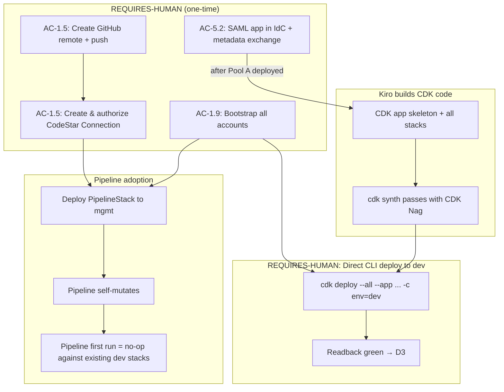

# Spec 1 — platform-foundation: Design

**Requirements approved:** 2026-07-02
**Analysis findings:** 10/10 resolved (approved with tightenings)

---

## 1. Architecture & Data Flow

### 1.1 Stack deployment sequencing (F-4 resolution)



**Key sequencing rules:**
- CDK code can synthesize independently of human steps.
- First D3 closure: direct CLI deploy (REQUIRES-HUMAN: needs deploy creds).
- Pipeline adoption happens after GitHub remote + CodeStar authorization.
- **Pipeline's first run must complete as a no-op** against the already-deployed
  dev stacks (acceptance criterion per reviewer tightening).
- Pool A federation wired after IdC SAML app created (two-phase).

### 1.2 CumplifyStage env-config (F-3 resolution)

```typescript
interface EnvConfig {
  envName: 'dev' | 'staging' | 'prod';
  account: string;
  region: string;
  // Stage-conditional resource parameters
  globalTableReplica: boolean;      // prod-only
  drRegionStack: boolean;           // prod-only (hosts KMS ReplicaKey in us-west-2)
  secretsReplica: boolean;          // prod-only
  s3Crr: boolean;                   // prod-only
  aossStandby: boolean;             // prod-only
  auroraMinCapacity: number;        // dev/staging=0, prod=0.5
  auroraMaxCapacity: number;        // dev/staging=4, prod=context
  cacheMultiAz: boolean;            // prod-only
  cacheNodeType: string;            // dev='cache.t4g.micro', prod=context
}
```

| Parameter | Dev | Staging | Prod |
|---|---|---|---|
| globalTableReplica | false | false | true |
| drRegionStack | false | false | true |
| secretsReplica | false | false | true |
| s3Crr | false | false | true |
| aossStandby | false | false | true |
| auroraMinCapacity | 0 | 0 | 0.5 |
| auroraMaxCapacity | 4 | 4 | context |
| cacheMultiAz | false | false | true |
| cacheNodeType | cache.t4g.micro | cache.t4g.micro | cache.t4g.medium |

### 1.3 Stack ordering within CumplifyStage (F-8 resolution)

```
NetworkStack → SecurityStack → DataStack → IdentityStack
```
Each stack receives its dependencies as props (never Fn::ImportValue).
`addDependency` enforces ordering.

### 1.4 Steering rules exercised

| Rule | How exercised |
|---|---|
| `00-stack-facts.md` | Account IDs, regions, CMK rules, DynamoDB config |
| `06-cdk-conventions.md` | CDK Nag = failure, crossAccountKeys, Graviton, zero NAT, 10 CMKs |
| `02-aoss-rule.md` | 45s cold-start restated on AOSS collection |
| `01-tenancy-rules.md` | DynamoDB LeadingKeys, Cognito immutable tenantId |
| `16-identity-boundaries.md` | Three hard-separated pools, token/claim/IAM layers |
| `13-testing.md` | Property-based tests on any services/* code (PreTokenGen stub) |

---

## 2. Contracts Consumed / Produced

### Consumed
- CDK context: account IDs, regions, env-specific parameters.
- `cumplify-dev-readonly` AWS profile (readback tests).
- IAM Identity Center instance (ssoins-7223ecc47a6f8a22, identity store
  d-90660f1ebb, owner 157082218687) — for Pool A SAML federation.

### Produced
- Stack outputs via `cdk-outputs.json` (F-9): VPC ID, subnet IDs, security
  group IDs, CMK ARNs, table name/ARN, cluster endpoint, pool IDs/ARNs,
  AOSS collection endpoint, bucket ARNs.
- Props interfaces: `INetworkStackProps`, `ISecurityStackOutputs`,
  `IDataStackOutputs`, `IIdentityStackOutputs` — consumed by specs 2–5.

### Contracts updated
- `contracts/` — no API/event contracts (infra-only spec).
- Readback assertions added to `infra/readback/` (§7).

---

## 3. Data Model Changes

### DynamoDB CumplifyCore (created, not populated)
- Table created with schema per AC-4.1. No items written by this spec.
- Streams enabled for spec 5 (audit-trail sealer) to consume.
- Global Table replica (prod-only) uses a **multi-Region KMS key** (F-1):
  prod's dynamodb CMK created with `multiRegion: true`; a `kms.ReplicaKey`
  in us-west-2 is hosted in the `DrRegionStack`.

### Aurora PostgreSQL (created, no schemas)
- Cluster created per AC-4.2. No RLS policies or schemas applied by this spec.
- Schemas (quality, environmental, ohs, legal, etc.) arrive with spec 3/4.

### Tenant isolation statement
- DynamoDB: LeadingKeys ABAC ready (no items yet — enforced from first write).
- Aurora: RLS enforcement deferred to first schema migration (spec 3).
- AOSS: data-access policy created with CFN exec role as PLACEHOLDER Principal
  (F-7). Spec 4 adds the Bedrock KB role; spec 5 adds the audit-retrieval role.
- Cognito: `custom:tenantId` immutable from creation — no tenant data exposed
  until PreTokenGeneration is fully wired.

---

## 4. Aurora Serverless v2 Auto-Pause (OQ-3 / F-10 — RESOLVED)

**Verified via aws-docs MCP (2026-07-02):**
- 0-ACU auto-pause supported on Aurora PostgreSQL **16.3+** (our target 16.x ✓).
- Resume latency: **~15 seconds typical**; if paused >24 hours: **30+ seconds**.
- Auto-pause timeout: minimum 300s (5 min); we use 300s for dev/staging.
- Source: [AWS docs — Aurora Serverless v2 auto-pause](https://docs.aws.amazon.com/AmazonRDS/latest/AuroraUserGuide/aurora-serverless-v2-auto-pause.html)

**Dev DX expectation-setting:** After 5 minutes of inactivity, Aurora pauses.
First connection after pause takes ~15s (cold DB connection). Developers should
expect this delay and configure client timeouts > 15s. If paused overnight
(>24h): ~30s resume. This is acceptable for dev/staging (cost savings > latency).

---

## 5. Identity Center Federation (F-2 — two-phase, RESOLVED)

**IAM Identity Center instance (verified live):**
- Instance: `ssoins-7223ecc47a6f8a22`
- Identity store: `d-90660f1ebb`
- Owner account: 157082218687 (mgmt)
- Created: 2026-05-20

**Two-phase wiring:**
1. Phase 1 (this spec): Deploy Pool A with standard Cognito config, no
   federation. Pool A is usable with email/password + MFA immediately.
2. Phase 2 (REQUIRES-HUMAN task): Create SAML application in IAM Identity
   Center pointing to Pool A's SAML endpoint. Exchange metadata (IdC metadata
   → Cognito SAML identity provider; Cognito callback URLs → IdC app config).
   Pool A then supports SSO login for internal staff.

This avoids blocking the entire IdentityStack on the federation step.

---

## 6. VPC Flow Logs Bucket (F-5 resolution)

A dedicated flow-logs bucket in NetworkStack:
- Name: `cumplify-<env>-vpc-flow-logs`
- Versioned, CMK encrypted (s3-general key from SecurityStack).
- Lifecycle: expire objects after **90 days** (chosen parameter — flow logs
  are renewable, not evidence).
- No Object Lock (logs are not compliance records).
- Block all public access.

---

## 7. Readback Assertions (§7 — grows with this spec)

Assertions live in `infra/readback/platform-foundation.test.ts`. All use the
`assertResource` helper. ABSENT = FAIL (post-deploy mode assumed — CDKToolkit
exists). Env-conditional assertions driven by `cdk-outputs.json` + envConfig.

| # | Resource | Property | Designed value |
|---|---|---|---|
| R-1 | CumplifyCore table | SSE.Type | KMS |
| R-2 | CumplifyCore table | SSE.KMSMasterKeyArn | dynamodb CMK ARN |
| R-3 | CumplifyCore table | GlobalSecondaryIndexes.length | 9 |
| R-4 | CumplifyCore table | PointInTimeRecoveryStatus | ENABLED |
| R-5 | S3 evidence vault | ObjectLockConfiguration.Mode | COMPLIANCE |
| R-6 | S3 evidence vault | ObjectLockConfiguration.DefaultRetention.Days | 2555 |
| R-7 | VPC | NatGateways.length | 0 |
| R-8 | VPC | VpcEndpoints (interface) | AOSS, SecretsManager, KMS, bedrock-runtime, execute-api |
| R-9 | VPC | VpcEndpoints (gateway) | S3, DynamoDB |
| R-10 | AOSS collection | Type | VECTORSEARCH |
| R-11 | AOSS collection | CollectionStatus | ACTIVE or CREATING |
| R-12 | Aurora cluster | StorageEncrypted | true |
| R-13 | Aurora cluster | ServerlessV2ScalingConfig.MinCapacity | 0 (dev) |
| R-14 | ElastiCache | AtRestEncryptionEnabled | true |
| R-15 | ElastiCache | TransitEncryptionEnabled | true |
| R-16 | Cognito Pool A | MfaConfiguration | ON |
| R-17 | Cognito Pool B | MfaConfiguration | OPTIONAL |
| R-18 | Cognito Pool C | MfaConfiguration | OPTIONAL |
| R-19 | KMS keys | count (alias prefix cumplify/<env>/) | 10 |
| R-20 | KMS keys | KeyRotationEnabled (each) | true |
| R-21 | Global Table replica (prod-only) | ReplicaStatus us-west-2 | ACTIVE |
| R-22 | DR KMS ReplicaKey (prod-only) | exists in us-west-2 | true |

---

## 8. SOC 2 Impact (per 11-soc2.md)

**Criteria touched:** CC6 (Logical access + encryption), CC8 (Change management),
A1 (Availability).

- **CC6 encryption:** 10-CMK inventory established — every data store encrypted
  with a dedicated customer-managed key. Key rotation enabled. This is the
  encryption-at-rest foundation for the entire SOC 2 story.
- **CC6 access:** Three hard-separated Cognito pools enforce identity boundaries
  from day one. Pool-level MFA policies configured.
- **CC8:** CDK Pipelines with self-mutation, CDK Nag enforcement, manual approvals
  before staging/prod — the change-management automation backbone.
- **A1:** Aurora auto-pause with automatic resume; Global Table DR replication
  (prod); Secrets Manager replica (prod); S3 WORM CRR (prod). DR posture
  established at the data layer.

**Evidence emitted:** CloudFormation deploy events (CloudTrail), KMS key creation
events, pipeline execution history. All automatic.

---

## 9. Audit Events Emitted

**None.** This spec creates infrastructure — it does not write to the CumplifyCore
AUDITLOG, emit domain events, or modify tenant-visible state. The PreTokenGen
Lambda stub logs its fallback path (F-8 tightening: no silent paths), but that's
operational logging, not compliance audit events.

---

## 10. Cost Impact (aws-pricing MCP-cited, dev account)

| Resource | Monthly estimate (dev) | Source |
|---|---|---|
| 10 KMS CMKs | **$10/mo** | [$1/key/month](https://aws.amazon.com/kms/pricing/) |
| 5 VPC Interface Endpoints × 2 AZs | **$73/mo** | [$0.01/hr/AZ × 730h](https://aws.amazon.com/privatelink/pricing/) |
| 2 VPC Gateway Endpoints (S3, DDB) | **$0** | [Free](https://docs.aws.amazon.com/whitepapers/latest/building-scalable-secure-multi-vpc-network-infrastructure/centralized-access-to-vpc-private-endpoints.html) |
| Aurora Serverless v2 (auto-pause, dev) | **~$0–$5/mo** | $0 paused; ~$0.12/ACU-hr when active; dev usage minimal |
| AOSS NextGen (scale-to-zero, dev) | **$0 idle** | [Scale-to-zero, pay-per-use](https://aws.amazon.com/about-aws/whats-new/2026/05/amazon-opensearch-serverless-next-generation-generally-available/) |
| ElastiCache (cache.t4g.micro, dev) | **~$12/mo** | ~$0.016/hr on-demand |
| S3 (Object Lock + general, minimal) | **<$1/mo** | Negligible at bootstrap |
| VPC flow logs to S3 | **<$1/mo** | Dev traffic minimal |
| DynamoDB (on-demand, no traffic) | **$0** | Pay-per-request, no requests |
| **Total dev standing cost** | **~$96/mo** | |

**Part 27 tripwire check:** $96/mo << $200/mo threshold. Not triggered.

**Prod delta (additive):** Global Table replica (+$0 idle with on-demand),
Secrets Manager replica ($0.40/secret/month/region), S3 CRR (per-GB transfer),
ElastiCache multi-AZ (~2× node cost), Aurora min 0.5 ACU (~$44/mo floor).
Prod estimate: ~$200–$250/mo total (still within tripwire for initial deployment
with no traffic).

---

## 11. Failure Modes, Retry/DLQ, and Rollback Move

### Failure modes
| Failure | Impact | Mitigation |
|---|---|---|
| CDK deploy fails mid-stack | Partial CloudFormation stack; next deploy retries | CloudFormation automatic rollback on failure |
| Bootstrap trust missing | Pipeline deploy fails with AccessDenied | AC-1.9 runbook verifies trust before first deploy |
| Aurora resume timeout (>15s) | First dev connection slow after idle | Client timeout > 30s; documented in §4 |
| AOSS cold-start 45s | First KB query slow after idle | 02-aoss-rule: exponential backoff everywhere |
| PreTokenGen Lambda > 5s | Cognito rejects the trigger response | Stub is minimal (DDB read or fallback); <100ms expected |

### Rollback move
- Individual stacks: CloudFormation rollback-on-failure (automatic).
- Full rollback: `cdk destroy` in reverse dependency order (Identity → Data →
  Security → Network). RETAIN policies on stateful resources prevent data loss.
- Pipeline: if self-mutation breaks synth, fix in CodeBuild manually (documented
  gotcha from cdk-guidance §1.3).

---

*Design complete. Do not generate tasks yet.*
