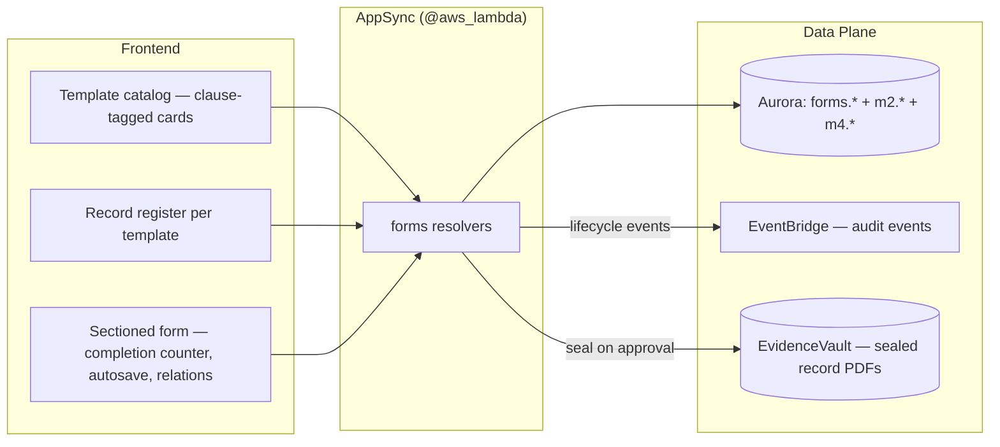

# QMS Forms & Records Engine — Design R1

**Spec:** `qms-forms-engine` (spec 41)
**Requirements approved:** R1 2026-07-14 (commit `4598d42`)
**Design revision:** R1 — architect-authored. BC-1..BC-8 govern.
**Depends on:** spec 40 Task 1 (shared migration wave: clause registry, `IMS` enum) — everything else in this spec is independent of the generation pipeline and can start immediately.
**Steering rules exercised:** `01-tenancy-rules.md`, `05-hitl.md`, `17-i18n.md`, `19-kiro-truth.md` §9

---

## 1. Architecture



No new AI surface, no new transport, no Step Functions — this spec is CRUD + validation + governance over seeded template data. That is why it goes to Kiro first while the architect builds spec 40's generation core.

---

## 2. Data Model — migration `012_qms_forms.sql`

Schema `forms`. RLS ENABLE + FORCE + policy + `app_role` grant on every tenant table; cross-tenant denial test extended.

### 2.1 Template tables — tenant-less catalog (BC-1: templates are DATA)

`app_role` gets SELECT only; catalog changes ship as seed migrations.

- `forms.templates`: `(id, key UNIQUE, title_key, description_key, category, clause_refs TEXT[], standards TEXT[] CHECK ⊆ {ISO9001, ISO14001, ISO45001, IMS}, maps_to TEXT NULL CHECK IN ('m2_ncr'), requires_approval BOOLEAN, sort_order)`. `title_key`/`description_key` are **i18n catalog keys** (BC-7), not strings.
- `forms.template_sections`: `(id, template_id FK, section_key, title_key, sort_order)`.
- `forms.template_fields`: `(id, section_id FK, field_key, label_key, field_type CHECK IN ('text','textarea','number','date','select','multiselect','radio','checkbox','user','relation'), required BOOLEAN, options JSONB NULL, relation_target TEXT NULL CHECK IN ('nonconformity','corrective_action','audit','risk','document','clause','user'), maps_to_column TEXT NULL, validation JSONB NULL, sort_order)`.
  - `CHECK (field_type != 'relation' OR relation_target IS NOT NULL)`.
  - "Clause 8.7 · 30 fields" chips are **COUNTs over these rows** (TPL-2) — a hardcoded count string is a BC-1 violation and a review reject.

### 2.2 Record tables — tenant

- `forms.records`: `(id, tenant_id, template_id FK, status CHECK IN ('draft','in_progress','complete','approved','reopened'), opened_by, completed_by NULL, completed_at NULL, approved_by NULL, approved_at NULL, m2_nc_id UUID NULL, m4_record_id UUID NULL, created_*/updated_*/version)`.
- `forms.record_values`: **one row per filled field, typed value columns** (OQ-2 resolution): `(id, record_id FK, tenant_id, field_id FK, value_text, value_number NUMERIC, value_date TIMESTAMPTZ, value_bool BOOLEAN, value_uuid UUID, value_json JSONB, UNIQUE(record_id, field_id))` + `CHECK` that exactly one value column is non-null. Partial indexes on `(field_id, value_uuid)` and `(field_id, value_date)`. **Load-test task under FORCE RLS before catalog-wide rollout** (OQ-2's own condition) — target: register listing p95 < 500 ms at 10k records × 30 fields.

### 2.3 Relation integrity (BC-2)

`value_uuid` writes run an **existence probe inside the record's tenant transaction**: `SELECT 1 FROM <target table> WHERE id = :uuid` — under FORCE RLS with the tenant GUC already set (C-2), a cross-tenant or missing target returns zero rows → typed error `LINK_TARGET_NOT_FOUND`, transaction rolls back. Target table comes from a **code-side allowlist map** keyed by `relation_target` (never SQL-interpolated from data). We never store a typed-in identifier as a link.

### 2.4 Completion counter (REC-2)

Server-computed in the read resolver: `filled = COUNT(record_values)` joined to required/total from `template_fields`; returned as `{fieldsFilled, fieldsTotal, requiredMissing}`. The client renders, never computes.

---

## 3. NCR → M2 mapping (BC-3 — the anti-facade constraint)

`m2.nonconformities` requires NOT NULL CHECK-constrained `standard`, `source ∈ (audit|incident|complaint|process)`, `nc_type`, `clause_ref`, `severity` (migration `003:4-20`); `m2.corrective_actions.nc_id` is NOT NULL FK (`003:37`). Therefore the seeded NCR template **carries these as REQUIRED fields** (`maps_to_column` set: `standard`, `source` (select with exactly the four legal values), `nc_type`, `clause_ref` (relation → clause registry), `severity`), alongside the competitor-parity spine (NCR Info / Description / Containment / Disposition-as-select / Root Cause / Closure ≥ 30 fields, TPL-5).

`submitFormRecord` for a `maps_to='m2_ncr'` template, in ONE tenant transaction:
1. Assert every `maps_to_column` field is filled → else typed error `MAPPING_INCOMPLETE`, **write nothing** (ACC-4 negative case).
2. `INSERT m2.nonconformities` from mapped values; `INSERT m2.corrective_actions` (`nc_id` from step 2's row, `action_desc`/`owner_id`/`due_date`/`containment_flag` from mapped fields).
3. Stamp `forms.records.m2_nc_id`; mark complete; publish audit event.

**Zero new `m2` columns. Zero hardcoded defaults** — `clause_ref='8.7'` or `severity='medium'` as a fallback is fabrication (steering 19 §9) and a review reject.

---

## 4. Lifecycle, SoD, Audit (BC-4, BC-5, REC-4)

- `draft/in_progress` → autosave via `saveFormRecordValues` (partial, unvalidated, REC-3).
- `submitFormRecord` → full validation → `complete`; record becomes immutable (resolver rejects writes on `status IN ('complete','approved')`).
- `reopenFormRecord` → explicit, role-gated, audit-logged (REC-4).
- `approveFormRecord` (templates with `requires_approval`): approver ≠ `completed_by` ≠ `opened_by` → violation publishes `Security.SodViolationBlocked` and blocks (BC-4).
- EVERY transition publishes a hash-chained audit event via the existing `publishAuditEvent` path (BC-5) — entityId = record id, retrievable via `getAuditTrail` (ACC-6).
- Sealing (REC-7, gated on spec-40 BC-10 residue — now unblocked): approved record → PDF (reuses spec-40 `PdfRenderFn`) → EvidenceVault with per-object retain-until from `m4.retention_policies` → `m4.records` pointer row with `retain_until` (the columns that exist and are never written today).

---

## 5. GraphQL SDL additions (SCHEMA-5; no `extend type`; explicit node dependency)

```graphql
enum FormRecordStatus { DRAFT IN_PROGRESS COMPLETE APPROVED REOPENED }
type FormTemplate @aws_lambda { id: ID! key: String! titleKey: String! descriptionKey: String!
  category: String! clauseRefs: [String!]! standards: [Standard!]! requiresApproval: Boolean!
  sectionCount: Int! fieldCount: Int! sections: [FormTemplateSection!]! }
type FormTemplateSection @aws_lambda { id: ID! sectionKey: String! titleKey: String! fields: [FormTemplateField!]! }
type FormTemplateField @aws_lambda { id: ID! fieldKey: String! labelKey: String! fieldType: String!
  required: Boolean! options: AWSJSON relationTarget: String validation: AWSJSON }
type FormRecord @aws_lambda { id: ID! templateId: ID! status: FormRecordStatus!
  completion: FormCompletion! values: AWSJSON! openedBy: String! completedBy: String
  m2NcId: ID createdAt: AWSDateTime! updatedAt: AWSDateTime! }
type FormCompletion @aws_lambda { fieldsFilled: Int! fieldsTotal: Int! requiredMissing: [String!]! }

input SaveFormRecordValuesInput { recordId: ID! values: AWSJSON! }   # {fieldKey: value} partial map
input SubmitFormRecordInput { recordId: ID! }
input ApproveFormRecordInput { recordId: ID! }
input ReopenFormRecordInput { recordId: ID! justification: String! }

# Query += listFormTemplates: [FormTemplate!]!          # filtered by tenant standards-in-scope (TPL-3)
#          getFormTemplate(id: ID!): FormTemplate
#          listFormRecords(templateId: ID!, status: FormRecordStatus): [FormRecord!]!   # ALSO closes m4 listRecords BLOCKED item (ACC-2)
#          getFormRecord(id: ID!): FormRecord
# Mutation += createFormRecord(templateId: ID!): FormRecord!
#             saveFormRecordValues / submitFormRecord / approveFormRecord / reopenFormRecord
#             exportFormRecordPdf(recordId: ID!): ExportResult!
```

`listFormTemplates` filters by the tenant's standards in scope (spec-40 org profile; falls back to all until a profile exists) — a 9001-only tenant never sees 14001-only registers (TPL-3/ACC-1).

## 6. Seeded catalog (TPL-4) & the 407-field question (OQ-1)

Seed wave 1 (this spec): NCR (BC-3 spine), Management Review Minutes (all 9.3.2 inputs / 9.3.3 outputs as sections), Risk & Opportunity Register, Environmental Aspects & Impacts (14001), Legal & Compliance Obligations (14001/45001), HIRA (45001), Incident Investigation (45001), Emergency Preparedness & Response, Worker Consultation & Participation (45001), Competence & Training Matrix, Supplier Evaluation, Calibration Log, Document Change Request, Objectives & Improvement Plan, Interested Parties & Context.

**OQ-1 resolved by design:** the Internal Audit Report is NOT a 407-field static template — it is a **checklist generator over the clause registry** (per in-scope clause: conformity select + evidence text + finding relation), matching what the competitor's field count actually is (generated-per-clause) at a fraction of the seed burden. Ships as its own task; the static seed catalog does not wait for it.

## 7. Decisions & Risks

| # | Decision | Rationale / risk |
|---|---|---|
| D-1 | Row-per-field typed columns (not JSONB blob, not EAV-untyped) | Queryable registers + typed validation; risk = row volume under FORCE RLS → load-test task gates rollout |
| D-2 | Relation targets via code allowlist + RLS existence probe | BC-2 without dynamic SQL; cross-tenant denial is RLS-enforced, not resolver vigilance |
| D-3 | Template/label i18n via catalog keys | Pseudo-locale CI stays honest; tenant-authored labels documented as runtime data outside the check (BC-7) |
| D-4 | Internal Audit Report = generator, not seed (OQ-1) | Competitor's 407 fields are per-clause rows; generating from the registry is smaller AND better |
| D-5 | Sealing reuses spec-40 PdfRenderFn + retention path | One PDF pipeline, one retention discipline (BC-10 residue) |
